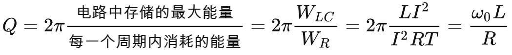
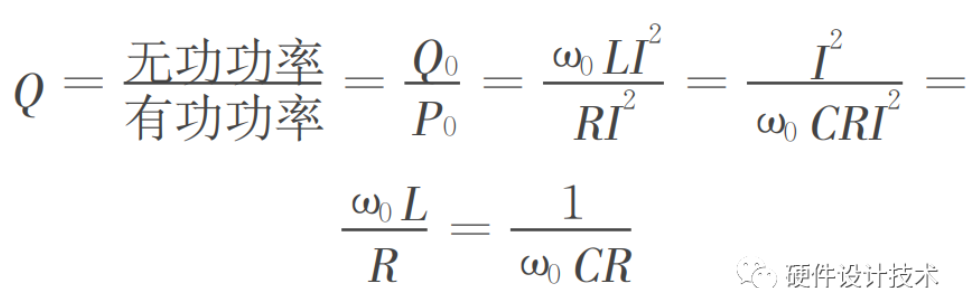
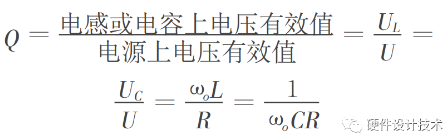
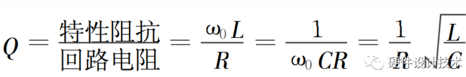
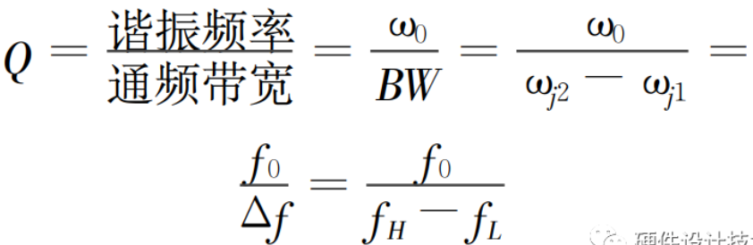
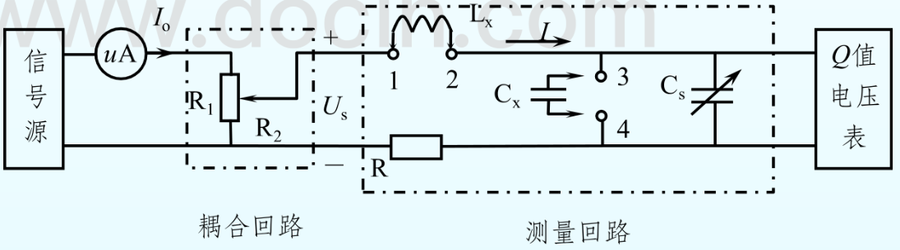
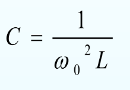
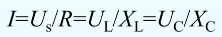
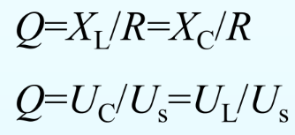

高频，Q值，高频电感测Q值，lcr(?)测试仪测试电路

# 品质因数Q：

​		它用来描述谐振电路的质量或其谐振能力。揭示了谐振电路的通频带和选择性之间相矛盾的关系；Q 值越大，通频带宽度就越窄，电路的选择性能越好，抑非能力越强。反之Q 值越小，通频带宽度就越宽，抑非能力越弱，选择性能越差；但带宽包含的信号多，信号损失小，有利于减小信号的失真。

### **1.1 能量定义 Q 值**

在谐振状态下，电感和电容中的能量不随时间变化，贮存的能量与时间 t 无关，它不再与外界交换能量，而是稳定地储存在电路中。电阻上消耗的能量 WR 应由外电路不断地输入有功功率来补偿。Q 值等于谐振电路中所储存的能量与每一个周期内消耗的能量之比的2π倍。Q 值越高，意味着相对于储存的能量而言，所需付出的能量耗散越少，亦即谐振电路储能的效率越高。

### **1.2 功率定义 Q 值**

在谐振电路中可用储能元件上的无功功率 Q0与有功功率 P0 之比定义为回路的 Q 值。此时，所谓的“无功功率”是指回路谐振时电感中的无功功率或电容中的无功功率，而“有功功率”是指回路中损耗的总功率．

### **1.3 电压定义 Q 值**

教材中关于品质因数的概念是以讨论 RLC串联电路在谐振时 L、C 元件上的电压与电压源电压之间的关系引出的。定义为谐振时电感或电容上电压有效值与电源上电压有效值之比；即串联谐振电路的品质因数为：

### **1.4 参数定义 Q 值**

用参数定义 Q 值是从串联电路中电压分配的角度引出的，这种定义方式表明了品质因数 Q 与各电路参数之间的关系。通常把一个串联回路内电感量或电容量的特性阻抗与回路电阻 R 的比值称为回路的品质因数，即为：

### **1.5 带宽度定义 Q 值**

电路发生谐振的频率 ω0 称为谐振频率，谐振峰两边 I ＝ （1/2） Im 处的频率值ω2j 和 ω1j 之间宽度定义为通频带宽度 BW，
衡量一个**谐振器**在电路中性能的好坏。常用品质因数 Q ＝ ω0/ω2j －ω1j 来描述，Q 的物理意义是在谐振频率ω0 附近将具有更强的频率响应；对于偏离 ω0 较远的频率，则响应很弱或不响。

# **电感Q值**：

也叫电感的品质因子，是衡量电感器件的主要参数。是指电感器在某一频率的交流电压下工作时，**所呈现的感抗与其等效损耗电阻之比**。电感器的**Q值越高，其损耗越小**，效率越高。**也可以定义**为**无功功率除以有功功率**。

理想电感本身是不能消耗能量的，而**实际的电感是有损耗的**。电感在一个充放电周期内，**储存并释放的能量为无功能量**，而因为这个过程额外损耗的能量就是有功能量，损耗的能量主要作为热量耗散。而两者的比值就是电感的Q值。所以电感的**Q值越高，损耗越小**。

# Q表

谐振法构成的测量仪器称为Q表；
适合再高频下测量电容量、电感量、电容损耗因数、谐振回路、电感品质因数

## 1.信号源

正弦信号源，振荡频率范围即为Q表工作频率范围

## 2.耦合回路

它将信号源输出的信号馈入到测量回路，通常电阻耦合，称为插入电阻，要求 R2 要小以减少影响。

## 3.测量回路

一个LC谐振电路，谐振特性来测量Q表。

## 4.Q值电压表

Q值时刻的电压表，用于指示Q值大小。当Q值电压表指示电压最大时，测量回路处于谐振状态。