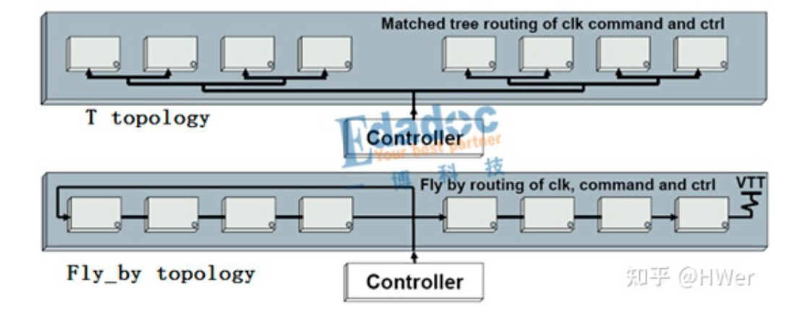
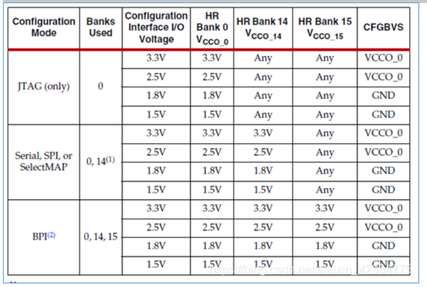
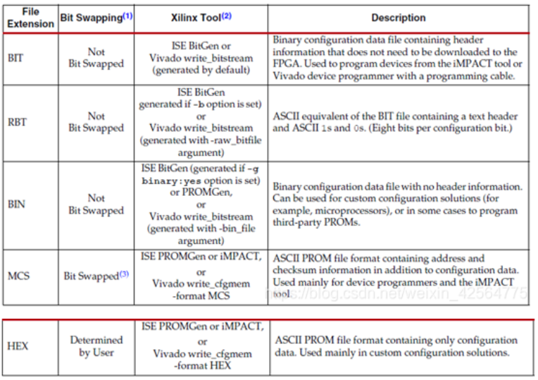

# 叠层

TOP sig
2	GND
3 	POWER
4	  SIG
5      GND
6  	SIG

# power

为了最小化电流消耗和确保FPGA I/O在上电时处于三态状态，Artix-7电源推荐的上电顺序如图2所示，即依次为：
**VCCINT，VCCBRAM，VCCAUX，VCCO**（即先内核上电，后I/O上电）。推荐的关电顺序与之相反。

如果VCCINT和VCCBRAM具有相同电压电平，两者可以采用一种电源供电。同样，如果VCCAUX和VCCO具有同样的推荐电压电平，它们也可以采用同一种电源供电。

# ddr

拓扑结构只影响地址线的走线方式不影响数据线。

确定了DDR的拓扑结构，就可以进行元器件的摆放，有以下几个原则需要遵守：

原则一，考虑拓扑结构，仔细查看CPU地址线的位置，使得地址线有利于相应的拓扑结构

原则二，地址线上的匹配电阻靠近CPU

原则三，数据线上的匹配电阻靠近DDR

原则四，将DDR芯片摆放并旋转，使得DDR数据线尽量短，也就是，DDR芯片的数据引脚靠近CPU

原则五，如果有VTT端接电阻，将其摆放在地址线可以走到的最远的位置。一般来说，DDR2不需要VTT端接电阻，只有少数CPU需要；DDR3都需要VTT端接电阻。

原则六，DDR芯片的去耦电容放在靠近DDR芯片相应的引脚

**T型拓扑及Fly_by拓扑结构,**这两种拓扑结构应用最多的应该是在DDR。
因为DDR3的设计还是比较复杂，而且应用也比较广泛，如下图是常见的T型及Fly_by型的拓扑应用。

# 配置

### CFGBVS

如果VCCO0连接至2.5V或3.3V，CFGBVS连接至VCCO0。
如果VCCO0连接至1.5V或1.8V，CFGBVS连接至GND。
建议bank0、bank14、bank15的VCCO电压一致，避免出现I/O Transition at the End of Startup

### M[2:0]

### PROGRAM_B （ input ）

低电平有效，为低时，配置信息被清空，将配置过程重新进行。

上电时保持PROGRAM_B为低电平不会使FPGA配置保持复位状态。而是使用INIT_B来延迟上电配置序列。

### INIT_B（inout）

FPGA处于配置复位状态，FPGA正在初始化（清除）其配置存储器时，或者当FPGA检测到配置错误时，FPGA将此引脚驱动为低电平。

在上电期间，INIT_B可以在外部保持低电平，以在初始化过程结束时停止上电配置序列。

当初始化过程后在INIT_B输入检测到高电平时，FPGA继续执行M [2：0]引脚设置所指示的配置序列的其余部分。

### VCCBATT

如果不要求使用易失性密钥存储区中的解密密钥，请将此引脚连接到GND或VCCAUX。

## FPGA加载时序

上电时序图

7系列器件需要为VCCO_0，VCCAUX，VCCBRAM和VCCINT引脚供电

在JTAG模式下，除VCCO_0之外的任何I / O电源都不需要为7系列FPGA配置供电。 当选择使用多功能引脚的配置模式（即串行，主BPI，SPI，SelectMAP）时，还必须提供VCCO_14，VCCO_15或两者。

### 清除配置内存

在器件上电后，PROGRAM_B引脚脉冲为低电平，使用JTAG JPROGRAM指令或IPROG命令后，配置存器将被顺序清零。

### 采样M2:0引脚

当INIT_B引脚为高电平时，器件对M [2：0]模式引脚进行采样，如果处于主模式，则开始驱动CCLK。

### 同步

对于BPI，Slave SelectMAP和Master SelectMAP模式，必须首先检测总线宽度。 

从串行，主串行，SPI和JTAG模式忽略总线宽度检测模式

然后必须将特殊的32位同步字（0xAA995566）发送到配置逻辑，同步字警告设备即将到来配置数据，并将配置数据与配置逻辑对齐。

因为工具生成的所有配置比特流（BIT文件）都包括总线宽度检测模式和同步字。

### 检查设备ID

设备同步后，必须先通过设备ID检查才能加载配置数据帧。这可以防止使用为不同设备格式化的比特流进行配置。 如果在配置期间发生ID错误，则设备会尝试执行回退重新配置。

### 启动

加载配置帧后，比特流指示设备进入启动序列。 启动序列由8相（0-7阶段）顺序状态机控制。

## 配置文件格式

其中MCS、BIN和HEX文件为固化文件，直接烧写到FPGA外挂的存储器中。

# 管脚与模拟输入

VCCADC_0：XADC 中ADC 和其他模拟电路的模拟电源引脚，电压和VCCAUX保持一致，建议单独供电或通过滤波电路（电感等）连到VCCAUX上，不使用时也需要接VCCAUX；

GNDADC_0：XADC的模拟接地引脚，应该通过磁珠连接到系统GND。在一个混合信号系统中，如果可能的话，此引脚应该连到在一个模拟的接地平面上，在这种情况下就可以不需要铁氧体磁珠。即使XADC 不用，也应始终将此引脚连接到GND。

VP_0/VN_0：XADC专用差分输入引脚（专用是对比其他XADC模拟输入来说，该引脚不能用作普通IO，其他的都可以），不使用时接GND；

VREFP_0：电压基准，此引脚可连接到外部1.25V 精确参考IC（±0.2%或12 位的±9 LSB），以获得ADC 的最佳性能。应将其视为模拟信号，与VREFN 信号一起提供1.25V 差分电压。如果将此引脚连接到GNDADC，芯片内参考源（12 位时为±1%或±41 LSB）被激活。如果没有提供外部引用，这个引脚应该应始终连接到GNDADC。

VREFN_0：电压基准GND，该引脚应与外部1.25V 精确参考IC（±0.2%）的地引脚相连，以获得最佳的ADC 性能。应将其视为模拟信号，与VREFP 信号一起提供差分1.25V 电压。即使没有提供外部参考，此引脚也应始终连接到GNDADC。

AD0P_ toAD15P：辅助模拟输入/数字IO，这些是多功能引脚，可以支持16 个模拟的正输入端，也可以用作常规数字I/O（见图1-1）。当不被用作模拟输入时，这些引脚可以像其他任何数字I/O 一样使用。

AD0N_ toAD15N：辅助模拟输入/数字IO，这些是多功能引脚，可以支持16 个模拟的负输入端，也可以用作常规数字I/O（见图1-1）。当不被用作模拟输入时，这些管脚可以像其他任何数字I/O 一样使用。

DXP_0/DXN_0：DXP、DXN 为内部热敏二极管温度传感器引脚，在BANK0热二极管被允许接入使用DXP和DXN引脚，结合外部温度监控电路可实现对FPGA芯片结温的监控，不用时接系统GND。在设计该部分电路时，可以使用MAX6642替代热敏二极管。大多数热敏二极管温度传感器，包括MAX1617和MAX6654，与二极管都有两个连接点：DXP和DXN。DXP连接至热敏二极管的阳极，源出二极管偏置电流。DXN吸入偏置电流，并将阴极偏置在0.7V左右。

从上图可以看出，FPGA上电后，XADC可以监测FPGA内的温度以及所有的FPGA电压，还可以接收来自FPGA专用模拟差分管脚VP_0/VN_0的模拟差分信号(不可以作为普通User I/O)，也可以接收FPGA其他普通数字/模拟混合管脚VAUXP/VAUXN[15:0]的16路模拟差分输入(不使用的时候可以作为普通的User I/O)，因此XADC可以最多处理17路外部模拟信号。

XADC的输出通过JTAG口可以直接被FPGA开发工具读取并用Vivado开发工具实时在线监测，也可以由用户调用XADC硬核，并用代码在FPGA里实现实时获取信息。另外，如果咱们觉得用代码实现有困难，那还可以借助Xilinx CORE Generator生成XADC的IP核，只要配置好之后加载到FPGA逻辑代码里也可以工作，自己写代码和调动IP核这两种方式都可以方便的供用户自己读取FPGA的温度、电压以及外部输入的模拟信号等信息。

