# AD9910

AD9910是一种直接数字合成器(DDS)，具有集成的14位DAC，支持高达1 Gsps的采样率。AD9910采用了先进的专有DDS技术，在不牺牲性能的情况下显著降低了功耗。
DDS/DAC组合形成了一个数字可编程的高频模拟输出合成器，能够在高达400 MHz的频率上生成频率灵活的正弦波形。

用户可以访问控制DDS的三个信号控制参数:频率、相位和幅值。DDS通过其32位累加器提供快速跳频和频率调谐分辨率。

AD9910 支持四种工作模式

- 单频调制模式
- RAM调制模式
- 数字斜坡调制模式
- 并行数据端口调制模式

# 数据模式

## 单频调制模式

在单频调制模式中，DDS信号控制参数由编程寄存器直接提供。
Profile是一个包括DDS信号控制参数的独立寄存器。AD9910共有8个Profile寄存器, 每个Profile都能单独访问。

利用三个外部profile引脚(PROFILE[2:0])可选择想要的profile。
改变Profile引脚状态将在SYNC_CLK下一上升沿使用所选Profile中指定参数更新DDS。

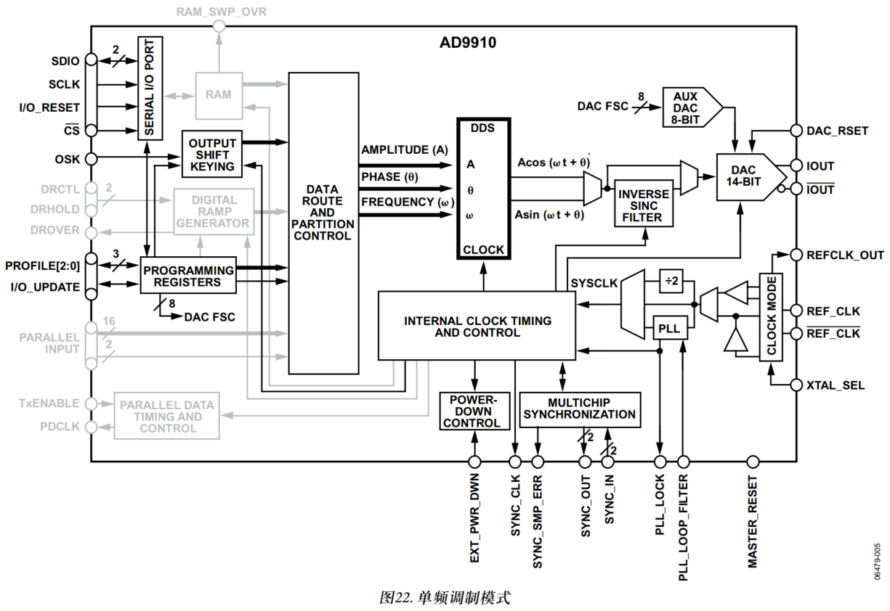

## RAM调制模式

RAM调制模式由RAM使能位和I/O_ UPDATE引脚(或改变Profile)激活。在此模式中，调制的DDS信号控制参数直接通过RAM提供。

RAM由1024x32位控制字组成。通过复杂的内部状态机配合，RAM可非常灵活地生成随时间变化的任意波形。可编程定时器控制RAM向DDS发送控制字的速率。因此，可编程定时器将决定了向DDS发送的32位样本的采样速率。
DDS具体信号控制参数(RAM样本发送目的地)也可通过8个独立的RAM Profile寄 存器编程控制。使用三个外部Profile引脚(PROFILE[2:0])可选择具体的Profile。任何Profile引脚状态的改变会在SYNC_CLK下一上升沿将激活所选的RAM Profile

在RAM调制模式中，可生成随时间变化的振幅、相位或频率信号，从而实现对任意DDS载波信号控制参数调制的功能。另外，利用极化调制格式还能将RAM样本分成振幅分量和相位分量;相位分量精度为16位，振幅分量精度为14位。

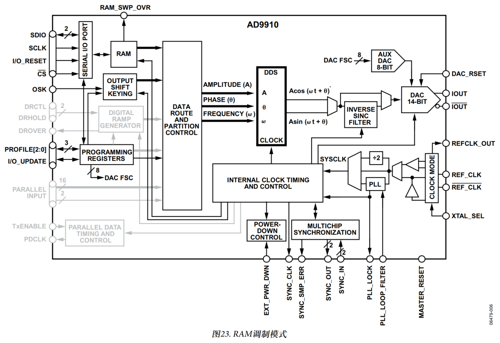

## 并行数据端口模式

16个 MSB 数据字 D[15:0] 引脚
2  个  LSB  目的字 F[1:0]	引脚

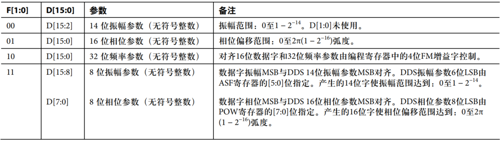

并行数据时钟 PDCLK
在PDCLK引脚上产生一个 1/4 DAC 采样速率的时钟信号（并行数据端口采样速率）

PDCLK作为并行端口的数据采样时钟使用

PDCLK每个上升沿用于将用户提供的18位数据锁存在数据端口中

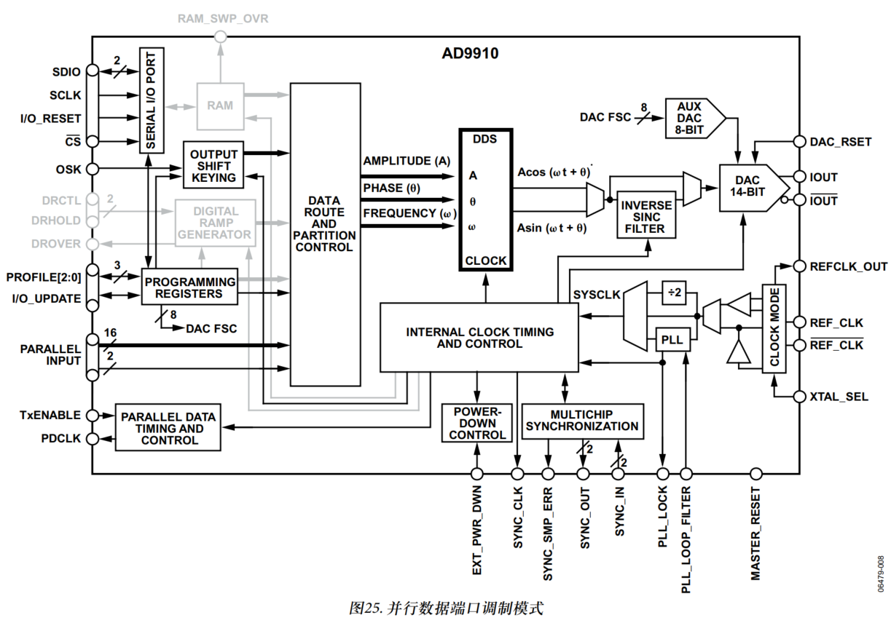

# SPI串行接口

SCLK：时钟

CS：片选，低电平有效

SDIO：双向数据线

SDO：高阻

## 一：指令字节周期

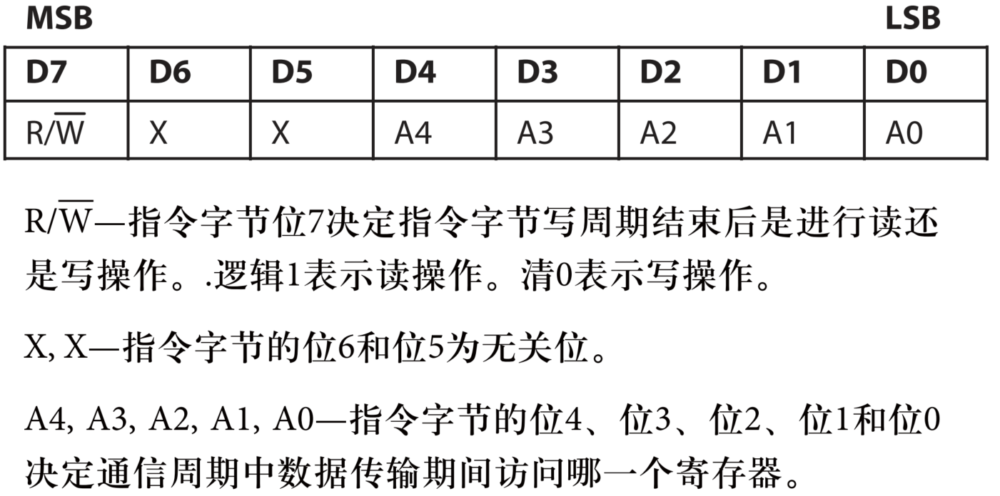

例如寄存器0x16(H)，0x0XX10110

在IO全部复位之后，下一个字节即为指令字节，用于传递访问的寄存器地址；

## 二：写周期/读周期、

SDIO双向进行，CFR1寄存器默认为0，忽略SDO引脚；

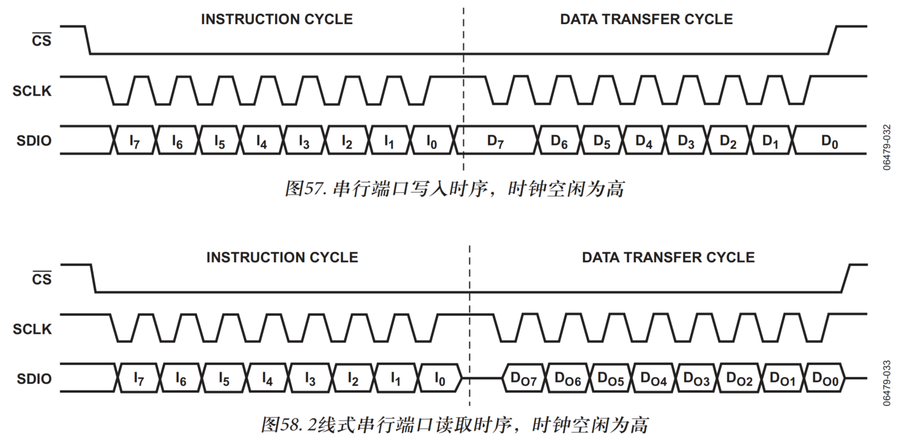

寄存器位宽 32:64 位，默认值查表；=

## 三：数据更新

写入周期结束后，编程数据位于缓冲器中，处于无效状态。IO_UPDATE将串行端口缓冲器中的数据传输到有效寄存器。

读周期是从有效寄存器中读取数据，而不是从缓冲器中；

IO_UPDATE用于启动缓冲器数据转移

上升沿有效，脉冲宽度必须大于一个SYNC_CLK时钟周期，建议与SYNC_CLK同步拉高并保持两个时钟周期；

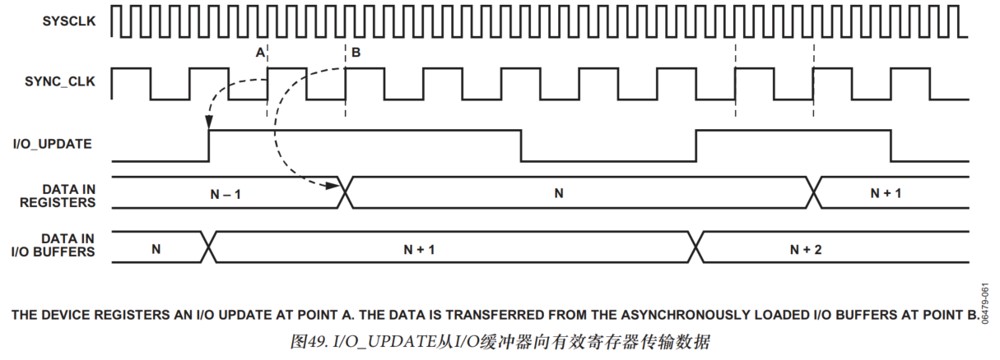

# 时钟接口

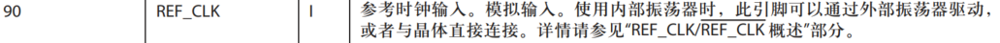

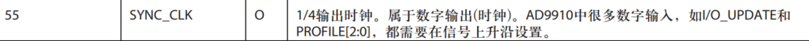

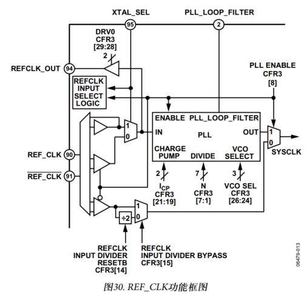

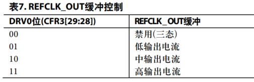

# 使用单频调制模式

通过PF[0:2]引脚来分别选中总共八个profile寄存器，通过配置这些寄存器来完成振幅频率相位的配置；

# 

