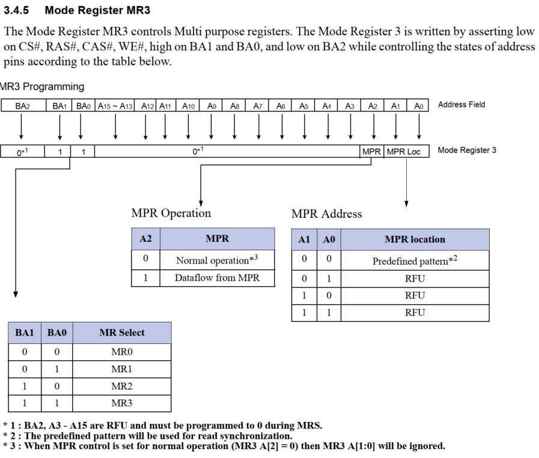
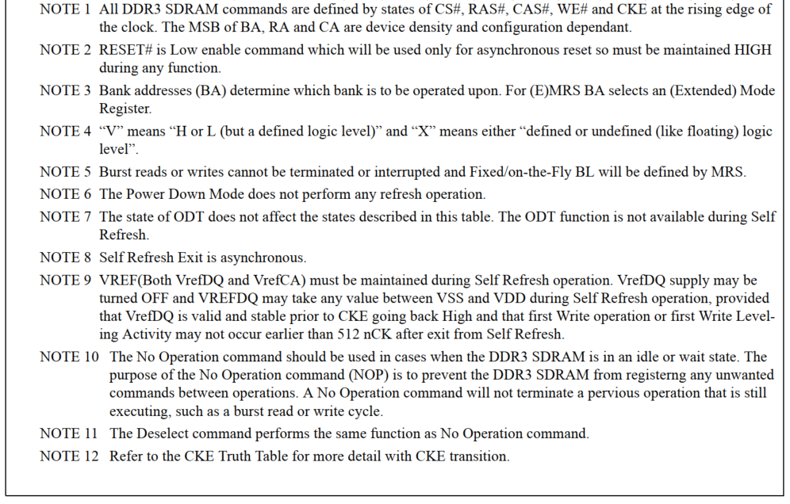
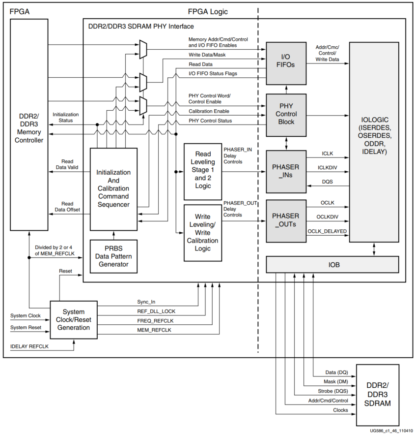
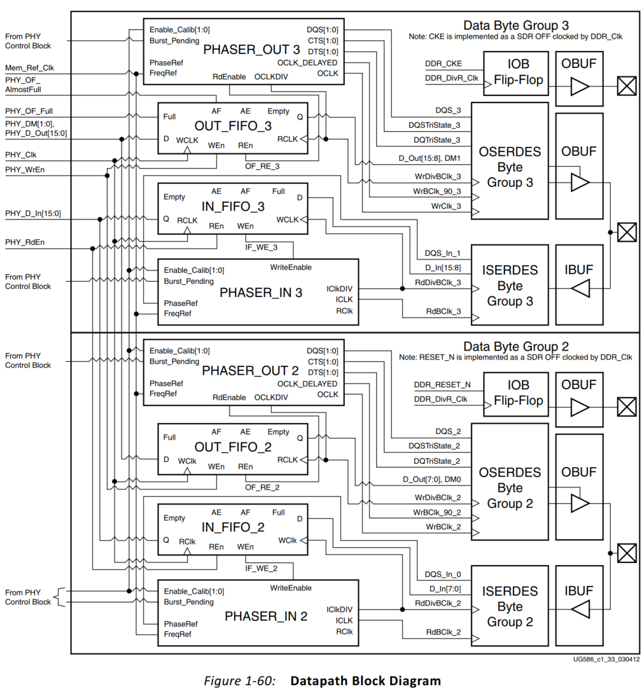
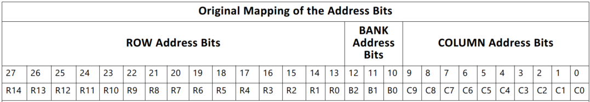
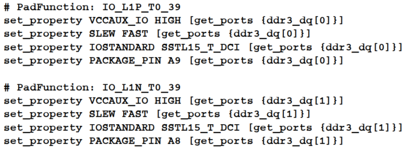

# Xilinx MIG IP Core

# DDR3 phy


# DDR3 address


# DDR3 Initialization

## MR0


## MR1


## MR2


## MR3




## MR Sequence

MR2->0000


MR3->0000


MR1->0006


MR0->0520


MR0->0400


and more....


# DDR3 Timing

1


2


3


**See more details in JESD79-3e**


# DDR3 Command





# Core Architecture

## Memory Controller  


## Clock

### clock input

The 7 series FPGA MIG DDR3/DDR2 design has two clock inputs, the reference clock and the system clock. The reference clock drives the IODELAYCTRL components in the design, while the system clock input is used to create all MIG design clocks that are used to clock the internal logic

### clock architecture

- Internal (FPGA) logic
  The internal FPGA logic is clocked by a global clocking resource at a half or quarter frequency of the DDR2 or DDR3 SDRAM clock frequency 

- Write path (output) I/O logic
  The PHASER_OUT generates a byte clock (OCLK), a divided byte clock (OCLKDIV), and a delayed byte clock (OCLK_DELAYED) for its associated byte group.   

  OCLK_DELAYED is used to clock the DQS ODDR to achieve the required 90° phase offset between the write DQS and its associated DQ bits.   

  

- Read path (input) and delay I/O logic

  The input read datapath is clocked by the PHASER_IN block. The PHASER_IN block provides synchronized clocks for each byte group to the IN_FIFOs and to the IDDR/ISERDES.  

  The PHASER_IN block receives the DQS signal for the associated byte group and generates two delayed clocks for DDR2 or DDR3 SDRAM data captures: read byte clock (ICLK) and read divided byte clock (ICLKDIV).   

- IDELAY reference clock  

  You need to always supply a 200 MHz ref_clk and then MIG creates the appropriate IDELAYCTRL frequency with an additional MMCM.   


### Sharing sys_clk between Controllers 

-  Interfaces Spanning I/O Columns – A single sys_clk input cannot drive memory interfaces spanning multiple I/O columns. The input clock input must be in the same column as the memory interface to drive the PLL using the CMT Backbone, which minimizes jitter.

-  Interfaces in Single I/O Column – If the memory interfaces are entirely contained within the same I/O column, a common sys_clk can be shared among the interfaces. The sys_clk can be input on any CCIO in the column where the memory interfaces are located. This includes CCIO in banks that do not contain the memory interfaces, but must be in the same column as the memory interfaces.  

### Sharing BUFG Clock (phy_clk)  

The MIG 7 series DDR3 design includes an MMCM which outputs the phy_clk on a BUFG route. It is **not possible** to share this clock amongst multiple controllers to synchronize the user interfaces. This is not allowed because the timing from the FPGA logic to the PHY Control block must be controlled. This is not possible when the clock is shared amongst multiple controllers. The only option for synchronizing user interfaces amongst multiple controllers is to create an asynchronous FIFO for clock domain transfer.  


## Rank Machines  

The rank machines correspond to DRAM ranks. Rank machines monitor the activity of the bank machines and track rank or device-specific timing parameters.   

a rank machine monitors the number of activate commands sent to a rank within a time window.
After the allowed number of activates have been sent, the rank machine generates an inhibit signal that prevents the bank machines from sending any further activates to the rank until the time window has shifted enough to allow more activates.  

Rank machines are **statically** assigned to a physical DRAM rank. 


## Bank Machine

Most of the Memory Controller logic resides in the bank machines. Bank machines correspond to DRAM banks. 

A given bank machine manages a single DRAM bank at any given time. However, bank machine assignment is dynamic, so it is not necessary to have a bank machine for each physical bank.  
Rank machines are statically assigned to a physical DRAM rank.  

**Typical Cycle**

1. Accepts your request
2. Activates the target row
3. Issues the column (read or write) command
4. Precharges the target row
5. Returns to the idle pool of bank machines  

Now consider the case when a request arrives targeting an open DRAM bank, managed by an already active bank machine. The already active bank machine recognizes that the new request targets the same DRAM bank and skips the precharge step (**step 4**).   

Column commands can be reordered for the purpose of optimizing memory interface throughput **(step 3)**.  

The queue depth is equal to the number of bank machines, greater efficiency can be obtained by increasing the number of bank machines (nBANK_MACHS). As this number is increased, FPGA logic timing becomes more challenging. In some situations, the overall system efficiency can be greater with an increased number of bank machines and a lower memory clock frequency.   


##  Column Machine 

The single column machine generates the timing information necessary to manage the DQ data bus.   
Although there can be multiple DRAM ranks, there is a single DQ bus, all the columns in all DRAM ranks are managed as a single unit.   


## Arbitration Block  

The arbitration block receives requests to send commands to the DRAM array from the bank machines.   
Row commands and column commands are arbitrated independently.  
The arbitration block implements a round-robin protocol to ensure forward progress.  
Arbitration is necessary because several bank machines might request to send row commands (activate and precharge) at the same time. 


## Reordering 

DRAM accesses are broken into two quasi-independent parts, row commands and column commands.   
Each request occupies a logical queue entry, and each queue entry has an associated bank machine.   

The bank machine attempts to activate the proper rank, bank, or row on behalfof the current request. 

In the process, the bank machine looks at the current state of the DRAM to decide if various timing parameters are met. 
Eventually, all timing parameters are met and the bank machine arbitrates to send the activate. 

Not all requests require an activate. 
If a preceding request has activated the same rank, bank, or row, a subsequent request might inherit the bank machine state and avoid the precharge/activate penalties.  

After the necessary rank, bank, or row is activated and the RAS to CAS delay timing is met, 
the bank machine tries to issue the CAS-READ or CAS-WRITE command.   
Before arbitrating to send a CAS command, the bank machine must look at the state of the DRAM, the state of the DQ bus, priority, and
ordering,  then the bank machine arbitrates to send a CAS command.   

The controller supports three ordering modes:  

- **STRICT**     – In this mode the controller always issues commands to the memory in the exact order received at the native interface. 
- **NORM**       – In this mode the controller reorders reads but not writes as needed to improve efficiency. (not visible in UI)
- **RELAXED** –  Writes and reads can be reordered as needed for maximum efficiency between rank-bank queues.  

note: This **RELAXED** option is not selectable in the MIG GUI. To enable, generate the design with the synthesis options "Global" in the Generate Output Products settings. After generating the design, the design top-level RTL file should be edited and the ORDERING parameter should be changed to "RELAXED.  


## Precharge Policy  

The controller implements an aggressive precharge policy. The controller examines the input queue of requests as each transaction completes. 
If no requests are in the queue for a currently open bank/row, the controller closes it to minimize latency for requests to other rows in the bank.   


## Error Correcting Code  

A Single Error Correct Double Error Detect (SECDED) code is used.
All single errors are detected and corrected. All errors of two bits are detected. 
Errors of more than two bits might or might not be detected.
The ECC mode is optional and supported only for a 72-bit data width. 
The data mask feature is disabled when ECC mode is enabled.   


### Read-Modify-Write  

Any writes of less than the full DRAM burst must be performed as a read-modify-write cycle.
The specified location must be read, corrections if any performed, merged with the write data, ECC computed, and then written back to the DRAM array. 
The wr_bytes command is defined for ECC operation. When the wr_bytes command is given, the
Memory Controller always performs a read-modify-write cycle instead of a simple write
cycle. The byte enables must always be valid, even for simple commands. Specifically, all
byte enables must be asserted for all wr commands when ECC mode is enabled.  


When the wr_bytes command is given, the Memory Controller performs a read-modify-write (RMW) cycle.   


## User Interface Block  

The UI block presents the UI to a user design. It provides a simple alternative to the native interface. 
• Buffers read and write data
• Reorders read return data to match the request order
• Presents a flat address space and translates it to the addressing required by the SDRAM  


# MIG phy

The PHY generates the signal timing and sequencing required to interface to the memory device. 
It contains the clock-, address-, and control-generation logic, write and read datapaths, 
and state logic for initializing the SDRAM after power-up.    

The PHY is provided as a single HDL codebase for DDR2 and DDR3 SDRAMs. 
The MIG tool customizes the SDRAM type and numerous other design-specific parameters through top-level HDL parameters and constraints contained in a XDC file.  


## Overall PHY Architecture  

**dedicated blocks**
structured adjacent to one another with back-to-back interconnects to minimize the clock and datapath routing necessary to build high-performance physical layers.  

**soft calibration logic**
The phaser blocks (PHASER_IN and PHASER_OUT) are multi-stage programmable delay line loops that can dynamically track DQS signal variation and provide precision phase adjustment.  





## I/O Architecture  

Four PHASER_IN and PHASER_OUT blocks, four IN/OUT_FIFOs, ISERDES, OSERDES, ODDR, IDELAY, and IOBs. 
A single PHY control block communicates with all four PHASER_IN and PHASER_OUT blocks within the I/O bank.  

This includes control over the flow of address, command, and data between the IN/OUT_FIFOs and ISERDES/OSERDES,
and control of the PHASER_IN and PHASER_OUT blocks.   

The calibration logic or the Memory Controller initiates a DDR2 or DDR3 SDRAM command sequence by writing address, command, and data (for write commands) into the IN/OUT_FIFOs and simultaneously or subsequently writes the PHY control word to the PHY control block.   

When **multi-I/O bank** implementations are required, each PHY control block controls the byte group elements in that bank. 
This requires that the PHY control blocks stay in phase with their adjacent PHY control blocks. 
The center PHY control block is configured to be the master controller for a three I/O bank implementation. 
For two bank implementations, either PHY control block can be designated the master.  


**PHY Cmd**
Write (Wr – 0x01)   	Read (Rd – 0x03)    	Non-Data (ND – 0x04)
**Activate Precharge**
00: No action	01: Activate	10: Precharge	11: Precharge/Activate  

The DDR3 SDRAM RESET_N signal is directly controlled by the FPGA logic, not the PHY control word.   

## Memory Initialization


## Command Path  

A command requested by the calibration logic or Memory Controller is sent out as a PHY control word to the PHY control block and a simultaneous input to the address/control/command OUT_FIFOs.   

Each of the address/control/command signals must have values for four memory clock cycles because each PHY_Clk cycle entails four memory clock cycles.  

**three types of commands:**  

- Write commands including write and write with auto precharge.
- Read commands including read and read with auto precharge.
- Non-Data commands including Mode Register Set, Refresh, Precharge, Precharge All Banks, Activate, No Operation, Deselect, ZQ Calibration Long, and ZQ Calibration Short.


OSERDES is used in single data rate (SDR) mode because address/control/commands are SDR signals.  
The FPGA logic need not issue NOP commands during long wait times between valid commands 


The timing diagram of the address/command path from the output of the OUT_FIFO.


## Datapath

The datapath comprises the write and read datapaths. 
The datapath in the 7 series FPGA is completely implemented in dedicated logic with IN/OUT FIFOs interfacing the FPGA logic.  
The IN/OUT_FIFOs provide datapath **serialization/deserialization** in addition to clock domain crossing, thereby allowing the FPGA logic to operate at low frequencies up to 1/4 the frequency of the DDR2 or DDR3 SDRAM clock.   



Each IN/**OUT_FIFO** has a storage array of memory elements arranged as 10 groups eight bits wide and eight entries deep.   

The **OUT_FIFO** receives eight bits of data for each DQ serializes from eight bits to four bits and outputs the 4-bit data to the OSERDES.

The **OSERDES** further serializes the 4-bit data to a serial DDR data stream in the OCLK domain.   D(4:2:1)  C(1:2:4)

The **PHASER_OUT** clock output OCLK is used to clock DQ bits whereas the OCLK_DELAYED output is used to clock DQS to achieve the 90° phase offset between DQS and its associated DQ bits during writes.   

The **IN_FIFO** receives 4-bit data from each DQ bit **ISERDES** in a given byte group and writes them into the storage array. 

he **IN_FIFO** is used to further deserialize the data by writing two of the 4-bit datagrams into each 8-bit memory element.  


# Calibration & Initialization 

## Memory Initialization  

The PHY executes initialization sequence for memory following deassertion of system reset. 
Each DDR2 or DDR3 SDRAM has a series of mode registers, accessed through mode register set (MRS) commands.   

The particular bit values programmed into these registers are configurable in the PHY and determined by the values of top-level HDL parameters like BURST_MODE (BL), BURST_TYPE, CAS latency (CL), CAS write latency (CWL), write recovery for auto precharge (tWR), on-die termination resistor values (RTT_NOM and RTT_WR), and output driver strength (OUTPUT_DRV).  


## PHASER_IN Phase Lock 

PHASER_IN is placed in read calibration mode to phase align its free-running frequency reference clock to the associated read DQS.   

The calibration logic issues back-to-back read commands to provide the PHASER_IN block with a continuous stream of DQS pulses for it to achieve lock.   

## PHASER_IN DQSFOUND Calibration

This calibration stage is required to align the different DQS groups to the same PHY_Clk
clock edge in an I/O bank.   

Different DQS groups have different skews with respect to each other because of the clock (CK) fly-by routing differences to each DDR2 or DDR3 component and delay differences in each component.  This calibration stage is required to determine the optimal position of read data_offset with respect to the read command per I/O bank.  

Each byte group can be read out of the IN_FIFO on different PHY_Clk cycles due to fly-by routing and delay differences within each group.   Therefore, the IN_FIFO Not Empty flags for all the byte groups are ANDed together and used as the read enable for all data IN_FIFOs. Figure 1-61 shows the read data capture timing diagram.  


## Write Leveling  

Write leveling, which is a feature available in DDR3 SDRAM, is performed in this stage of calibration. DDR3 SDRAM modules have adopted fly-by topology on clocks, address, commands, and control signals to improve signal integrity. 

Adjust each write DQS phase independently with respect to the CK forwarded to the DDR3 SDRAM device.   

During write leveling, DQS is driven by the FPGA memory interface and DQ is driven by the DDR3 SDRAM device to provide feedback.   


Periodic DQS pulses are output by the FPGA memory interface to detect the level of the CK clock at the DDR3 SDRAM device.  
The interval between DQS pulses is specified as a minimum of 16 clock cycles.   
QS is delayed using the PHASER_OUT fine and coarse delay in unit tap increments until a 0 to 1 transition is detected on the feedback DQ input. 

#### Implementation Details

The **write_calib_n** signal indicating the start input to the PHY control block after tWLDQSEN to ensure that DQS is driven Low after ODT is asserted.   

During write leveling, PHASER_IN outputs a free-running clock used to capture the DQ feedback to the DQ IN_FIFOs. During write leveling, the data byte group IN_FIFOs is in flow-through mode.  


### Multi-Purpose Register Read Leveling

The Multi-Purpose Register (MPR) is used to center the read DQS in the read DQ window.  

Read DQS centering is required for the next stage of calibration.  

### OCLKDELAYED Calibration  

Write DQS is centered in the write DQ window using the PHASER_OUT stage 3 delay in this stage of calibration.   

The DDR3 SDRAM JEDEC specification requires the write DQS to be within ±90° of CK defined by the tDQSS specification. To avoid tDQSS violation during the edge detection  

## Write Calibration  

Write calibration is performed after both stages of read leveling because correct data pattern sequence detection is necessary for this stage of calibration.   

Write calibration is required to align DQS to the correct CK edge. During write leveling, DQS is aligned to the nearest rising edge of CK.   


#### Implementation Details  


## Read Leveling  

Read leveling stage 1 is required to center align the read strobe in the read valid data window for the first stage of capture.   

A PHASER_IN provides two clock outputs namely ICLK and ICLKDIV. ICLK is the stage 2 delay output and ICLKDIV is the rising edge aligned divided by 2 version of ICLK.  

The ICLK and ICLKDIV outputs of one PHASER_IN block are used to clock all the DQ ISERDES associated with one byte.   


# MC to PHY Interface

The calibration logic module constructs the PHY control word before sending it to the PHY control block during calibration.   

After calibration is complete, the **init_calib_complete** signal is asserted and sent to the Memory Controller.

The address, command, control, and data buses are multiplexed before being sent to the PHY control block.  
These buses are driven by the calibration module during the memory initialization and calibration stages and by the Memory Controller during normal operation.   


# Native Interface  

The native interface connects to an FPGA user design to allow access to an external memory device.  


## **parameter**


## **signal**


**cmd[2:0]**  


**accept**
This signal indicates to the user design whether or not a request is accepted by the core.

**data_buf_addr** 
For write commands, data_buf_addr is an address in the buffer containing the source data to be written to the external memory. 
For read commands, data_buf_addr is an address in the buffer that  receives read data from the external memory.   

**Write Command Signals**  


**Read Command Signals**  


**Native Interface Maintenance Command Signals**   


## Protocol

If use_addr is asserted but accept is not ：


The user design retries request 3.


The **data_buf_addr** bus must be supplied with requests. This bus is an address **pointer** to a **buffer** that exists in the user design. 
It tells the core where to locate data when processing **write commands**, where to place data when processing read commands.  

When the core processes a command, the core echoes **data_buf_addr** back to the user design by **wr_data_addr** for write commands, and **rd_data_addr** for read commands:


Correspond data is now` in the correspond buffer which the **data_buf_addr** point;


# APP Interface

## User Interface


**app_cmd[2:0]** 
 

**app_en**  	
This input strobes in a request. You must apply the desired values to **app_addr[ ], app_cmd[2:0]**, and app_hi_pri, and then assert app_en to submit the request to the UI. This initiates a handshake that the UI acknowledges by asserting app_rdy.  

**app_wdf_end**  
This input indicates that the data on the app_wdf_data[] bus in the current cycle is the last data for the current request.  

**app_rdy**  
This output indicates to you whether the request currently being submitted to the UI is accepted. If the UI does not assert this signal after app_en is asserted, the current request must be retried. The app_rdy output is not asserted if:
° PHY/Memory initialization is not yet completed
° All the bank machines are occupied (can be viewed as the command buffer being full)
\- A read is requested and the read buffer is full 
\- A write is requested and no write buffer pointers are available
° A periodic read is being inserted  

**app_wdf_rdy**
This output indicates that the write data FIFO is ready to receive data. Write data is accepted when both app_wdf_rdy and app_wdf_wren are asserted.  

**app_ref_req**
When asserted, this active-High input requests that the Memory Controller send a refresh command to the DRAM. It must be pulsed for **a single cycle** to make the request and then deasserted at least until the app_ref_ack signal is asserted to acknowledge the request and indicate that it has been sent.  

**app_ref_ack **
When asserted, this active-High input acknowledges a refresh request and indicates that the command has been sent from the Memory Controller to the PHY.  


## Address Mapping

The mapping between the User Interface address bus and the physical memory row, bank and column can be configured.   

Depending on how the application data is organized, addressing scheme Bank- Row-Column or Row-Bank-Column can be chosen to optimize controller efficiency.   


​																						**BANK_ROW_COLUMN**  



​																						**ROW_BANK_COLUMN**  

## Command Path

When **app_en** is asserted and the **app_rdy** is asserted from the UI, a command is accepted and written to the FIFO by the UI.   


non back-to-back write comman can depict three scenarios for the **app_wdf_data**, **app_wdf_wren**, and **app_wdf_end** as follows:  


## Write Path 

The write data is registered in the write FIFO when app_wdf_wren is asserted and app_wdf_rdy is High.

If app_wdf_rdy is deasserted, the user logic needs to hold app_wdf_wren and app_wdf_end High along with the valid app_wdf_data value until app_wdf_rdy is asserted.   


The app_wdf_end signal must be used to indicate the end of a memory write burst. For memory burst types of eight in 2:1 mode, the app_wdf_end signal must be asserted on the second write data word.  


In this case, the application data provided in the first cycle is 0000_0405 (Hex),
and the data provided in the last cycle is 0000_080A (Hex). 
This is for a BL8 transaction.  


## Read Path

The read data is returned by the UI in the requested order and is valid when **app_rd_data_valid** is asserted   

The **app_rd_data_end** signal indicates the end of each read command burst and is not needed in user logic.  


## User Refresh

For user-controlled refresh, the Memory Controller managed maintenance should be disabled by setting the **USER_REFRESH** parameter to “**ON**.”  

To request a REF command, **app_ref_req** is strobed for one cycle. When the Memory Controller sends the command to the PHY, it strobes **app_ref_ack** for one cycle, after which another request can be sent.    


## User ZQ  

For user-controlled ZQ calibration, the Memory Controller managed maintenance should be disabled by setting the **tZQI** parameter to **0**.  


# AXI Interface

## Parameters

**C_S_AXI_ADDR_WIDTH** : 32

**C_S_AXI_DATA_WIDTH** : **32**, 64, 128, 256

**C_S_AXI_ID_WIDTH** : 1-16

**C_S_AXI_SUPPORTS_NARROW_ BURST** :  0 or 1
This parameter adds logic blocks to support narrow AXI transfers. It is required if any master connected to the Memory Controller issues narrow bursts. This parameter is **automatically set if the AXI data width is smaller than the recommended value**.

**C_RD_WR_ARB_ALGORITHM** : TDM, ROUND_ROBIN, RD_PRI_REG, RD_PRI_REG_STARVE_LIMI T, WRITE_PRIORITY_REG, WRITE_PRIORIT

**C_S_AXI_BASEADDR** : Valid address
Address requests at this address map to **rank 1, bank 0, row 0, column 0**. The base/high address together define the accessible size of the memory. This accessible size must be a power of two. Additionally, the base/high address pair must be aligned to a multiple of the accessible size. The **minimum accessible size is 4,096 bytes**

**C_S_AXI_HIGHADDR** : Valid address


## Interface

```verilog
/************************************************ Write address **************************************************/
input	[C_AXI_ID_WIDTH]		 s_axi_awid	
// Write address ID.
input	[C_S_AXI_ADDR_WIDTH]	 s_axi_awaddr
// C_S_AXI_ADDR_WIDTH = 32
input	[8]						s_axi_awlen
// Burst length. 
output							s_axi_awready 
// Write address ready.
input 	[2]						s_axi_awburst

/************************************************ Write data *****************************************************/
// Burst type
input							s_axi_awvalid
// Write address valid
output							s_axi_awready
// Write address ready
input	[C_AXI_DATA_WIDTH]	      s_axi_wdata
// Write data
input	[C_AXI_DATA_WIDTH/8]	  s_axi_wstrb
// Indicates valid data in narrow trasaction
input   						s_axi_wlast
// Write last, the last transfer in a write burst
input						 	s_axi_wvalid
// Write valid
output							s_axi_wready
// Write ready

/************************************************* Write response ************************************************/
output	[C_AXI_ID_WIDTH]		  s_axi_bid
// Response ID
output	[2]						s_axi_bresp
// Write response
output							s_axi_bvalid
// Write response valid.
input							s_axi_bready
// Response Ready

/************************************************* Read address **************************************************/
input	[C_AXI_ID_WIDTH]		  s_axi_arid
// Read address DI
input	[C_AXI_ADDR_WIDTH]	 	  s_axi_araddr
// Read address
input	[8]						 s_axi_arlen
// Read burst length 
input	[3]						 s_axi_arsize
// Read burst size
input 	[2]						 s_axi_arburst
// Burst type
input							 s_axi_arvalid
// Read address valid
input							 s_axi_arready
// Read address ready

/************************************************* Read data *****************************************************/
output	[C_AXI_ID_WIDTH]		  s_axi_rid
// Read ID
output	[C_AXI_DATA_WIDTH]		  s_axi_rdata
// Read datan
output	[2]						 s_axi_rresp
// Read response
output							s_axi_rlast
// Read last
output						 	s_axi_rvalid
// Read valid
input							s_axi_rready
// Read ready
```

## AXI Addressing  

The AXI address from the AXI master is a TRUE byte address.

The AXI shim converts the address from the AXI master to the memory based on AXI SIZE and memory data width.  

The LSBs of the AXI byte address are masked to 0, depending on the data width of the memory array.   
If the memory array is 64 bits (8 bytes) wide, AXI address[2:0] are ignored and treated as 0. If the memory array is 16 bits (2 bytes) wide, AXI address[0] is ignored and treated as 0.  


## Upsizing

When the data width on the User Interface side is wider than that on the AXI Interface side,
upsizing is performed in the AXI Shim interface. Data packing is performed for INCR and WRAP bursts.

In the resulting transaction issued to the user interface side, the number of data beats is reduced accordingly:

-  For writes, data merging occurs.
-  For reads, data serialization occurs.  


# Customizing the Core

## Parameters


These parameters depend on the selected memory clock frequency, memory device and specificed FPGA;  


Parameters set up by the MIG tool based on the pinout selected  


# Design Guidelines  


## Design Rules

Memory types, memory parts, and data widths are based on the selected FPGA, FPGA speed grade, and design frequency. 
The final frequency ranges are subject to characterization results.  


## Bank and Pin Selection Guides

Xilinx 7 series FPGAs are designed for very high-performance memory interfaces  

Xilinx 7 series FPGAs have dedicated logic for each DQS byte group. Four DQS byte groups are available in each 50-pin bank.  

**Each byte group consists of a clock-capable I/O pair for the DQS and 10 associated I/Os.**  

In a typical DDR3 data bus configuration, **8** of these 10 I/Os are used for the **DQs**, 1 is used for the data mask (DM), and 1 is left over for other signals in the memory interface.  

The MIG tool follows these rules:  

- The system clock input must be in the same column as the memory interface. 
  The system clock input is recommended to be in the address/control bank, when possible.  

- **CK** must be connected to a p-n pair in one of the control byte groups. 
  Any p-n pair inthe group is acceptable, including **SRCC**, **MRCC** pins.  

- If multiple CK outputs are used, such as for **dual rank**, all CK outputs must **come from the same byte lane**.  

- **DQS** signals for a byte group must be connected to a designated **DQS** pair in the bank due to the dedicated strobe connections for DDR2 and DDR3 SDRAM.   

- DQ and DM (if used) signals must be connected to the byte group pins associated with the corresponding DQS.  

- VRN and VRP are used for the digitally controlled impedance (DCI) reference for banks that support DCI

- The non-byte groups pins (that is, VRN/VRP pins in HP banks and top/bottom most pins in HR banks) can be used for an address/control pin, if the following conditions are met:  
  - For HP banks, DCI cascade is used or the bank does **not** need the VRN/VRP pins, as in the case of only outputs.  
  - An **unused** pin exists in the adjacent byte group (T0/T3) or the CK output is contained in the adjacent byte group.  
  - The adjacent byte group (T0/T3) is **used** as an address/control byte group.  

- No more than three vertical banks from a **die** perspective can be used for a single interface.  
- All address/control must be in the same I/O bank.  
- Control (RAS_N, CAS_N, WE_N, CS_N, CKE, ODT) and address must be connected to byte groups not used for the data.

- Pins can be freely swapped within each byte group , except for the DQS  
- Byte groups (data and address/control) can be freely swapped with each other.  
- Pins in the address/control byte groups can be freely swapped within and between their byte groups.  


## Bank Sharing Among Controllers  

**No** unused part of a bank used in a memory interface is permitted to be shared with another memory interface.   

With the exception of the shared address and control in the dual controller supported in the MIG core.  


# Configuration 

The I/O standards are set appropriately for the DDR3 interface with LVCMOS15, SSTL15, SSTL15_T_DCI, DIFF_SSTL15, or DIFF_SSTL15_T_DCI, as appropriate.   

- **sys_rst** – This is the main system reset (asynchronous). The reset signal must be applied for a minimum pulse width of 5 ns.
- **init_calib_complete** – This signal indicates when the internal calibration is done and that the interface is ready for use.

the MIG tool puts an additional constraint in the XDC  


The MIG tool sets the VCCAUX_IO constraint based on the data rate and voltage input selected.   



### IO Standards

- Designs generated by the MIG tool use the SSTL15_T_DCI and DIFF_SSTL15_T_DCI standards for all bidirectional I/O (DQ, DQS) in the High-Performance banks. In the
- High-Range banks, the tool uses the SSTL15 and DIFF_SSTL15 standard with the internal termination (IN_TERM) attribute chosen in the GUI.
- The SSTL15 and DIFF_SSTL15 standards are used for unidirectional outputs, such as control/address, and forward memory clocks.
- LVCMOS15 is used for the RESET_N signal driven to the DDR3 memory.  
