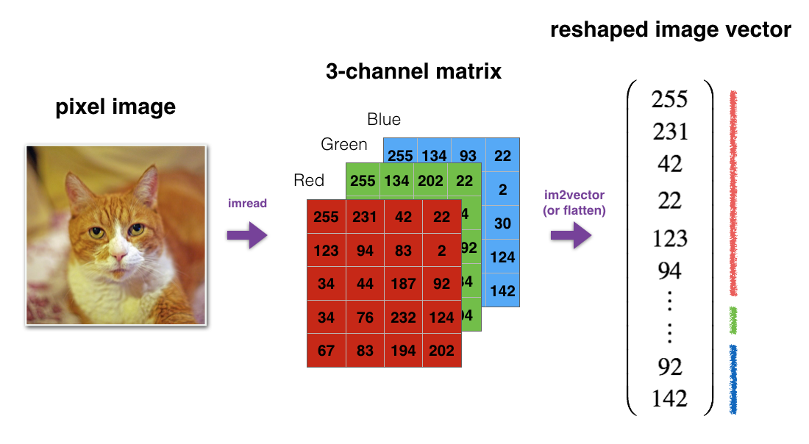
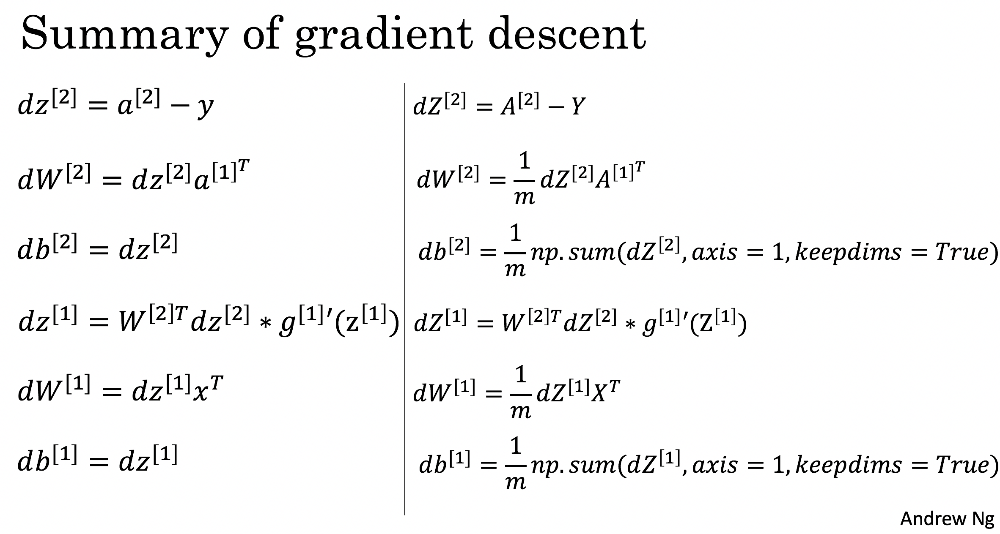
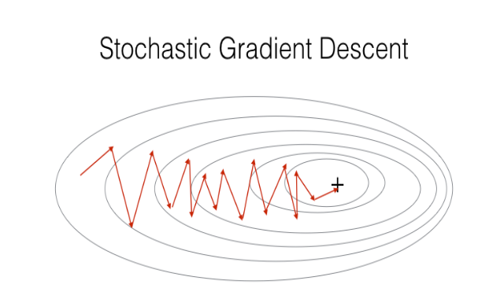
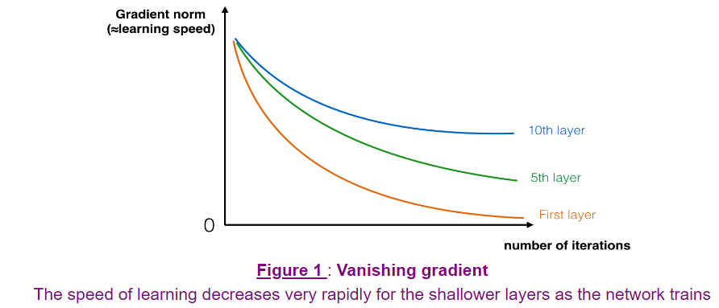
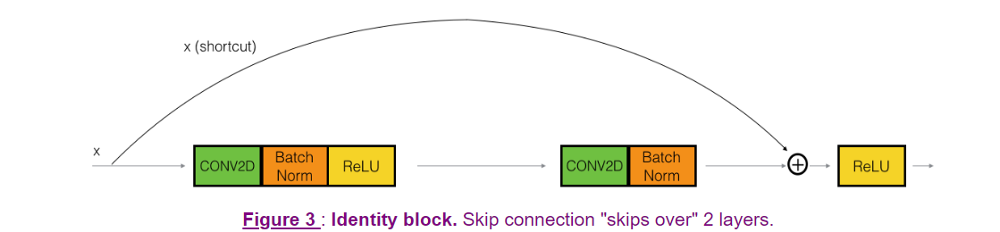
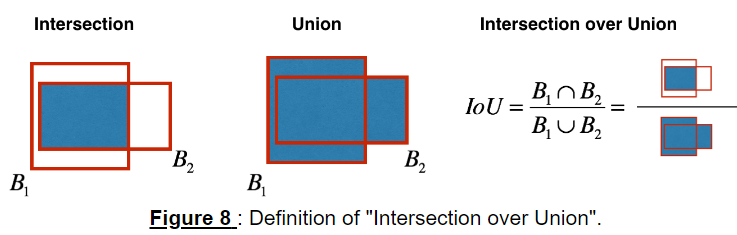

# C1

## W2A1 

### basic and numpy

tip: use np. but math. in ML

```py
import numpy as np

# example of np.exp
t_x = np.array([1, 2, 3])
print(np.exp(t_x)) # result is (exp(1), exp(2), exp(3))
```

### **sigmoid**

```py
import numpy as np
s = 1/(1+np.exp(-x))
```

### sigmoid_derivative

1. s = sigmoid(x)
2. sigmoid_derivative =  s(1 - s)

### Reshaping arrays



```python
def image2vector(image):
v = image.reshape(-1,1)
#or
v = image.reshape(1,-1).T
```

### Normalizing rows

‖𝑥‖=np.linalg.norm(x, axis=1, keepdims=True)

With `keepdims=True` the result will broadcast correctly against the original x.

`axis=1` means you are going to get the norm in a row-wise manner.

Don't try to use `x /= x_norm`. 

```py
import numpy as np
def normalize_rows(x):
x_norm = np.linalg.norm(x,axis = 1,keepdims = True)
x = x/x_norm
return x
```

### softmax

```py
x_exp = np.exp(x)
x_sum = np.sum(x_exp, axis = 1, keepdims = True)
s = x_exp / x_sum
s = s.astype("float32")
```

### Vectorization

```python
dot = np.dot(x1,x2)
outer = np.outer(x1,x2)
mul = np.multiply(x1,x2)
dot = np.dot(W,x1)
```

### loss functions

```py
def L1(yhat, y):
    """
    Arguments:
    yhat -- vector of size m (predicted labels)
    y -- vector of size m (true labels)
    
    Returns:
    loss -- the value of the L1 loss function defined above
    
	"""
    
    loss = abs(y - yhat)
```

**What you need to remember:**

- np.exp(x) works for any np.array x and applies the exponential function to every coordinate
- the sigmoid function and its gradient
- image2vector is commonly used in deep learning
- np.reshape is widely used. In the future, you'll see that keeping your matrix/vector dimensions straight will go toward eliminating a lot of bugs.
- numpy has efficient built-in functions
- broadcasting is extremely useful

- Vectorization is very important in deep learning. It provides computational efficiency and clarity.
- You have reviewed the L1 and L2 loss.
- You are familiar with many numpy functions such as np.sum, np.dot, np.multiply, np.maximum, etc...

## W2A2

### Packages

First, let's run the cell below to import all the packages that you will need during this assignment.

- [numpy](https://numpy.org/doc/1.20/) is the fundamental package for scientific computing with Python.
- [h5py](http://www.h5py.org/) is a common package to interact with a dataset that is stored on an H5 file.
- [matplotlib](http://matplotlib.org/) is a famous library to plot graphs in Python.
- [PIL](https://pillow.readthedocs.io/en/stable/) and [scipy](https://www.scipy.org/) are used here to test your model with your own picture at the end.

```py
import numpy as np
import copy
import matplotlib.pyplot as plt
import h5py
import scipy
from PIL import Image
from scipy import ndimage
from lr_utils import load_dataset
from public_tests import *

%matplotlib inline
%load_ext autoreload
%autoreload 2
```

### shape

```py
print(k.shape[0])        # shape[0]输出3，为矩阵的行数
print(k.shape[1])        # 同理shape[1]输出列数
```

### reshape

dataset is a numpy-array where each column represents a flattened image. 

There should be m_train (respectively m_test) columns.

```py
X_flatten = X.reshape(X.shape[0], -1).T      # X.T is the transpose of X
```

One common preprocessing step in machine learning is to center and **standardize** your dataset

But for picture datasets, it is simpler and more convenient and works almost as well to just divide every row of the dataset by 255 (the maximum value of a pixel channel).

```py
train_set_x = train_set_x_flatten / 255.
test_set_x = test_set_x_flatten / 255.
```

**What you need to remember:**

Common steps for pre-processing a new dataset are:

- Figure out the dimensions and shapes of the problem (m_train, m_test, num_px, ...)
- Reshape the datasets such that each example is now a vector of size (num_px * num_px * 3, 1)
- "Standardize" the data

### Building the parts of our algorithm

Loop:

- Calculate current loss (forward propagation)
- Calculate current gradient (backward propagation)
- Update parameters (gradient descent)

### Forward and Backward propagation

Forward Propagation:

- EYou get X
- You compute 𝐴
- You calculate the cost function

```py
    """
    Implement the cost function and its gradient for the propagation explained above

    Arguments:
    w -- weights, a numpy array of size (num_px * num_px * 3, 1)
    b -- bias, a scalar
    X -- data of size (num_px * num_px * 3, number of examples)
    Y -- true "label" vector (containing 0 if non-cat, 1 if cat) of size (1, number of examples)

    Return:
    cost -- negative log-likelihood cost for logistic regression
    dw -- gradient of the loss with respect to w, thus same shape as w
    db -- gradient of the loss with respect to b, thus same shape as b
    
    Tips:
    - Write your code step by step for the propagation. np.log(), np.dot()
    """
```

```python
    A = sigmoid(np.dot(w.T,X) + b) 
    cost = np.sum(((- np.log(A))*Y + (-np.log(1-A))*(1-Y)))/m
    dw = (np.dot(X,(A-Y).T))/m
    db = np.sum(A - Y) / m 
```

*`backward_propagation()`.

- Tips:
  - To compute dZ1 you'll need to compute 𝑔[1]′(𝑍[1])g[1]′(Z[1]). Since 𝑔[1](.)g[1](.) is the tanh activation function, if 𝑎=𝑔[1](𝑧)a=g[1](z) then 𝑔[1]′(𝑧)=1−𝑎2g[1]′(z)=1−a2. So you can compute 𝑔[1]′(𝑍[1])g[1]′(Z[1]) using `(1 - np.power(A1, 2))`.

```py
dZ2 = A2 - Y
dW2 = np.dot(dZ2, A1.T) / m
db2 = (1/m)*np.sum(dZ2,axis = 1,keepdims = True)
dZ1 = np.dot(W2.T,dZ2) * (1 - np.power(A1,2))
dW1 = np.dot(dZ1, X.T) / m
db1 = np.sum(dZ1,axis = 1,keepdims = True) / m
```


### Update Parameters

```py
W1 = W1 - learning_rate * dW1
b1 = b1 - learning_rate * db1
W2 = W2 - learning_rate * dW2
b2 = b2 - learning_rate * db2
```


### optimize

The goal is to learn 𝑤 and 𝑏 by minimizing the cost function 𝐽. 

For a parameter 𝜃, the update rule is 𝜃=𝜃−𝛼 𝑑𝜃=θ − αdθ, where 𝛼1 is the **learning rate**.

```py
w = copy.deepcopy(w)
b = copy.deepcopy(b) #copy all including sub list
```

```py
def optimize(w, b, X, Y, num_iterations=100, learning_rate=0.009, print_cost=False):
    """
    This function optimizes w and b by running a gradient descent algorithm
    
    Arguments:
    w -- weights, a numpy array of size (num_px * num_px * 3, 1)
    b -- bias, a scalar
    X -- data of shape (num_px * num_px * 3, number of examples)
    Y -- true "label" vector (containing 0 if non-cat, 1 if cat), of shape (1, number of examples)
    num_iterations -- number of iterations of the optimization loop
    learning_rate -- learning rate of the gradient descent update rule
    print_cost -- True to print the loss every 100 steps
    
    Returns:
    params -- dictionary containing the weights w and bias b
    grads -- dictionary containing the gradients of the weights and bias with respect to the cost function
    costs -- list of all the costs computed during the optimization, this will be used to plot the learning curve.
    
    Tips:
    You basically need to write down two steps and iterate through them:
        1) Calculate the cost and the gradient for the current parameters. Use propagate().
        2) Update the parameters using gradient descent rule for w and b.
    """
    
    w = copy.deepcopy(w)
    b = copy.deepcopy(b)
    
    costs = []
    
    for i in range(num_iterations):
        # Cost and gradient calculation 
        grads, cost = propagate(w, b, X, Y)
        
        # Retrieve derivatives from grads
        dw = grads["dw"]
        db = grads["db"]
        
        # update rule
        w = w - learning_rate*dw
        b = b - learning_rate*db
        # Record the costs
        if i % 100 == 0:
            costs.append(cost)
        
            # Print the cost every 100 training iterations
            if print_cost:
                print ("Cost after iteration %i: %f" %(i, cost))
    
    params = {"w": w,
              "b": b}
    
    grads = {"dw": dw,
             "db": db}
    
    return params, grads, costs
```

### predict

1. Calculate 𝑌̂ =𝐴=𝜎(𝑤.𝑇𝑋+𝑏)
2. Convert the entries of a into 0 (if activation <= 0.5) or 1 (if activation > 0.5), stores the predictions in a vector `Y_prediction`.

```py
def predict(w, b, X):
    '''
    Predict whether the label is 0 or 1 using learned logistic regression parameters (w, b)
    
    Arguments:
    w -- weights, a numpy array of size (num_px * num_px * 3, 1)
    b -- bias, a scalar
    X -- data of size (num_px * num_px * 3, number of examples)
    
    Returns:
    Y_prediction -- a numpy array (vector) containing all predictions (0/1) for the examples in X
    '''
    
    m = X.shape[1]
    Y_prediction = np.zeros((1, m))
    w = w.reshape(X.shape[0], 1)
    
    A = sigmoid(np.dot(w.T, X) + b)
    
    for i in range(A.shape[1]):   
    	if A[0, i] > 0.5:
            Y_prediction[0, i] = 1
        else:
            Y_prediction[0, i] = 0
```

### Compute the Cost

```python
logprobs = np.multiply(np.log(A2),Y)
cost = - np.sum(logprobs)    
```

 


# C2

## W1A1

**Initialization**

A well-chosen initialization can:

- Speed up the convergence of gradient descent
- Increase the odds of gradient descent converging to a lower training (and generalization) error

There are two types of parameters to initialize in a neural network:

- the weight matrices (𝑊[1],𝑊[2],𝑊[3],...,𝑊[𝐿−1],𝑊[𝐿])(W[1],W[2],W[3],...,W[L−1],W[L])
- the bias vectors (𝑏[1],𝑏[2],𝑏[3],...,𝑏[𝐿−1],𝑏[𝐿])

### Zero Initialization

(terrible)

```py
def initialize_parameters_zeros(layers_dims):
    """
    Arguments:
    layer_dims -- python array (list) containing the size of each layer.
    
    Returns:
    parameters -- python dictionary containing your parameters "W1", "b1", ..., "WL", "bL":
                    W1 -- weight matrix of shape (layers_dims[1], layers_dims[0])
                    b1 -- bias vector of shape (layers_dims[1], 1)
                    ...
                    WL -- weight matrix of shape (layers_dims[L], layers_dims[L-1])
                    bL -- bias vector of shape (layers_dims[L], 1)
    """
    
    parameters = {}
    L = len(layers_dims)            # number of layers in the network
    
    for l in range(1, L):
        #(≈ 2 lines of code)
        # parameters['W' + str(l)] = 
        # parameters['b' + str(l)] = 
        # YOUR CODE STARTS HERE
        parameters['W' + str(l)] = np.zeros((layers_dims[l], layers_dims[l - 1]))
        parameters['b' + str(l)] = np.zeros((layers_dims[l], 1))
        # YOUR CODE ENDS HERE
    return parameters
```

```py
Cost after iteration 0: 0.6931471805599453
Cost after iteration 1000: 0.6931471805599453
Cost after iteration 2000: 0.6931471805599453
Cost after iteration 3000: 0.6931471805599453
Cost after iteration 4000: 0.6931471805599453
Cost after iteration 5000: 0.6931471805599453
Cost after iteration 6000: 0.6931471805599453
Cost after iteration 7000: 0.6931471805599453
Cost after iteration 8000: 0.6931471805599453
Cost after iteration 9000: 0.6931471805599453
Cost after iteration 10000: 0.6931471805599455
Cost after iteration 11000: 0.6931471805599453
Cost after iteration 12000: 0.6931471805599453
Cost after iteration 13000: 0.6931471805599453
Cost after iteration 14000: 0.6931471805599453
```

On the train set:
Accuracy: 0.5
On the test set:
Accuracy: 0.5

The performance is **terrible**, the cost doesn't decrease, and the algorithm performs no better than random guessing. Why? Take a look at the details of the predictions and the decision boundary:

### Random Initialization

To break symmetry, initialize the weights randomly.

```py
    parameters['W' + str(l)] = np.random.randn(layers_dims[l], layers_dims[l - 1]) * 10
    parameters['b' + str(l)] = np.zeros((layers_dims[l], 1))
```

```
On the train set:
Accuracy: 0.83
On the test set:
Accuracy: 0.86
```

**Observations**:

- The cost starts very high. This is because with large random-valued weights, the last activation (sigmoid) outputs results that are very close to 0 or 1 for some examples, and when it gets that example wrong it incurs a very high loss for that example. Indeed, when log(𝑎[3])=log(0)log⁡(a[3])=log⁡(0), the loss goes to infinity.
- Poor initialization can lead to vanishing/exploding gradients, which also slows down the optimization algorithm.
- If you train this network longer you will see better results, but initializing with overly large random numbers slows down the optimization.

**In summary**:

- Initializing weights to very large random values doesn't work well.
- Initializing with small random values should do better. 

### He Initialization

this is named for the first author of He et al., 2015.

- Different initializations lead to very different results
- Random initialization is used to break symmetry and make sure different hidden units can learn different things
- Resist initializing to values that are too large!
- He initialization works well for networks with ReLU activations


## W1A2

### L2 Regularization

Implement `compute_cost_with_regularization()` which computes the cost given by formula (2). 

```python
np.sum(np.square(Wl))
```


```PY
L2_regularization_cost = (np.sum(np.square(W1)) + np.sum(np.square(W2)) + np.sum(np.square(W3))) * 1/m * lambd/2

cost = cross_entropy_cost + L2_regularization_cost
```

### backward_propagation_with_regularization

For each, you have to add the regularization term's gradient (𝑑𝑑𝑊(12𝜆𝑚𝑊2)=𝜆𝑚𝑊ddW(12λmW2)=λmW).

```py
dW3 = 1./m * np.dot(dZ3, A2.T) + (lambd / m)*W3
```

**Observations**:

- The value of 𝜆λ is a hyperparameter that you can tune using a dev set.
- L2 regularization makes your decision boundary smoother. If 𝜆λ is too large, it is also possible to "oversmooth", resulting in a model with high bias.

**What is L2-regularization actually doing?**:

L2-regularization relies on the assumption that a model with small weights is simpler than a model with large weights. Thus, by penalizing the square values of the weights in the cost function you drive all the weights to smaller values. It becomes too costly for the cost to have large weights! This leads to a smoother model in which the output changes more slowly as the input changes.

**What you should remember:** the implications of L2-regularization on:

- The cost computation:
  - A regularization term is added to the cost.
- The backpropagation function:
  - There are extra terms in the gradients with respect to weight matrices.
- Weights end up smaller ("weight decay"):
  - Weights are pushed to smaller values.

### Dropout

At each iteration, you shut down (= set to zero) each neuron of a layer with probability 1−𝑘𝑒𝑒𝑝_𝑝𝑟𝑜𝑏1−keep_prob or keep it with probability 𝑘𝑒𝑒𝑝_𝑝𝑟𝑜𝑏keep_prob . 

The dropped neurons don't contribute to the training in both the forward and backward propagations of the iteration.

 With dropout, your neurons thus become less sensitive to the activation of one other specific neuron, because that other neuron might be shut down at any time.

 With dropout, your neurons thus become less sensitive to the activation of one other specific neuron, because that other neuron might be shut down at any time.

### forward_propagation_with_dropout

1. creating a variable 𝑑[1]d[1] with the same shape as 𝑎[1]a[1] using `np.random.rand()` to randomly get numbers between 0 and 1.
2. Set each entry of 𝐷[1]D[1] to be 1 with probability (`keep_prob`), and 0 otherwise.
3. **Hint:**X = (X < keep_prob).astype(int)        Note that the `X = (X < keep_prob).astype(int)` works with multi-dimensional arrays, and the resulting output preserves the dimensions of the input array.

Set 𝐴[1] to 𝐴[1]∗𝐷[1]

Divide 𝐴[1]by `keep_prob`

```py
    D1 = np.random.rand(A1.shape[0], A1.shape[1])
    D1 = (D1 < keep_prob).astype(int)
    A1 = np.multiply(A1, D1)
    A1 = A1 / keep_prob
```

### Backward Propagation with Dropout

**What you should remember about dropout:**

- Dropout is a regularization technique.
- You only use dropout during training. **Don't use dropout (randomly eliminate nodes) during test time.**
- Apply dropout both during forward and backward propagation.
- During training time, divide each dropout layer by keep_prob to keep the same expected value for the activations. For example, if keep_prob is 0.5, then we will on average shut down half the nodes, so the output will be scaled by 0.5 since only the remaining half are contributing to the solution. Dividing by 0.5 is equivalent to multiplying by 2. Hence, the output now has the same expected value. You can check that this works even when keep_prob is other values than 0.5.

## W2A1

**Optimization_methods**

### Gradient Descent

𝑊[𝑙]=𝑊[𝑙]−𝛼 𝑑𝑊[𝑙]

𝑏[𝑙]=𝑏[𝑙]−𝛼 𝑑𝑏[𝑙]

```PY
        parameters["W" + str(l)] = parameters["W" + str(l)] - learning_rate * grads['dW' + str(l)]
        parameters["b" + str(l)] = parameters["b" + str(l)] - learning_rate * grads['db' + str(l)]
```




### Mini-Batch Gradient Descent

**Shuffle**: Create a shuffled version of the training set (X, Y) as shown below.


**Partition**: Partition the shuffled (X, Y) into mini-batches of size `mini_batch_size` (here 64). 


**Hint:**

𝑚𝑖𝑛𝑖_𝑏𝑎𝑡𝑐ℎ_𝑋=𝑠ℎ𝑢𝑓𝑓𝑙𝑒𝑑_𝑋[:,𝑖:𝑗]

Think of a way in which you can use the for loop variable `k` help you increment `i` and `j` in multiples of mini_batch_size.

As an example, if you want to increment in multiples of 3, you could the following:

```py
def random_mini_batches(X, Y, mini_batch_size = 64, seed = 0):
    """
    Creates a list of random minibatches from (X, Y)
    
    Arguments:
    X -- input data, of shape (input size, number of examples)
    Y -- true "label" vector (1 for blue dot / 0 for red dot), of shape (1, number of examples)
    mini_batch_size -- size of the mini-batches, integer
    
    Returns:
    mini_batches -- list of synchronous (mini_batch_X, mini_batch_Y)
    """
    
    np.random.seed(seed)            # To make your "random" minibatches the same as ours
    m = X.shape[1]                  # number of training examples
    mini_batches = []
        
    # Step 1: Shuffle (X, Y)
    permutation = list(np.random.permutation(m))
    shuffled_X = X[:, permutation]
    shuffled_Y = Y[:, permutation].reshape((1, m))
    
    inc = mini_batch_size

    # Step 2 - Partition (shuffled_X, shuffled_Y).
    # Cases with a complete mini batch size only i.e each of 64 examples.
    num_complete_minibatches = math.floor(m / mini_batch_size) # number of mini batches of size mini_batch_size in your partitionning
    for k in range(0, num_complete_minibatches):
        # (approx. 2 lines)
        # mini_batch_X =  
        # mini_batch_Y =
        # YOUR CODE STARTS HERE
        mini_batch_X = shuffled_X[:, k * mini_batch_size : (k+1)*mini_batch_size] 
        mini_batch_Y = shuffled_Y[:, k * mini_batch_size : (k+1)*mini_batch_size]
        
        # YOUR CODE ENDS HERE
        mini_batch = (mini_batch_X, mini_batch_Y)
        mini_batches.append(mini_batch)
    
    # For handling the end case (last mini-batch < mini_batch_size i.e less than 64)
    if m % mini_batch_size != 0:
        #(approx. 2 lines)
        # mini_batch_X =
        # mini_batch_Y =
        # YOUR CODE STARTS HERE
        mini_batch_X = shuffled_X[:, math.floor(m/mini_batch_size)*mini_batch_size : ]
        mini_batch_Y = shuffled_Y[:, math.floor(m/mini_batch_size)*mini_batch_size : ]
        
        # YOUR CODE ENDS HERE
        mini_batch = (mini_batch_X, mini_batch_Y)
        mini_batches.append(mini_batch)
    
    return mini_batches
```

**What you should remember**:

- Shuffling and Partitioning are the two steps required to build mini-batches
- Powers of two are often chosen to be the mini-batch size, e.g., 16, 32, 64, 128.

**Note that**:

- The velocity is initialized with zeros. So the algorithm will take a few iterations to "build up" velocity and start to take bigger steps.
- If 𝛽=0β=0, then this just becomes standard gradient descent without momentum.

###  Momentum

Because mini-batch gradient descent makes a parameter update after seeing just a subset of examples, the direction of the update has some variance, and so the path taken by mini-batch gradient descent will "oscillate" toward convergence. Using momentum can reduce these oscillations.

Momentum takes into account the past gradients to smooth out the update. The 'direction' of the previous gradients is stored in the variable 𝑣v. Formally, this will be the exponentially weighted average of the gradient on previous steps. You can also think of 𝑣v as the "velocity" of a ball rolling downhill, building up speed (and momentum) according to the direction of the gradient/slope of the hill.


**How do you choose 𝛽?**

- The larger the momentum 𝛽β is, the smoother the update, because it takes the past gradients into account more. But if 𝛽β is too big, it could also smooth out the updates too much.
- Common values for 𝛽β range from 0.8 to 0.999. If you don't feel inclined to tune this, 𝛽=0.9β=0.9 is often a reasonable default.
- Tuning the optimal 𝛽β for your model might require trying several values to see what works best in terms of reducing the value of the cost function 𝐽J.

### update_parameters_with_momentum

Now, implement the parameters update with momentum. The momentum update rule is, for 𝑙=1,...,𝐿

{𝑣𝑑𝑊[𝑙]=𝛽𝑣𝑑𝑊[𝑙]+(1−𝛽)𝑑𝑊[𝑙]𝑊[𝑙]=𝑊[𝑙]−𝛼𝑣𝑑𝑊[𝑙]

{𝑣𝑑𝑏[𝑙]=𝛽𝑣𝑑𝑏[𝑙]+(1−𝛽)𝑑𝑏[𝑙]𝑏[𝑙]=𝑏[𝑙]−𝛼𝑣𝑑𝑏[𝑙]

where L is the number of layers, 𝛽β is the momentum and 𝛼α is the learning rate. All parameters should be stored in the `parameters` dictionary. Note that the iterator `l` starts at 1 in the `for` loop as the first parameters are 𝑊[1]W[1] and 𝑏[1]b[1] (that's a "one" on the superscript).

**Note that**:

- The velocity is initialized with zeros. So the algorithm will take a few iterations to "build up" velocity and start to take bigger steps.
- If 𝛽=0β=0, then this just becomes standard gradient descent without momentum.

**How do you choose 𝛽?**

- The larger the momentum 𝛽 is, the smoother the update, because it takes the past gradients into account more. But if 𝛽β is too big, it could also smooth out the updates too much.
- Common values for 𝛽 range from 0.8 to 0.999. If you don't feel inclined to tune this, 𝛽=0.9 is often a reasonable default.
- Tuning the optimal 𝛽 for your model might require trying several values to see what works best in terms of reducing the value of the cost function 𝐽.

**What you should remember**:Momentum takes past gradients into account to smooth out the steps of gradient descent. It can be applied with batch gradient descent, mini-batch gradient descent or stochastic gradient descent.You have to tune a momentum hyperparameter 𝛽 and a learning rate 𝛼.

### adam


```PY
def update_parameters_with_adam(parameters, grads, v, s, t, learning_rate = 0.01,
                                beta1 = 0.9, beta2 = 0.999,  epsilon = 1e-8):
    """
    Update parameters using Adam
    
    Arguments:
    parameters -- python dictionary containing your parameters:
                    parameters['W' + str(l)] = Wl
                    parameters['b' + str(l)] = bl
    grads -- python dictionary containing your gradients for each parameters:
                    grads['dW' + str(l)] = dWl
                    grads['db' + str(l)] = dbl
    v -- Adam variable, moving average of the first gradient, python dictionary
    s -- Adam variable, moving average of the squared gradient, python dictionary
    learning_rate -- the learning rate, scalar.
    beta1 -- Exponential decay hyperparameter for the first moment estimates 
    beta2 -- Exponential decay hyperparameter for the second moment estimates 
    epsilon -- hyperparameter preventing division by zero in Adam updates

    Returns:
    parameters -- python dictionary containing your updated parameters 
    v -- Adam variable, moving average of the first gradient, python dictionary
    s -- Adam variable, moving average of the squared gradient, python dictionary
    """
    
    L = len(parameters) // 2                 # number of layers in the neural networks
    v_corrected = {}                         # Initializing first moment estimate, python dictionary
    s_corrected = {}                         # Initializing second moment estimate, python dictionary
    
    # Perform Adam update on all parameters
    for l in range(L):
        # Moving average of the gradients. Inputs: "v, grads, beta1". Output: "v".
        ### START CODE HERE ### (approx. 2 lines)
        v["dW" + str(l+1)] = beta1*v["dW" + str(l+1)] + (1 - beta1)*grads['dW' + str(l+1)]
        v["db" + str(l+1)] = beta1*v["db" + str(l+1)] + (1 - beta1)*grads['db' + str(l+1)]
        ### END CODE HERE ###

        # Compute bias-corrected first moment estimate. Inputs: "v, beta1, t". Output: "v_corrected".
        ### START CODE HERE ### (approx. 2 lines)
        v_corrected["dW" + str(l+1)] = v["dW" + str(l+1)]/(1 - beta1**t)
        v_corrected["db" + str(l+1)] = v["db" + str(l+1)]/(1 - beta1**t)
        ### END CODE HERE ###

        # Moving average of the squared gradients. Inputs: "s, grads, beta2". Output: "s".
        ### START CODE HERE ### (approx. 2 lines)
        s["dW" + str(l+1)] = beta2*s["dW" + str(l+1)] + (1 - beta2)*np.square(grads['dW' + str(l+1)])
        s["db" + str(l+1)] = beta2*s["db" + str(l+1)] + (1 - beta2)*np.square(grads['db' + str(l+1)])
        ### END CODE HERE ###

        # Compute bias-corrected second raw moment estimate. Inputs: "s, beta2, t". Output: "s_corrected".
        ### START CODE HERE ### (approx. 2 lines)
        s_corrected["dW" + str(l+1)] = s["dW" + str(l+1)]/(1 - beta2**t)
        s_corrected["db" + str(l+1)] = s["db" + str(l+1)]/(1 - beta2**t)
        ### END CODE HERE ###

        # Update parameters. Inputs: "parameters, learning_rate, v_corrected, s_corrected, epsilon". Output: "parameters".
        ### START CODE HERE ### (approx. 2 lines)
        parameters["W" + str(l+1)] = parameters["W" + str(l+1)] - learning_rate*v_corrected["dW" + str(l+1)]/(np.sqrt(s_corrected["dW" + str(l+1)])+epsilon)
        parameters["b" + str(l+1)] = parameters["b" + str(l+1)] - learning_rate*v_corrected["db" + str(l+1)]/(np.sqrt(s_corrected["db" + str(l+1)])+epsilon)
        ### END CODE HERE ###

    return parameters, v, s
```

### Summary

| **optimization method** | **accuracy** | **cost shape** |
| ----------------------- | ------------ | -------------- |
| Gradient descent        | >71%         | smooth         |
| Momentum                | >71%         | smooth         |
| Adam                    | >94%         | smoother       |

Momentum usually helps, but given the small learning rate and the simplistic dataset, its impact is almost negligible.

On the other hand, Adam clearly outperforms mini-batch gradient descent and Momentum. If you run the model for more epochs on this simple dataset, all three methods will lead to very good results. However, you've seen that Adam converges a lot faster.

Some advantages of Adam include:

- Relatively low memory requirements (though higher than gradient descent and gradient descent with momentum)
  - Usually works well even with little tuning of hyperparameters (except 𝛼α)


## W3A1

**TensorFlow**

### Linear Function

define a constant X with the shape (3,1)

```python
X = tf.constant(np.random.randn(3,1), name = "X")
```

Note that the difference between `tf.constant` and `tf.Variable` is that you can modify the state of a `tf.Variable` but cannot change the state of a `tf.constant`.

- tf.matmul(..., ...) to do a matrix multiplication
- tf.add(..., ...) to do an addition
- np.random.randn(...) to initialize randomly

### sigmoid

Cast your tensor to type `float32` using `tf.cast`, then compute the sigmoid using `tf.keras.activations.sigmoid`.

- `tf.cast("...", tf.float32)`
- `tf.keras.activations.sigmoid("...")`

### One Hot Encodings


Many times in deep learning you will have a  𝑌  vector with numbers ranging from  0  to  𝐶−1 , where  𝐶  is the number of classes.

- [tf.one_hot(labels, depth, axis=0)]

`axis=0` indicates the new axis is created at dimension 0

### Forward Propagation

```python
@tf.function
def forward_propagation(X, parameters):
    Z1 = tf.add(tf.matmul(W1, X), b1)
    A1 = tf.keras.activations.relu(Z1)
    Z2 = tf.add(tf.matmul(W2, A1), b2)
    A2 = tf.keras.activations.relu(Z2)
    Z3 = tf.add(tf.matmul(W3, A2), b3)
    
```

### compute_cost

- It's important to note that the "`y_pred`" and "`y_true`" inputs of `tf.keras.losses.binary_crossentropy`are expected to be of shape (number of examples, num_classes). Since both the transpose and the original tensors have the same values, just in different order, the result of calculating the binary_crossentropy should be the same if you transpose or not the logits and labels. Just for reference here is how the Binary Cross entropy is calculated in TensorFlow:

```
mean_reduce(max(logits, 0) - logits * labels + log(1 + exp(-abs(logits))), axis=-1)
```

- `tf.reduce_mean` basically does the summation over the examples.

```py
cost = tf.reduce_mean(tf.keras.losses.binary_crossentropy(labels,logits,from_logits=True))
```

# C4 

## W1A1 

**Convolutional Neural Networks**

- Explain the convolution operation
- Apply two different types of pooling operation
- Identify the components used in a convolutional neural network (padding, stride, filter, ...) and their purpose
- Build a convolutional neural network

**Outline of the Assignment**

- Convolution functions, including:
  - Zero Padding
  - Convolve window
  - Convolution forward
  - Convolution backward (optional)
- Pooling functions, including:
  - Pooling forward
  - Create mask
  - Distribute value
  - Pooling backward (optional)


The main benefits of padding are:

- It allows you to use a CONV layer without necessarily shrinking the height and width of the volumes. This is important for building deeper networks, since otherwise the height/width would shrink as you go to deeper layers. An important special case is the "same" convolution, in which the height/width is exactly preserved after one layer.
- It helps us keep more of the information at the border of an image. Without padding, very few values at the next layer would be affected by pixels at the edges of an image.

### zero_pad

if you want to pad the array "a" of shape(5,5,5,5,5) with `pad = 1` for the 2nd dimension, `pad = 3` for the 4th dimension and `pad = 0` for the rest, you would do:

```python
a = np.pad(a, ((0,0), (1,1), (0,0), (3,3), (0,0)), mode='constant', constant_values = (0,0))
```

```py
    Argument:
    X -- python numpy array of shape (m, n_H, n_W, n_C) representing a batch of m images
    pad -- integer, amount of padding around each image on vertical and horizontal dimensions
    
    Returns:
    X_pad -- padded image of shape (m, n_H + 2 * pad, n_W + 2 * pad, n_C)
    
    X_pad = np.pad(X, ((0,0), (pad,pad), (pad,pad), (0,0)), mode = 'constant', constant_values = (0,0))
```


### Single Step of  Convolution

- Takes an input volume
- Applies a filter at every position of the input
- Outputs another volume (usually of different size)

### Forward Pass

- `A_prev`, the activations output by the previous layer (for a batch of m inputs);
- Weights are denoted by `W`. The filter window size is `f` by `f`.
- The bias vector is `b`, where each filter has its own (single) bias.

**Hint**:

1. To select a 2x2 slice at the upper left corner of a matrix "a_prev" (shape (5,5,3)), you would do:

   ```python
   a_slice_prev = a_prev[0:2,0:2,:]
   ```

   Notice how this gives a 3D slice that has height 2, width 2, and depth 3. Depth is the number of channels.
   This will be useful when you will define `a_slice_prev` below, using the `start/end` indexes you will define.

2. To define a_slice you will need to first define its corners `vert_start`, `vert_end`, `horiz_start` and `horiz_end`. This figure may be helpful for you to find out how each of the corners can be defined using h, w, f and s in the code below.


​    

```py
def conv_forward(A_prev, W, b, hparameters):
        """
    Implements the forward propagation for a convolution function
    Arguments:
    A_prev -- output activations of the previous layer, 
        numpy array of shape (m, n_H_prev, n_W_prev, n_C_prev)
    W -- Weights, numpy array of shape (f, f, n_C_prev, n_C)
    b -- Biases, numpy array of shape (1, 1, 1, n_C)
    hparameters -- python dictionary containing "stride" and "pad"

    Returns:
    Z -- conv output, numpy array of shape (m, n_H, n_W, n_C)
    cache -- cache of values needed for the conv_backward() function
    """

    # Retrieve dimensions from A_prev's shape (≈1 line)  
    # (m, n_H_prev, n_W_prev, n_C_prev) = None
    (m, n_H_prev, n_W_prev, n_C_prev) = A_prev.shape

    # Retrieve dimensions from W's shape (≈1 line)
    # (f, f, n_C_prev, n_C) = None
    (f, f, n_C_prev, n_C) = W.shape

    # Retrieve information from "hparameters" (≈2 lines)
    # stride = None
    # pad = None
    stride = hparameters['stride']
    pad    = hparameters['pad']

    # Compute the dimensions of the CONV output volume using the formula given above. 
    # Hint: use int() to apply the 'floor' operation. (≈2 lines)
    # n_H = None
    # n_W = None
    n_H = int((n_H_prev - f + 2*pad) / stride + 1)
    n_W = int((n_W_prev - f + 2*pad) / stride + 1)

    # Initialize the output volume Z with zeros. (≈1 line)
    # Z = None
    Z = np.zeros((m, n_H, n_W, n_C))

    # Create A_prev_pad by padding A_prev
    # A_prev_pad = None
    A_prev_pad = zero_pad(A_prev, pad)

    # for i in range(None):               # loop over the batch of training examples
        # a_prev_pad = None               # Select ith training example's padded activation
        # for h in range(None):           # loop over vertical axis of the output volume
            # Find the vertical start and end of the current "slice" (≈2 lines)
            # vert_start = None
            # vert_end = None

            # for w in range(None):       # loop over horizontal axis of the output volume
                # Find the horizontal start and end of the current "slice" (≈2 lines)
                # horiz_start = None
                # horiz_end = None

                # for c in range(None):   # loop over channels (= #filters) of the output volume

                    # Use the corners to define the (3D) slice of a_prev_pad (See Hint above the cell). (≈1 line)
                    # a_slice_prev = None

                    # Convolve the (3D) slice with the correct filter W and bias b, to get back one output neuron. (≈3 line)
                    # weights = None
                    # biases = None
                    # Z[i, h, w, c] = None
    # YOUR CODE STARTS HERE
    for i in range(m):
        a_prev_pad = A_prev_pad[i]
        for h in range(n_H):
            vert_start = h * stride
            vert_end   = vert_start + f

            for w in range(n_W):
                horiz_start = w * stride
                horiz_end   = horiz_start + f

                for c in range(n_C):
                    a_slice_prev = a_prev_pad[vert_start:vert_end, horiz_start:horiz_end, :]
                    weights = W[:, :, :, c]
                    bias    = b[:, :, :, c]
                    Z[i, h, w, c] = conv_single_step(a_slice_prev, weights, bias)

    # YOUR CODE ENDS HERE

    # Save information in "cache" for the backprop
    cache = (A_prev, W, b, hparameters)

    return Z, cache
```


### Pooling Layer

The pooling (POOL) layer reduces the height and width of the input. It helps reduce computation, as well as helps make feature detectors more invariant to its position in the input. The two types of pooling layers are:

- Max-pooling layer: slides an ( 𝑓,𝑓 ) window over the input and stores the max value of the window in the output.

- Average-pooling layer: slides an ( 𝑓,𝑓 ) window over the input and stores the average value of the window in the output.


```py
    n_H = int(1 + (n_H_prev - f) / stride)
    n_W = int(1 + (n_W_prev - f) / stride)
    n_C = n_C_prev
    
for i in range(m):
    for h in range(n_H):
        vert_start = h * stride
        vert_end   = vert_start + f
        for w in range(n_W):
            horiz_start = w * stride
            horiz_end   = horiz_start + f
            for c in range(n_C):
                a_prev_slice = A_prev[i, vert_start:vert_end, horiz_start:horiz_end, c]
                if mode == 'max':
                    A[i, h, w, c] = np.max(a_prev_slice)
                elif mode == 'average':
                    A[i, h, w, c] = np.mean(a_prev_slice)
```

**What you should remember**:

- A convolution extracts features from an input image by taking the dot product between the input data and a 2D array of weights (the filter).
- The 2D output of the convolution is called the feature map
- A convolution layer is where the filter slides over the image and computes the dot product
  - This transforms the input volume into an output volume of different size
- Zero padding helps keep more information at the image borders, and is helpful for building deeper networks, because you can build a CONV layer without shrinking the height and width of the volumes
- Pooling layers gradually reduce the height and width of the input by sliding a 2D window over each specified region, then summarizing the features in that region


### Backpropagation

#### Computing dA:

the formula for computing  𝑑𝐴  with respect to the cost for a certain filter  𝑊𝑐


```python
da_prev_pad[vert_start:vert_end, horiz_start:horiz_end, :] += W[:,:,:,c] * dZ[i, h, w, c]
```

Where  𝑊𝑐  is a filter and  𝑑𝑍ℎ𝑤  is a scalar.

Note that at each time, you multiply the the same filter  𝑊𝑐  by a different dZ when updating dA.

#### Computing dW:

This is the formula for computing 𝑑𝑊𝑐dWc (𝑑𝑊𝑐dWc is the derivative of one filter) with respect to the loss:


Where  𝑎𝑠𝑙𝑖𝑐𝑒  corresponds to the slice which was used to generate the activation  𝑍𝑖𝑗 . Hence, this ends up giving us the gradient for  𝑊  with respect to that slice. Since it is the same  𝑊 , we will just add up all such gradients to get  𝑑𝑊 .

```python
dW[:,:,:,c] \mathrel{+}= a_slice * dZ[i, h, w, c]
```

#### Computing db:

This is the formula for computing 𝑑𝑏db with respect to the cost for a certain filter 𝑊𝑐:


```python
db[:,:,:,c] += dZ[i, h, w, c]
```

```py
def conv_backward(dZ, cache):
"""
Implement the backward propagation for a convolution function

Arguments:
dZ -- gradient of the cost with respect to the output of the conv layer (Z), numpy array of shape (m, n_H, n_W, n_C)
cache -- cache of values needed for the conv_backward(), output of conv_forward()

Returns:
dA_prev -- gradient of the cost with respect to the input of the conv layer (A_prev),
           numpy array of shape (m, n_H_prev, n_W_prev, n_C_prev)
dW -- gradient of the cost with respect to the weights of the conv layer (W)
      numpy array of shape (f, f, n_C_prev, n_C)
db -- gradient of the cost with respect to the biases of the conv layer (b)
      numpy array of shape (1, 1, 1, n_C)
"""    
```

```python
# Retrieve information from "cache"
# (A_prev, W, b, hparameters) = None
# Retrieve dimensions from A_prev's shape
(A_prev, W, b, hparameters) = cache
(m, n_H_prev, n_W_prev, n_C_prev) = A_prev.shape
# Retrieve dimensions from W's shape
(f, f, n_C_prev, n_C) = W.shape

# Retrieve information from "hparameters"
# stride = None
# pad = None
stride = hparameters['stride']
pad    = hparameters['pad']

# Retrieve dimensions from dZ's shape
# (m, n_H, n_W, n_C) = None
(m, n_H, n_W, n_C) = dZ.shape

# Initialize dA_prev, dW, db with the correct shapes
# dA_prev = None                          
# dW = None
# db = None
dA_prev = np.zeros((m, n_H_prev, n_W_prev, n_C_prev))
dW      = np.zeros((f, f, n_C_prev, n_C))
db      = np.zeros((1, 1, 1, n_C))
# Pad A_prev and dA_prev
A_prev_pad  = zero_pad(A_prev, pad)
dA_prev_pad = zero_pad(dA_prev, pad)

for i in range(m):                       # loop over the training examples
    
    # select ith training example from A_prev_pad and dA_prev_pad
    a_prev_pad  = A_prev_pad[i]
    da_prev_pad = dA_prev_pad[i]
    
    for h in range(n_H):                   # loop over vertical axis of the output volume
        for w in range(n_W):               # loop over horizontal axis of the output volume
            for c in range(n_C):           # loop over the channels of the output volume
                
                # Find the corners of the current "slice"
                vert_start  = h * stride
                vert_end    = vert_start + f
                horiz_start = w * stride
                horiz_end   = horiz_start + f

                # Use the corners to define the slice from a_prev_pad
                a_slice = a_prev_pad[vert_start:vert_end, horiz_start:horiz_end, :]

                # Update gradients for the window and the filter's parameters using the code formulas given above
                da_prev_pad[vert_start:vert_end, horiz_start:horiz_end, :] += W[..., c] * dZ[i, h, w, c]
                # da_prev_pad[vert_start:vert_end, horiz_start:horiz_end, :] += None
                dW[:,:,:,c] += a_slice * dZ[i, h, w, c]
                db[:,:,:,c] += dZ[i, h, w, c]
                
    # Set the ith training example's dA_prev to the unpadded da_prev_pad (Hint: use X[pad:-pad, pad:-pad, :])
    dA_prev[i, :, :, :] = da_prev_pad[pad:-pad, pad:-pad, :]
# YOUR CODE STARTS HERE
```


​    

## W1A2

### Create the Sequential Model

You can also add layers incrementally to a Sequential model with the `.add()` method, or remove them using the `.pop()` method, much like you would in a regular Python list.

Actually, you can think of a Sequential model as behaving like a list of layers. Like Python lists, Sequential layers are ordered, and the order in which they are specified matters. If your model is non-linear or contains layers with multiple inputs or outputs, a Sequential model wouldn't be the right choice!

#### happyModel


```py
def happyModel():
    """
    Implements the forward propagation for the binary classification model:
    ZEROPAD2D -> CONV2D -> BATCHNORM -> RELU -> MAXPOOL -> FLATTEN -> DENSE
return modelNote that for simplicity and grading purposes, you'll hard-code all the values
such as the stride and kernel (filter) sizes. 
Normally, functions should take these values as function parameters.

Arguments:
None

Returns:
model -- TF Keras model (object containing the information for the entire training process) 
"""
model = tf.keras.Sequential([
        tf.keras.Input(shape = (64, 64, 3)),
        ## ZeroPadding2D with padding 3, input shape of 64 x 64 x 3
        tf.keras.layers.ZeroPadding2D(padding=3, data_format = "channels_last"),
        ## Conv2D with 32 7x7 filters and stride of 1
        tf.keras.layers.Conv2D(32, 7),
        ## BatchNormalization for axis 3
        tf.keras.layers.BatchNormalization(axis = 3),
        ## ReLU
        tf.keras.layers.ReLU(),
        ## Max Pooling 2D with default parameters
        tf.keras.layers.MaxPool2D(),
        ## Flatten layer
        tf.keras.layers.Flatten(),
        ## Dense layer with 1 unit for output & 'sigmoid' activation
        tf.keras.layers.Dense(1, activation = 'sigmoid')
        return model
```

### Forward Propagation 

- **tf.keras.layers.Conv2D(filters= ... , kernel_size= ... , padding='same')(input_img):** Read the full documentation on [Conv2D](https://www.tensorflow.org/api_docs/python/tf/keras/layers/Conv2D).
- **tf.keras.layers.MaxPool2D(pool_size=(f, f), strides=(s, s), padding='same'):** `MaxPool2D()` downsamples your input using a window of size (f, f) and strides of size (s, s) to carry out max pooling over each window. For max pooling, you usually operate on a single example at a time and a single channel at a time. Read the full documentation on [MaxPool2D](https://www.tensorflow.org/api_docs/python/tf/keras/layers/MaxPool2D).
- **tf.keras.layers.ReLU():** computes the elementwise ReLU of Z (which can be any shape). You can read the full documentation on [ReLU](https://www.tensorflow.org/api_docs/python/tf/keras/layers/ReLU).
- **tf.keras.layers.Flatten()**: given a tensor "P", this function takes each training (or test) example in the batch and flattens it into a 1D vector.
  - If a tensor P has the shape (batch_size,h,w,c), it returns a flattened tensor with shape (batch_size, k), where 𝑘=ℎ×𝑤×𝑐k=h×w×c. "k" equals the product of all the dimension sizes other than the first dimension.
  - For example, given a tensor with dimensions [100, 2, 3, 4], it flattens the tensor to be of shape [100, 24], where 24 = 2 * 3 * 4. You can read the full documentation on [Flatten](https://www.tensorflow.org/api_docs/python/tf/keras/layers/Flatten).
- **tf.keras.layers.Dense(units= ... , activation='softmax')(F):** given the flattened input F, it returns the output computed using a fully connected layer. You can read the full documentation on [Dense](https://www.tensorflow.org/api_docs/python/tf/keras/layers/Dense).

In the last function above (`tf.keras.layers.Dense()`), the fully connected layer automatically initializes weights in the graph and keeps on training them as you train the model. Hence, you did not need to initialize those weights when initializing the parameters.

Lastly, before creating the model, you'll need to define the output using the last of the function's compositions (in this example, a Dense layer):

- **outputs = tf.keras.layers.Dense(units=6, activation='softmax')(F)**

#### Window, kernel, filter, pool

The words "kernel" and "filter" are used to refer to the same thing. The word "filter" accounts for the amount of "kernels" that will be used in a single convolution layer. "Pool" is the name of the operation that takes the max or average value of the kernels.

This is why the parameter `pool_size` refers to `kernel_size`, and you use `(f,f)` to refer to the filter size.

Pool size and kernel size refer to the same thing in different objects - They refer to the shape of the window where the operation takes place.

plug in the following parameters for all the steps:

- [Conv2D](https://www.tensorflow.org/api_docs/python/tf/keras/layers/Conv2D): Use 8 4 by 4 filters, stride 1, padding is "SAME"
- [ReLU](https://www.tensorflow.org/api_docs/python/tf/keras/layers/ReLU)
- [MaxPool2D](https://www.tensorflow.org/api_docs/python/tf/keras/layers/MaxPool2D): Use an 8 by 8 filter size and an 8 by 8 stride, padding is "SAME"
- **Conv2D**: Use 16 2 by 2 filters, stride 1, padding is "SAME"
- **ReLU**
- **MaxPool2D**: Use a 4 by 4 filter size and a 4 by 4 stride, padding is "SAME"
- [Flatten](https://www.tensorflow.org/api_docs/python/tf/keras/layers/Flatten) the previous output.
- Fully-connected ([Dense](https://www.tensorflow.org/api_docs/python/tf/keras/layers/Dense)) layer: Apply a fully connected layer with 6 neurons and a softmax activation.

```python
def convolutional_model(input_shape):
    """
    Implements the forward propagation for the model:
    CONV2D -> RELU -> MAXPOOL -> CONV2D -> RELU -> MAXPOOL -> FLATTEN -> DENSE
    
Note that for simplicity and grading purposes, you'll hard-code some values
such as the stride and kernel (filter) sizes. 
Normally, functions should take these values as function parameters.

Arguments:
input_img -- input dataset, of shape (input_shape)

Returns:
model -- TF Keras model (object containing the information for the entire training process) 
"""

input_img = tf.keras.Input(shape=input_shape)
## CONV2D: 8 filters 4x4, stride of 1, padding 'SAME'
# Z1 = None
## RELU
# A1 = None
## MAXPOOL: window 8x8, stride 8, padding 'SAME'
# P1 = None
## CONV2D: 16 filters 2x2, stride 1, padding 'SAME'
# Z2 = None
## RELU
# A2 = None
## MAXPOOL: window 4x4, stride 4, padding 'SAME'
# P2 = None
## FLATTEN
# F = None
## Dense layer
## 6 neurons in output layer. Hint: one of the arguments should be "activation='softmax'" 
# outputs = None
model = tf.keras.Model(inputs=input_img, outputs=outputs)
return model
```


​    

## W2A1

### The Problem of Very Deep Neural Networks

In recent years, neural networks have become much deeper, with state-of-the-art networks evolving from having just a few layers (e.g., AlexNet) to over a hundred layers

- The main benefit of a very deep network is that it can represent very complex functions. It can also learn features at many different levels of abstraction, **from edges** (at the shallower layers, closer to the input) **to very complex features** (at the deeper layers, closer to the output).
- However, using a deeper network doesn't always help. A huge barrier to training them is vanishing gradients: very deep networks often have a gradient signal that goes to zero quickly, thus making gradient descent prohibitively slow.
- More specifically, during gradient descent, as you backpropagate from the final layer back to the first layer, you are multiplying by the weight matrix on each step, and thus the gradient can decrease exponentially quickly to zero (or, in rare cases, grow exponentially quickly and "explode," from gaining very large values).
- During training, you might therefore see the magnitude (or norm) of the gradient for the shallower layers decrease to zero very rapidly as training proceeds, as shown below:

Solve this problem by building a Residual Network!

###  Building a Residual Network


The image on the left shows the "**main path**" through the network. The image on the right adds a **shortcut** to the main path. 

### The Identity Block




```py
def identity_block(X, f, filters, training=True, initializer=random_uniform):
    """
    Implementation of the identity block as defined in Figure 4
    
    Arguments:
    X -- input tensor of shape (m, n_H_prev, n_W_prev, n_C_prev)
    f -- integer, specifying the shape of the middle CONV's window for the main path
    filters -- python list of integers, defining the number of filters in the CONV layers of the main path
    training -- True: Behave in training mode
                False: Behave in inference mode
    initializer -- to set up the initial weights of a layer. Equals to random uniform initializer
    
    Returns:
    X -- output of the identity block, tensor of shape (n_H, n_W, n_C)
    """
    
    # Retrieve Filters
    F1, F2, F3 = filters
    
    # Save the input value. You'll need this later to add back to the main path. 
    X_shortcut = X
    
    # First component of main path
    X = Conv2D(filters = F1, kernel_size = 1, strides = (1,1), padding = 'valid', kernel_initializer = initializer(seed=0))(X)
    X = BatchNormalization(axis = 3)(X, training = training) # Default axis
    X = Activation('relu')(X)
    
    ### START CODE HERE
    ## Second component of main path (≈3 lines)
    X = Conv2D(filters = F2, kernel_size = f, strides = (1,1), padding = 'same', kernel_initializer = initializer(seed=0))(X)
    X = BatchNormalization(axis = 3)(X, training = training)
    X = Activation('relu')(X) 

    ## Third component of main path (≈2 lines)
    X = Conv2D(filters = F3, kernel_size = 1, strides = (1,1), padding = 'valid', kernel_initializer = initializer(seed=0))(X)
    X = BatchNormalization(axis = 3)(X, training = training) 
    
    ## Final step: Add shortcut value to main path, and pass it through a RELU activation (≈2 lines)
    X = Add()([X_shortcut,X])
    X = Activation('relu')(X)  
    ### END CODE HERE

    return X
```

### The Convolutional Block


The ResNet "convolutional block" ,You can use this type of block when the input and output **dimensions don't match up**. 


### Building Your First ResNet Model (50 layers)


The details of this ResNet-50 model are:

- Zero-padding pads the input with a pad of (3,3)
- Stage 1:
  - The 2D Convolution has 64 filters of shape (7,7) and uses a stride of (2,2).
  - BatchNorm is applied to the 'channels' axis of the input.
  - MaxPooling uses a (3,3) window and a (2,2) stride.
- Stage 2:
  - The convolutional block uses three sets of filters of size [64,64,256], "f" is 3, and "s" is 1.
  - The 2 identity blocks use three sets of filters of size [64,64,256], and "f" is 3.
- Stage 3:
  - The convolutional block uses three sets of filters of size [128,128,512], "f" is 3 and "s" is 2.
  - The 3 identity blocks use three sets of filters of size [128,128,512] and "f" is 3.
- Stage 4:
  - The convolutional block uses three sets of filters of size [256, 256, 1024], "f" is 3 and "s" is 2.
  - The 5 identity blocks use three sets of filters of size [256, 256, 1024] and "f" is 3.
- Stage 5:
  - The convolutional block uses three sets of filters of size [512, 512, 2048], "f" is 3 and "s" is 2.
  - The 2 identity blocks use three sets of filters of size [512, 512, 2048] and "f" is 3.
- The 2D Average Pooling uses a window of shape (2,2).
- The 'flatten' layer doesn't have any hyperparameters.
- The Fully Connected (Dense) layer reduces its input to the number of classes using a softmax activation.

```py
def ResNet50(input_shape = (64, 64, 3), classes = 6):
    """
    Stage-wise implementation of the architecture of the popular ResNet50:
    CONV2D -> BATCHNORM -> RELU -> MAXPOOL -> CONVBLOCK -> IDBLOCK*2 -> CONVBLOCK -> IDBLOCK*3
    -> CONVBLOCK -> IDBLOCK*5 -> CONVBLOCK -> IDBLOCK*2 -> AVGPOOL -> FLATTEN -> DENSE 

    Arguments:
    input_shape -- shape of the images of the dataset
    classes -- integer, number of classes

    Returns:
    model -- a Model() instance in Keras
    """
    
    # Define the input as a tensor with shape input_shape
    X_input = Input(input_shape)

    
    # Zero-Padding
    X = ZeroPadding2D((3, 3))(X_input)
    
    # Stage 1
    X = Conv2D(64, (7, 7), strides = (2, 2), kernel_initializer = glorot_uniform(seed=0))(X)
    X = BatchNormalization(axis = 3)(X)
    X = Activation('relu')(X)
    X = MaxPooling2D((3, 3), strides=(2, 2))(X)

    # Stage 2
    X = convolutional_block(X, f = 3, filters = [64, 64, 256], s = 1)
    X = identity_block(X, 3, [64, 64, 256])
    X = identity_block(X, 3, [64, 64, 256])

    ### START CODE HERE
    
    ## Stage 3 (≈4 lines)
    X = convolutional_block(X, f = 3, filters = [128, 128, 512], s = 2) 
    X = identity_block(X, 3, [128, 128, 512])  
    X = identity_block(X, 3, [128, 128, 512])
    X = identity_block(X, 3, [128, 128, 512]) 
    
    ## Stage 4 (≈6 lines)
    X = convolutional_block(X, f = 3, filters = [256, 256, 1024], s = 2) 
    X = identity_block(X, 3, [256, 256, 1024])  
    X = identity_block(X, 3, [256, 256, 1024])
    X = identity_block(X, 3, [256, 256, 1024])
    X = identity_block(X, 3, [256, 256, 1024])
    X = identity_block(X, 3, [256, 256, 1024])

    ## Stage 5 (≈3 lines)
    X = convolutional_block(X, f = 3, filters = [512, 512, 2048], s = 2) 
    X = identity_block(X, 3, [512, 512, 2048])
    X = identity_block(X, 3, [512, 512, 2048]) 

    ## AVGPOOL (≈1 line). Use "X = AveragePooling2D(...)(X)"
    X = AveragePooling2D(
    pool_size=(2, 2),
    strides=None,
    padding='valid',
    data_format=None,
    )(X) 
    
    ### END CODE HERE

    # output layer
    X = Flatten()(X)
    X = Dense(classes, activation='softmax', kernel_initializer = glorot_uniform(seed=0))(X)
    
    
    # Create model
    model = Model(inputs = X_input, outputs = X)

    return model
```

**What you should remember**:

- Very deep "plain" networks don't work in practice because vanishing gradients make them hard to train.
- Skip connections help address the Vanishing Gradient problem. They also make it easy for a ResNet block to learn an identity function.
- There are two main types of blocks: The **identity block** and the **convolutional block**.
- Very deep Residual Networks are built by stacking these blocks together.


## W2A2

Transfer Learning with **MobileNetV2**

A pre-trained model is a network that's already been trained on a large dataset and saved, which allows you to use it to customize your own model cheaply and efficiently. The one you'll be using, MobileNetV2, was designed to provide fast and computationally efficient performance. It's been pre-trained on ImageNet, a dataset containing over 14 million images and 1000 classes.

- Create a dataset from a directory
- Preprocess and augment data using the Sequential API
- Adapt a pretrained model to new data and train a classifier using the Functional API and MobileNet
- Fine-tune a classifier's final layers to improve accuracy

### Preprocess and Augment Training Data

You can set the number of elements to prefetch manually, or you can use `tf.data.experimental.AUTOTUNE` to choose the parameters automatically. Autotune prompts `tf.data` to tune that value dynamically at runtime, by tracking the time spent in each operation and feeding those times into an optimization algorithm. The optimization algorithm tries to find the best allocation of its CPU budget across all tunable operations.

```py
AUTOTUNE = tf.data.experimental.AUTOTUNE
train_dataset = train_dataset.prefetch(buffer_size=AUTOTUNE)
```

Implement a function for data augmentation. Use a `Sequential` keras model composed of 2 layers:

```py
def data_augmenter():
    '''
    Create a Sequential model composed of 2 layers
    Returns:
        tf.keras.Sequential
    '''
    ### START CODE HERE
    data_augmentation = tf.keras.Sequential()
    data_augmentation.add(RandomFlip("horizontal"))
    data_augmentation.add(RandomRotation(0.2))
    ### END CODE HERE
    
    return data_augmentation
```

**What you should remember:**

- When calling image_data_set_from_directory(), specify the train/val subsets and match the seeds to prevent overlap
- Use prefetch() to prevent memory bottlenecks when reading from disk
- Give your model more to learn from with simple data augmentations like rotation and flipping.
- When using a pretrained model, it's best to reuse the weights it was trained on.


### Using MobileNetV2 for Transfer Learning

MobileNetV2 was trained on ImageNet and is optimized to run on mobile and other low-power applications. It's 155 layers deep (just in case you felt the urge to plot the model yourself, prepare for a long journey!) and very efficient for object detection and image segmentation tasks, as well as classification tasks like this one. The architecture has three defining characteristics:

- Depthwise separable convolutions
- Thin input and output bottlenecks between layers
- Shortcut connections between bottleneck layers


Each block consists of an inverted residual structure with a **bottleneck** at each end. These bottlenecks encode the intermediate inputs and outputs in a low dimensional space, and prevent non-linearities from destroying important information.

The shortcut connections, which are similar to the ones in traditional residual networks, serve the same purpose of speeding up training and improving predictions. These connections skip over the intermediate convolutions and connect the bottleneck layers.

**What you should remember**:

- MobileNetV2's unique features are:
  - Depthwise separable convolutions that provide lightweight feature filtering and creation
  - Input and output bottlenecks that preserve important information on either end of the block
- Depthwise separable convolutions deal with both spatial and depth (number of channels) dimensions

### Layer Freezing

How you can use a pretrained model to modify the classifier task so that it's able to recognize alpacas, achieve this in three steps:

1. Delete the top layer (**the classification layer**)
   - Set `include_top` in `base_model` as False
2. Add a new classifier layer
   - Train only one layer by freezing the rest of the network
   - As mentioned before, a single neuron is enough to solve a binary classification problem.
3. Freeze the base model and train the newly-created classifier layer
   - Set `base model.trainable=False` to avoid changing the weights and train *only* the new layer
   - Set training in `base_model` to False to avoid keeping track of statistics in the batch norm layer

```py
def alpaca_model(image_shape=IMG_SIZE, data_augmentation=data_augmenter()):
    ''' Define a tf.keras model for binary classification out of the MobileNetV2 model
    Arguments:
        image_shape -- Image width and height
        data_augmentation -- data augmentation function
    Returns:
    Returns:
        tf.keras.model
    '''
    
    
    input_shape = image_shape + (3,)
    
    ### START CODE HERE
    
    base_model = tf.keras.applications.MobileNetV2(input_shape=input_shape,
                                                   include_top=False, # <== Important!!!!
                                                   weights='imagenet') # From imageNet
    
    # Freeze the base model by making it non trainable
    base_model.trainable = False
    
    # create the input layer (Same as the imageNetv2 input size)
    inputs = tf.keras.Input(shape=input_shape) 
    
    # apply data augmentation to the inputs
    x = data_augmentation(inputs)
    
    # data preprocessing using the same weights the model was trained on
    # Already Done -> preprocess_input = tf.keras.applications.mobilenet_v2.preprocess_input
    x = preprocess_input(x) 
    
    # set training to False to avoid keeping track of statistics in the batch norm layer
    x = base_model(x, training=False) 
    
    # Add the new Binary classification layers
    # use global avg pooling to summarize the info in each channel
    x = tfl.GlobalAveragePooling2D()(x) 
    #include dropout with probability of 0.2 to avoid overfitting
    x = tfl.Dropout(0.2)(x)
        
    # create a prediction layer with one neuron (as a classifier only needs one)
    prediction_layer = tfl.Dense(1)
    
    ### END CODE HERE
    
    outputs = prediction_layer(x) 
    model = tf.keras.Model(inputs, outputs)
    
    return model
```

### Fine-tuning the Model

You could try fine-tuning the model by re-running the optimizer in the last layers to improve accuracy. 

In transfer learning, the way you achieve this is by unfreezing the layers at the end of the network, and then re-training your model on the final layers **with a very low learning rate**.

The intuition for what's happening: when the network is in its earlier stages, it trains on low-level features, like edges. In the later layers, more complex, high-level features like wispy hair or pointy ears begin to emerge. For transfer learning, the low-level features can be kept the same, as they have common features for most images. When you add new data, you generally want the high-level features to adapt to it, which is rather like letting the network learn to detect features more related to your data, such as soft fur or big teeth.

First, unfreeze the base model by setting `base_model.trainable=True`, set a layer to fine-tune from, then re-freeze all the layers before.

```py
base_model.trainable = True
# Let's take a look to see how many layers are in the base model
print("Number of layers in the base model: ", len(base_model.layers))
# Number of layers in the base model:  157
# Fine-tune from this layer onwards
fine_tune_at = 126

### START CODE HERE

##### One Way ########
"""
for layer in base_model.layers:
    if layer.name == 'block_16_expand':
        break
    layer.trainable = False
    print('Layer ' + layer.name + ' frozen.')
"""
######## Other Way ######
# Freeze all the layers before the `fine_tune_at` layer
for layer in base_model.layers[:fine_tune_at]:
    #print('Layer ' + layer.name + ' frozen.')
    layer.trainable = None
    
# Define a BinaryCrossentropy loss function. Use from_logits=True
loss_function= tf.keras.losses.BinaryCrossentropy(from_logits=True)
# Define an Adam optimizer with a learning rate of 0.1 * base_learning_rate
optimizer = tf.keras.optimizers.Adam(learning_rate=base_learning_rate*0.1)# 0.001
# Use accuracy as evaluation metric
metrics=['accuracy']

### END CODE HERE

model2.compile(loss=loss_function,
              optimizer = optimizer,
              metrics=metrics)
```

**What you should remember**:

- To adapt the classifier to new data: Delete the top layer, add a new classification layer, and train only on that layer
- When freezing layers, avoid keeping track of statistics (like in the batch normalization layer)
- Fine-tune the final layers of your model to capture high-level details near the end of the network and potentially improve accuracy


## W3A1

**YOLO: YOU ONLY LOOK ONCE**

"You Only Look Once" (YOLO) is a popular algorithm because it achieves high accuracy while also being able to run in real time. This algorithm "only looks once" at the image in the sense that it requires only one forward propagation pass through the network to make predictions. After non-max suppression, it then outputs recognized objects together with the bounding boxes.

- This program assignment is to build a a car detection system.


There are 80 classes the object detector want to recognize: c is from 1 to 80.

### Model Details

#### Inputs and outputs

- The **input** is a batch of images, and each image has the **shape (m, 608, 608, 3)**
- The **output** is a list of bounding boxes along with the recognized classes. Each bounding box is represented by 6 numbers (𝑝𝑐,𝑏𝑥,𝑏𝑦,𝑏ℎ,𝑏𝑤,𝑐)(pc,bx,by,bh,bw,c) as explained above. If you expand 𝑐c into an 80-dimensional vector, each bounding box is then represented by 85 numbers.

#### Anchor Boxes

- **Anchor boxes** are chosen by exploring the training data to choose reasonable height/width ratios that represent the different classes. For this assignment, 5 anchor boxes were chosen.
- The dimension for anchor boxes is the second to last dimension in the encoding: (𝑚,𝑛𝐻,𝑛𝑊,𝑎𝑛𝑐ℎ𝑜𝑟𝑠,𝑐𝑙𝑎𝑠𝑠𝑒𝑠)(m,nH,nW,anchors,classes).
- The **YOLO architecture** is: IMAGE (m, 608, 608, 3) -> DEEP CNN -> ENCODING (m, 19, 19, 5, 85).


#### Class score

 for each box you'll compute the following element-wise product and extract a probability that the box contains a certain class.
The class score is  𝑠𝑐𝑜𝑟𝑒𝑐,𝑖=𝑝𝑐×𝑐𝑖 : the probability that there is an object  𝑝𝑐  times the probability that the object is a certain class  𝑐𝑖 .


#### Visualizing classes

- For each of the 19x19 grid cells, find the maximum of the probability scores (taking a max across the 80 classes, one maximum for each of the 5 anchor boxes).
- Color that grid cell according to what object that grid cell considers the most likely.


#### Visualizing bounding boxes

Another way to visualize YOLO's output is to plot the bounding boxes that it outputs. Doing that results in a visualization like this:


#### Non-Max suppression

- Get rid of boxes with a low score. Meaning, the box is not very confident about detecting a class, either due to the low probability of any object, or low probability of this particular class.
- Select only one box when several boxes overlap with each other and detect the same object.

### Filtering with a Threshold on Class Scores

the following code  apply a filter by thresholding

- `box_confidence`: tensor of shape (19,19,5,1)(19,19,5,1) containing 𝑝𝑐pc (confidence probability that there's some object) for each of the 5 boxes predicted in each of the 19x19 cells.
- `boxes`: tensor of shape (19,19,5,4)(19,19,5,4) containing the midpoint and dimensions (𝑏𝑥,𝑏𝑦,𝑏ℎ,𝑏𝑤)(bx,by,bh,bw) for each of the 5 boxes in each cell.
- `box_class_probs`: tensor of shape (19,19,5,80)(19,19,5,80) containing the "class probabilities" (𝑐1,𝑐2,...𝑐80)(c1,c2,...c80) for each of the 80 classes for each of the 5 boxes per cell.

```py
def yolo_filter_boxes(boxes, box_confidence, box_class_probs, threshold = 0.6):
    """Filters YOLO boxes by thresholding on object and class confidence.
    
    Arguments:
        boxes -- tensor of shape (19, 19, 5, 4)
        box_confidence -- tensor of shape (19, 19, 5, 1)
        box_class_probs -- tensor of shape (19, 19, 5, 80)
        threshold -- real value, if [ highest class probability score < threshold],
                     then get rid of the corresponding box

    Returns:
        scores -- tensor of shape (None,), containing the class probability score for selected boxes
        boxes -- tensor of shape (None, 4), containing (b_x, b_y, b_h, b_w) coordinates of selected boxes
        classes -- tensor of shape (None,), containing the index of the class detected by the selected boxes

    Note: "None" is here because you don't know the exact number of selected boxes, as it depends on the threshold. 
    For example, the actual output size of scores would be (10,) if there are 10 boxes.
    """
    
    x = 10
    y = tf.constant(100)
    
    ### START CODE HERE
    # Step 1: Compute box scores
    ##(≈ 1 line)
    box_scores =  box_class_probs * box_confidence

    # Step 2: Find the box_classes using the max box_scores, keep track of the corresponding score
    ##(≈ 2 lines)
    box_classes = tf.math.argmax(box_scores, axis = -1)
    box_class_scores = tf.math.reduce_max(box_scores, axis = -1)
    
    # Step 3: Create a filtering mask based on "box_class_scores" by using "threshold". The mask should have the
    # same dimension as box_class_scores, and be True for the boxes you want to keep (with probability >= threshold)
    ## (≈ 1 line)
    filtering_mask = (box_class_scores >= threshold)
    
    # Step 4: Apply the mask to box_class_scores, boxes and box_classes
    ## (≈ 3 lines)
    scores = tf.boolean_mask(box_class_scores, filtering_mask)
    boxes = tf.boolean_mask(boxes, filtering_mask)
    classes = tf.boolean_mask(box_classes, filtering_mask)
    ### END CODE HERE
    
    return scores, boxes, classes
```

**Expected Output**:

| **scores[2]**     | 9.270486                                   |
| ----------------- | ------------------------------------------ |
| **boxes[2]**      | [ 4.6399336 3.2303846 4.431282 -2.202031 ] |
| **classes[2]**    | 8                                          |
| **scores.shape**  | (1789,)                                    |
| **boxes.shape**   | (1789, 4)                                  |
| **classes.shape** | (1789,)                                    |


### Non-max Suppression

#### iou

Non-max suppression uses the very important function called **"Intersection over Union"**, or IoU.



code of implementation 

```py
def iou(box1, box2):
    """Implement the intersection over union (IoU) between box1 and box2
    
    Arguments:
    box1 -- first box, list object with coordinates (box1_x1, box1_y1, box1_x2, box_1_y2)
    box2 -- second box, list object with coordinates (box2_x1, box2_y1, box2_x2, box2_y2)
    """


    (box1_x1, box1_y1, box1_x2, box1_y2) = box1
    (box2_x1, box2_y1, box2_x2, box2_y2) = box2

    ### START CODE HERE
    # Calculate the (yi1, xi1, yi2, xi2) coordinates of the intersection of box1 and box2. Calculate its Area.
    ##(≈ 7 lines)
    xi1 = max(box1_x1, box2_x1)
    yi1 = max(box1_y1, box2_y1)
    xi2 = min(box1_x2, box2_x2)
    yi2 = min(box1_y2, box2_y2)
    inter_width = max(yi2 - yi1, 0)
    inter_height =  max(xi2 - xi1, 0)
    inter_area = inter_width * inter_height
    
    # Calculate the Union area by using Formula: Union(A,B) = A + B - Inter(A,B)
    ## (≈ 3 lines)
    box1_area = (box1_x2 - box1_x1)*(box1_y2 - box1_y1)
    box2_area = (box2_x2 - box2_x1)*(box2_y2 - box2_y1)
    union_area = box1_area + box2_area - inter_area
    
    # compute the IoU
    iou = inter_area / union_area
    ### END CODE HERE
    
    return iou
```

#### yolo_non_max_suppression

```py
def yolo_non_max_suppression(scores, boxes, classes, max_boxes = 10, iou_threshold = 0.5):
    """
    Applies Non-max suppression (NMS) to set of boxes
    
    Arguments:
    scores -- tensor of shape (None,), output of yolo_filter_boxes()
    boxes -- tensor of shape (None, 4), output of yolo_filter_boxes() that have been scaled to the image size (see later)
    classes -- tensor of shape (None,), output of yolo_filter_boxes()
    max_boxes -- integer, maximum number of predicted boxes you'd like
    iou_threshold -- real value, "intersection over union" threshold used for NMS filtering
    
    Returns:
    scores -- tensor of shape (, None), predicted score for each box
    boxes -- tensor of shape (4, None), predicted box coordinates
    classes -- tensor of shape (, None), predicted class for each box
    
    Note: The "None" dimension of the output tensors has obviously to be less than max_boxes. Note also that this
    function will transpose the shapes of scores, boxes, classes. This is made for convenience.
    """
    
    max_boxes_tensor = tf.Variable(max_boxes, dtype='int32')# tensor to be used in tf.image.non_max_suppression()

    ### START CODE HERE
    # Use tf.image.non_max_suppression() to get the list of indices corresponding to boxes you keep
    ##(≈ 1 line)
    nms_indices = tf.image.non_max_suppression(boxes,scores,max_boxes_tensor,iou_threshold)
    
    # Use tf.gather() to select only nms_indices from scores, boxes and classes
    ##(≈ 3 lines)
    scores = tf.gather(scores,nms_indices)
    boxes = tf.gather(boxes,nms_indices)
    classes = tf.gather(classes,nms_indices)
    ### END CODE HERE

    
    return scores, boxes, classes
```

### Wrapping Up the Filtering

implment yolo_eval

```py
def yolo_eval(yolo_outputs, image_shape = (720, 1280), max_boxes=10, score_threshold=.6, iou_threshold=.5):
    """
    Converts the output of YOLO encoding (a lot of boxes) to your predicted boxes along with their scores, box coordinates and classes.
    
    Arguments:
    yolo_outputs -- output of the encoding model (for image_shape of (608, 608, 3)), contains 4 tensors:
                    box_xy: tensor of shape (None, 19, 19, 5, 2)
                    box_wh: tensor of shape (None, 19, 19, 5, 2)
                    box_confidence: tensor of shape (None, 19, 19, 5, 1)
                    box_class_probs: tensor of shape (None, 19, 19, 5, 80)
    image_shape -- tensor of shape (2,) containing the input shape, in this notebook we use (608., 608.) (has to be float32 dtype)
    max_boxes -- integer, maximum number of predicted boxes you'd like
    score_threshold -- real value, if [ highest class probability score < threshold], then get rid of the corresponding box
    iou_threshold -- real value, "intersection over union" threshold used for NMS filtering
    
    Returns:
    scores -- tensor of shape (None, ), predicted score for each box
    boxes -- tensor of shape (None, 4), predicted box coordinates
    classes -- tensor of shape (None,), predicted class for each box
    """
    
    ### START CODE HERE
    # Retrieve outputs of the YOLO model (≈1 line)
    box_xy, box_wh, box_confidence, box_class_probs = yolo_outputs
    
    # Convert boxes to be ready for filtering functions (convert boxes box_xy and box_wh to corner coordinates)
    boxes = yolo_boxes_to_corners(box_xy, box_wh)
    
    # Use one of the functions you've implemented to perform Score-filtering with a threshold of score_threshold
    scores, boxes, classes = yolo_filter_boxes(boxes, box_confidence, box_class_probs, score_threshold)
    
    # Scale boxes back to original image shape.
    boxes = scale_boxes(boxes, image_shape)
    
    # Use one of the functions you've implemented to perform Non-max suppression with 
    # maximum number of boxes set to max_boxes and a threshold of iou_threshold (≈1 line)
    scores, boxes, classes = yolo_non_max_suppression(scores, boxes, classes, max_boxes, iou_threshold)
    ### END CODE HERE
    
    return scores, boxes, classes
```

### Summary for YOLO

- Input image (608, 608, 3)
- The input image goes through a CNN, resulting in a (19,19,5,85) dimensional output.
- After flattening the last two dimensions, the output is a volume of shape (19, 19, 425):
  - Each cell in a 19x19 grid over the input image gives 425 numbers.
  - 425 = 5 x 85 because each cell contains predictions for 5 boxes, corresponding to 5 anchor boxes, as seen in lecture.
  - 85 = 5 + 80 where 5 is because (𝑝𝑐,𝑏𝑥,𝑏𝑦,𝑏ℎ,𝑏𝑤)(pc,bx,by,bh,bw) has 5 numbers, and 80 is the number of classes we'd like to detect
- You then select only few boxes based on:
  - Score-thresholding: throw away boxes that have detected a class with a score less than the threshold
  - Non-max suppression: Compute the Intersection over Union and avoid selecting overlapping boxes
- This gives you YOLO's final output.


**What you should remember**:

- YOLO is a state-of-the-art object detection model that is fast and accurate
- It runs an input image through a CNN, which outputs a 19x19x5x85 dimensional volume.
- The encoding can be seen as a grid where each of the 19x19 cells contains information about 5 boxes.
- You filter through all the boxes using non-max suppression. Specifically:
  - Score thresholding on the probability of detecting a class to keep only accurate (high probability) boxes
  - Intersection over Union (IoU) thresholding to eliminate overlapping boxes
- Because training a YOLO model from randomly initialized weights is non-trivial and requires a large dataset as well as lot of computation, previously trained model parameters were used in this exercise. If you wish, you can also try fine-tuning the YOLO model with your own dataset, though this would be a fairly non-trivial exercise.


## W3A2

### Image Segmentation with U-Net

**U-Net** - a type of CNN designed for quick, precise image segmentation, and using it to predict a label for every single pixel in an image


U-Net builds on a previous architecture called the Fully Convolutional Network, or **FCN**, which replaces the dense layers found in a typical CNN with a **transposed convolution layer that upsamples the feature map back to the size of the original input image**

Unfortunately, the final feature layer of the FCN suffers from **information loss** due to **downsampling** too much. It then becomes difficult to upsample after so much information has been lost, causing an output that looks **rough.**

U-Net improves on the FCN, nstead of one transposed convolution at the end of network, it uses a **matching number of convolutions** for downsampling the input image to a feature map, and **transposed convolutions** for **upsampling** those maps back up to the original input image size. It also adds **skip connections**, to retain information that would otherwise become lost during encoding.

### Model Details


**Contracting path** (Encoder containing downsampling steps): right

**Expanding path** (Decoder containing upsampling steps): left 

**Crop function**: This step crops the image from the contracting path and concatenates it to the current image on the expanding path to create a skip connection.

**Final Feature Mapping Block**: In the final layer, a 1x1 convolution is used to map each 64-component feature vector to the desired number of classes. 

The U-Net network has 23 convolutional layers in total.


#### Encoder (Downsampling Block)


The encoder is a stack of various conv_blocks:

Each `conv_block()` is composed of 2 **Conv2D** layers with ReLU activations. We will apply **Dropout**, and **MaxPooling2D** to some conv_blocks, as you will verify in the following sections, specifically to the last two blocks of the downsampling.

```py
def conv_block(inputs=None, n_filters=32, dropout_prob=0, max_pooling=True):
    """
    Convolutional downsampling block
    
    Arguments:
        inputs -- Input tensor
        n_filters -- Number of filters for the convolutional layers
        dropout_prob -- Dropout probability
        max_pooling -- Use MaxPooling2D to reduce the spatial dimensions of the output volume
    Returns: 
        next_layer, skip_connection --  Next layer and skip connection outputs
    """

    ### START CODE HERE
    conv = Conv2D(n_filters, # Number of filters
                  3,# Kernel size   
                  activation='relu',
                  padding='same',
                  kernel_initializer= 'he_normal')(inputs)
    conv = Conv2D(n_filters, # Number of filters
                  3,# Kernel size   
                  activation='relu',
                  padding='same',
                  kernel_initializer= 'he_normal')(conv)
    ### END CODE HERE
    
    # if dropout_prob > 0 add a dropout layer, with the variable dropout_prob as parameter
    if dropout_prob > 0:
         ### START CODE HERE
        conv = Dropout(dropout_prob)(conv)
         ### END CODE HERE
         
        
    # if max_pooling is True add a MaxPooling2D with 2x2 pool_size
    if max_pooling:
        ### START CODE HERE
        next_layer = MaxPooling2D(2, strides=2)(conv)
        ### END CODE HERE
        
    else:
        next_layer = conv
  
    ### OUTPUT
    skip_connection = conv
    
    return next_layer, skip_connection
```

#### Decoder (Upsampling Block)


There are two new components in the decoder: `up` and `merge`, the transpose convolution and the skip connections. In addition, there are two more convolutional layers set to the same parameters as in the encoder.encounter the `Conv2DTranspose` layer, which performs the inverse of the `Conv2D` layer.

```py
def upsampling_block(expansive_input, contractive_input, n_filters=32):
    """
    Convolutional upsampling block
    
    Arguments:
        expansive_input -- Input tensor from previous layer
        contractive_input -- Input tensor from previous skip layer
        n_filters -- Number of filters for the convolutional layers
    Returns: 
        conv -- Tensor output
    """
    
    ### START CODE HERE
    up = Conv2DTranspose(
                 n_filters,    # number of filters
                 3,# Kernel size
                 strides=2,
                 padding='same')(expansive_input)
    
    # Merge the previous output and the contractive_input
    merge = concatenate([up, contractive_input], axis=3)
    
    conv = Conv2D(n_filters, # Number of filters
                  3,# Kernel size   
                  activation='relu',
                  padding='same',
                  kernel_initializer= 'he_normal')(merge)
    conv = Conv2D(n_filters, # Number of filters
                  3,# Kernel size   
                  activation='relu',
                  padding='same',
                  kernel_initializer= 'he_normal')(conv)
    ### END CODE HERE
    
    return conv
```

### build  the model

```py
def unet_model(input_size=(96, 128, 3), n_filters=32, n_classes=23):
    """
    Unet model
    
    Arguments:
        input_size -- Input shape 
        n_filters -- Number of filters for the convolutional layers
        n_classes -- Number of output classes
    Returns: 
        model -- tf.keras.Model
    """
    inputs = Input(input_size)
    # Contracting Path (encoding)
    # Add a conv_block with the inputs of the unet_ model and n_filters
    ### START CODE HERE
    cblock1 = conv_block(inputs=inputs, n_filters=n_filters*1)
    # Chain the first element of the output of each block to be the input of the next conv_block. 
    # Double the number of filters at each new step
    cblock2 = conv_block(inputs=cblock1[0], n_filters=n_filters*2)
    cblock3 = conv_block(inputs=cblock2[0], n_filters=n_filters*4)
    # Include a dropout of 0.3 for this layer
    cblock4 = conv_block(inputs=cblock3[0], n_filters=n_filters*8,dropout_prob=0.3)
    # Include a dropout of 0.3 for this layer, and avoid the max_pooling layer
    cblock5 = conv_block(inputs=cblock4[0], n_filters=n_filters*16,dropout_prob=0.3, max_pooling=False) 
    ### END CODE HERE
    
    # Expanding Path (decoding)
    # Add the first upsampling_block.
    # From here,at each step, use half the number of filters of the previous block 
    # Use the cblock5[0] as expansive_input and cblock4[1] as contractive_input and n_filters * 8
    ### START CODE HERE
    ublock6 = upsampling_block(cblock5[0], cblock4[1], n_filters*8)
    # Chain the output of the previous block as expansive_input and the corresponding contractive block output.
    # Note that you must use the second element of the contractive block i.e before the maxpooling layer. 
    
    ublock7 = upsampling_block(ublock6, cblock3[1], n_filters*4)
    ublock8 = upsampling_block(ublock7, cblock2[1], n_filters*2)
    ublock9 = upsampling_block(ublock8, cblock1[1], n_filters*1)
    ### END CODE HERE

    conv9 = Conv2D(n_filters,
                 3,
                 activation='relu',
                 padding='same',
                 kernel_initializer='he_normal')(ublock9)

    # Add a Conv2D layer with n_classes filter, kernel size of 1 and a 'same' padding
    ### START CODE HERE
    conv10 = Conv2D(n_classes, 1, padding='same')(conv9)
    ### END CODE HERE
    
    model = tf.keras.Model(inputs=inputs, outputs=conv10)

    return model
```


**What you should remember**:

- Semantic image segmentation predicts a label for every single pixel in an image
- U-Net uses an equal number of convolutional blocks and transposed convolutions for downsampling and upsampling
- Skip connections are used to prevent border pixel information loss and overfitting in U-Net
