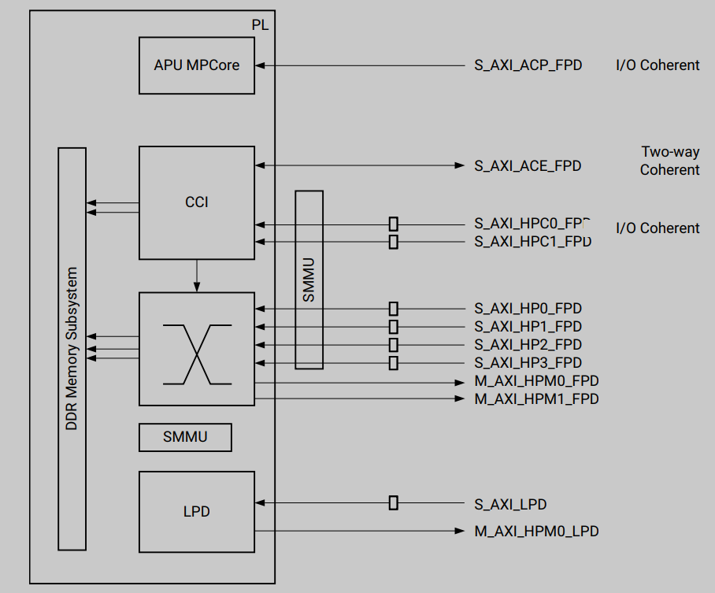
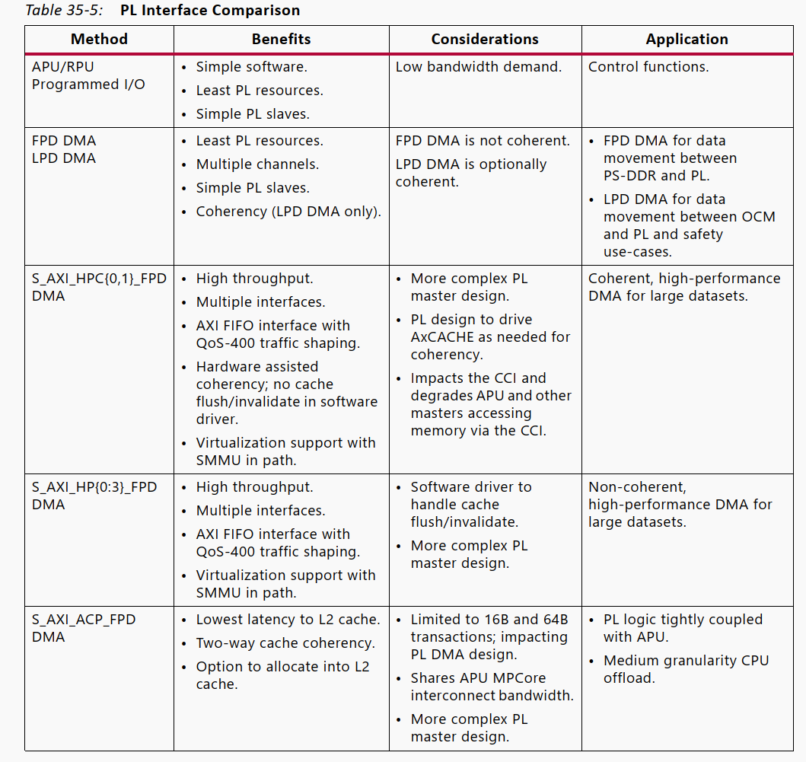
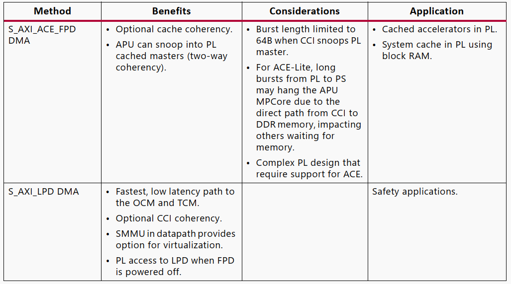

''

low-power domain (LPD)   full-power domain (FPD)

**Accelerator coherency port (ACP)**  
直接和 APU 的 L1/L2 cache 连接，通过 I/O coherency 仲裁避免碰撞

**ACE (AXI Coherency Extention)**

所有 high performance FPD 都要经过 system memory management unit (SMMU).  SMMU 为传输分配物理地址

6个高性能接口提供 PL 总线作为 master 访问所有 PS salve
但是，它们的设计目的是为 DDR 内存提供高带宽数据路径。
从 FPD 到 PL 的两个 PS master，主要用于高性能，如 APU, FPD DMA, PCIe。

