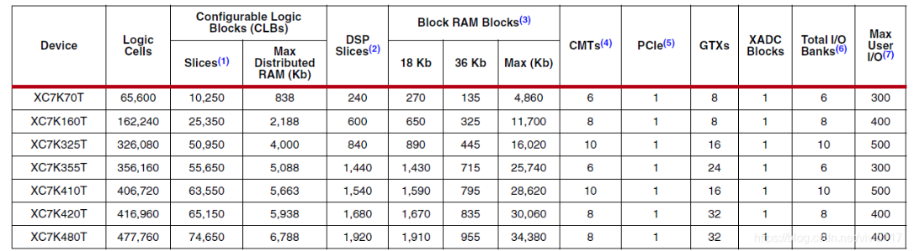
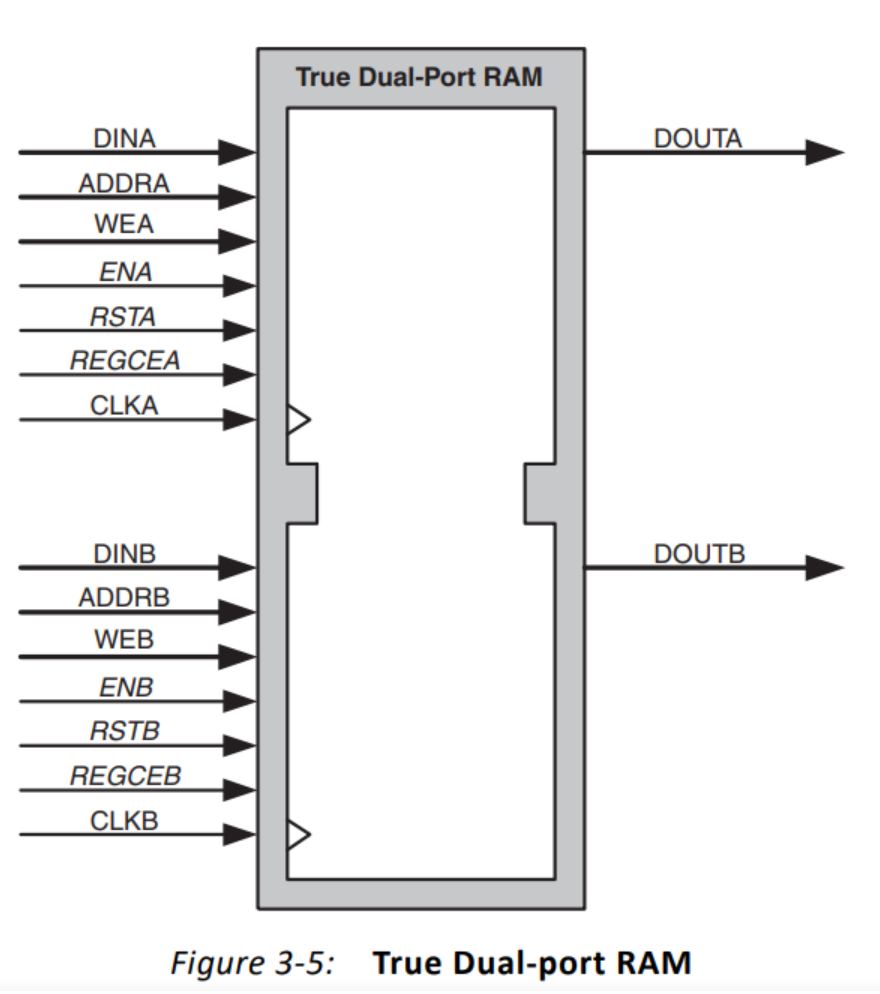

# Re0：从零开始的FPGA之旅

## 1. IO

详见ug471

IO逻辑资源简介

- Combinatorial input/output，组合输入/输出。
- 3-state output control，三态输出控制。
- Registered input/output，寄存输入/输出。
- Registered 3-state output control，寄存三态输出控制。
- Double-Data-Rate (DDR) input/output，双倍数据速率 (DDR) 输入/输出。
- DDR output 3-state control，DDR 输出三态控制。
- IDELAY provides users control of an adjustable, fine-resolution delay taps，IDELAY 为用户提供可调节、高分辨率延迟抽头的控制 
- ODELAY provides users control of an adjustable, fine-resolution delay taps
- SAME_EDGE output DDR mode，SAME_EDGE 输出 DDR 模式。
- SAME_EDGE and SAME_EDGE_PIPELINED input DDR mode，SAME_EDGE 和 SAME_EDGE_PIPELINED 输入 DDR 模式。

其中IOB就是input/output buffer。可编程IO的作用就是完成信号的采集和输出，引脚可以配置支持不同电气特性，上拉下拉或三态，差分或单端。IOB与附近的idelay、odelay、ilogic、ologic和可编程IO等资源，共同组成FPGA的IO_Bank。


### **ILOGIC 资源**

ILOGIC 块位于 I/O 块 (IOB) 旁边。ILOGIC 块包含用于在数据通过 IOB 进入 FPGA 时捕获数据的同步元素。 7 系列器件中 ILOGIC 配置的可能情况是 ILOGICE2（HP I/O bank）和 ILOGICE3（HR I/O bank）。但除非明确说明，否则 ILOGICE2 和 ILOGICE3 在功能上是相同的，它们的端口也是如此。 ILOGICE2 和 ILOGICE3 之间的唯一区别是：

- ILOGICE3 位于 HR 组中，并具有零保持延迟元件 (ZHOLD，zero hold delay element )。
- ILOGICE2 位于HP bank 中并且没有 ZHOLD元件。

ZHOLD 延迟与内部时钟分配延迟自动匹配，使用时可确保焊盘到焊盘保持时间为零。 ILOGIC 模块在输入端支持可选的**静态无补偿零保持 (ZHOLD)** 延迟线，以补偿时钟插入延迟。 当时钟路径直接来自同一或相邻 bank 中的 BUFG/BUFGCE 时，ZHOLD 功能经过优化以补偿时钟插入延迟。 ZHOLD 默认启用，除非时钟源是 MMCM 或 PLL，或者除非在 Xilinx 设计约束 (XDC) 中设置了 IOBDELAY 属性。


- HP：High Performance
- HR：High Range
- HD：High Density

这几个概念都是在7系列之后才有的，其中7系列的FPGA中有HP Bank和HR Bank，UltraScale FPGA有HP Bank、HR Bank和HD Bank，但并不是一个FPGA中会同时包含HP/HR/HD Bank。

HP Bank，从名字就可以看出来，应用于高性能也就是速度比较高的场景，比如DDR或者其它高速差分总线（不是gtx），由于速率比较高，Bank电压最高也只能到1.8V。

HR Bank表示支持wider range of I/O standards，最高能够支持到3.3V的电压。

HD Bank应用于低速I/O的场景，最高速率限制在250M以内，最高电压也是支持到3.3V

Kintex UltraScale 和Virtex UltraScale中有HP Bank和HR Bank，Virtex UltraScale+系列中只有HP Bank，Zynq UltraScale+ MPSoC 和Kintex UltraScale+ 系列包含HP和HR Bank。

**使用注意事项**
为了保证FPGA输入输出接口的时序，一般会要求将输入管脚首先**打一拍**再使用，输出接口也要打一拍再输出FPGA。这样做的目的是为了让这打一拍的寄存器约束到IOB上，从而使得每一次编译输入或者输出的时序不会发生改变。

这是因为，IOB是位于IO附近的寄存器，是FPGA上距离IO最近的寄存器，并且位置固定。当你输入或者输出采用了IOB约束，那么就可以保证从IO到达寄存器或者从寄存器到达IO之间的走线延迟最短、最大限度保证时序满足要求，同时由于IO的位置是固定的，所以每一次编译都不会造成输入或者输出的时序发生改变。
IOB的应用一般有两种，一种是在代码中添加约束，另一种可以在约束文件xdc中添加。

在约束文件中加入下面约束：
set_property  IOB true [get_ports {port_name}]

直接在代码中加约束，在寄存器前加入下面约束,需要注意的是，对于输入IOB约束，这里的寄存器是第一级寄存器，对于输出IOB约束，这里的寄存器是最后一级寄存器，且寄存器输出不能再作为组合逻辑输入。
（* IOB = "true" *) reg  O_data;

**组合输入路径**
组合输入路径用于创建从输入驱动器到 FPGA 逻辑的直接连接。 在以下情况下，软件会自动使用此路径：

1. 从输入数据到 FPGA 逻辑中的逻辑资源存在直接连接，未经过寄存。
2. **pack I/O register/latch into IOBs**软件映射指令设置为**OFF**。


### **输入 DDR (IDDR)**

7 系列器件在 ILOGIC 模块中具有专用寄存器，用于实现输入**双倍数据速率寄存器** (Double Data Register) 。 **此功能通过实例化 IDDR 原语来使用。**输入 I/O 块的所有时钟都是完全多路复用的，即 ILOGIC 和 OLOGIC 块之间没有时钟共享。

IDDR 原语支持以下操作模式：

- OPPOSITE_EDGE 模式
- SAME_EDGE 模式
- SAME_EDGE_PIPELINED 模式

这些模式允许设计人员将下降沿数据传输到 ILOGIC 模块内的上升沿域，从而节省 CLB 和时钟资源，并提高性能。 这些模式是使用 DDR_CLK_EDGE 属性实现的。 

传统输入 DDR 解决方案或 **OPPOSITE_EDGE** 模式是通过 ILOGIC 模块中的单个输入来实现的。 数据通过时钟上升沿的输出 Q1 和时钟下降沿的输出 Q2 提供给 FPGA 逻辑。下图显示了使用 OPPOSITE_EDGE 模式输入 DDR 的时序图。


在 **SAME_EDGE** 模式下，数据在相同的时钟沿被呈现到 FPGA 逻辑中。 下图显示了使用 SAME_EDGE 模式输入 DDR 的时序图。 在时序图中，输出对 Q1 和 Q2 不再是 (0) 和 (1)。 相反，呈现的第一对是 Q1 (0) 和 Q2 对（无关），然后是下一个时钟周期的对 (1) 和 (2)。


在 **SAME_EDGE_PIPELINED** 模式下，数据在同一时钟沿呈现到 FPGA 逻辑中。与 SAME_EDGE 模式不同，数据对不被一个时钟周期分隔。 但是，需要额外的时钟延迟来消除 SAME_EDGE 模式的分离效应。 下图显示了使用 SAME_EDGE_PIPELINED 模式的输入 DDR 的时序图。 输出对 Q1 和 Q2 同时呈现给 FPGA 逻辑。


**原语**：

不支持同时设置和重置。类似一个标准寄存器的的功能。

Port Name	    Function				      Description

Q1 and Q2	   Data outputs			    IDDR 寄存器输出。

C					  Clock input port		   C 引脚代表时钟输入引脚。

CE				    Clock enable port		使能引脚影响将数据加载到 DDR 触发器中。 低电平时，时钟转换被忽略，新数据不会加载到 DDR 触发器中。 CE 必须为高电平才能将新数据加载到 DDR 触发器中。

D					  Data input (DDR)		 来自 IOB 的 IDDR 寄存器输入。

S/R				  Set/Reset					  同步/异步置位/复位引脚。 S/R 被断言为高电平。IDDR 原语包含置位和复位引脚。 但是，每个 IDDR 只能使用一个。 描述的是 S/R，而不是单独的置位和复位引脚。


### BUFG，BUFR，BUFIO

当Xilinx 7Series FPGA中，存在3种主要的时钟网络：BUFG，BUFR，BUFIO以及他们所衍生出的各种变种。那么他们有什么主要特点和区别呢？

BUFIO是IO时钟网络，顾名思义，它只能驱动IO Block里面的逻辑，不能驱动CLB里面的LUT，REG等逻辑。BUFIO可以被如下节点驱动：

1、SRCCs and MRCCs in the same clockregion
2、MRCCs in an adjacent clock regionusing BUFMRs
3、MMCMs clock outputs 0-3 driving theHPC in the same clock region

BUFR是regional时钟网络，顾名思义，它的驱动范围只能局限在一个clock region的逻辑，但是它可以同时驱动IO和内部逻辑。BUFR可以被如下节点所驱动：

1、所有能驱动BUFIO的节点
2、MMCMs clock outputs 0-3
3、General interconnect

BUFG是全局时钟网络，它可以驱动所有的IO和逻辑，并且可以被Transceiver所驱动。


### ISERDES/OSERDES

- ISERDES模块的作用在于实现高速源同步输入数据的串并转换。

- OSERDES模块的作用在于实现高速源同步输出数据的并串转换。

- SERDES支持SDR和DDR两个模式。
        SDR模式支持2、3、4、5、6、7、8bit位宽；
        DDR模式支持4、6、8bit位宽，10或14bit位宽需要两个模块级联。
        Bitslip模块可以使设计者重新排列输入的并行数据，可用于源同步。

  

**串行数据输入端**
该部分接收外部输入的高速源同步数据，数据模式可以是SDR或者DDR。在SDR模式下，数据转换的位宽可以为2,3,4,5,6,7,8bit。在DDR模式下，数据位宽可以是4,6,8bit。如果是两个iserdes模块级联使用，DDR模式还可以支持10,14bit。


## 2. CLB

详见ug474

CLB是指可编程逻辑功能块（Configurable Logic Blocks）

Xilinx created the Advanced Silicon Modular Block (ASMBL) architecture to enable FPGA platforms with varying feature mixes optimized for different application domains.  

ASMBL优化了布局，允许任何位置放置电源和地，允许不同功能的ip单元独立排布；


### Slice

每个CLB包含2个Slice，每个Slice包含：

- 四个6输入查找表LUT
- 八个存储单元
- 多路复选器
- 进位逻辑


Each CLB can contain two SLICEL or a SLICEL and a SLICEM.  

SliceL与SliceM最大的区别就是没有分布式RAM和移位寄存器  


Diagram of SLICEM  																		Diagram of SLICEL  

我们经常说到FPGA容量是多少，FPGA器件的容量通常用逻辑单元来衡量，这在逻辑上等同于经典的4输入LUT和触发器。 7系列FPGA逻辑单元和6输入LUT的数量之比为1.6：1。所以，逻辑单元和Slice的数量比是6.4：1



单个slice资源


每个Slice有8个存储单元，4个可配置成DFF或者锁存器，另外4个只能配置为DFF

SLICEM可以配置成分布式RAM，多bit的情况需要增加相应倍数的LUT进行并联。


### Set/Reset

- CLB 可以进行复位或置位，但应该避免同时使用复位和置位，用尽可能少的 set/reset 信号，大规模的设计**用相同的同步复位**；
- 可以尽量多使用 **FF**，因为 FF 比 LUT 资源更多；
- DSP 和 Block RAM 的 FF 应尽量使用内部的 DFF；
- set 等控制信号尽量少用，因为在CLB中是公用的；
- 小规模的移位和存储，应尽量使用CLB来实现；

The control signals clock (CLK), clock enable (CE), and set/reset (SR) are common to allstorage elements in one slice. 
• SRLOW: Synchronous or asynchronous Reset when CLB SR signal is asserted
• SRHIGH: Synchronous or asynchronous Set when CLB SR signal is asserted 
• INIT0: Asynchronous Reset on power-up or global Set/Reset 
• INIT1: Asynchronous Set on power-up or global Set/Reset 


### LUT

由于FPGA需要被反复烧写，它实现组合逻辑的基本结构不可能像ASIC那样通过固定的与非门来完成，而只能采用一种易于反复配置的结构。查找表可以很好地满足这一要求，**目前主流FPGA都采用了基于SRAM工艺的查找表结构**。

**LUT本质上就是一个RAM**。它把数据事先写入RAM后， 每当输入一个信号就等于输入一个地址进行查表，找出地址对应的内容，然后输出。

7系列FPGA中的函数发生器实现为六输入查找表（LUT）。slice的4个函数发生器（A，B，C和D）中的每一个都有六个独立输入（A输入A1至A6）和两个独立输出（O5和O6）

函数发生器可以实现以下函数功能：
•任意定义的六输入布尔函数
•两个任意定义的五输入布尔函数，只要这两个函数共享公共输入
•两个任意定义的布尔函数（3个和2个或更少输入）

 

**存储单元**

每个slice有8个存储元素。

4个可以配置为边沿触发D型触发器或电平敏感锁存器。 D输入可以通过AFFMUX，BFFMUX，CFFMUX或DFFMUX的LUT输出直接驱动，也可以通过AX，BX，CX或DX输入绕过函数发生器的BYPASS slice输入直接驱动。 当配置为锁存器时，当CLK为低电平时，锁存器是透明的。
4个额外的存储单元，它们只能配置为边沿触发的D型触发器。 D输入可以由LUT的O5输出驱动，也可以由 AX，BX，CX或DX输入的BYPASS slice输入驱动。

slice中的两种配置版本： 4个寄存器和4个寄存器/锁存器

always @(posedge) -> 综合成 flip-flop;
always @(*) -> 综合成 latch；


### Distributed RAM 

(Available in SLICEM Only)  

SLICEM中的函数发生器添加一个据输入端口和使能就将 其拓展成一个分布式 RAM。

block RAM 的资源相当宝贵，所以用分布式 RAM 来存储一些数据是非常有效的；
• Single-Port 32 x 1-bit RAM
• Dual-Port 32 x 1-bit RAM
• Quad-Port 32 x 2-bit RAM
• Simple Dual-Port 32 x 6-bit RAM
• Single-Port 64 x 1-bit RAM
• Dual-Port 64 x 1-bit RAM
• Quad-Port 64 x 1-bit RAM
• Simple Dual-Port 64 x 3-bit RAM
• Single-Port 128 x 1-bit RAM
• Dual-Port 128 x 1-bit RAM  

每种分布式RAM配置占用的LUT数量（每个slice四个）


分布式RAM比块RAM有更好的灵活性，但块RAM的资源比较宝贵，分布式RAM适用小规模存储场景。


使用分布式RAM需要注意的地方
1）分布式RAM模块是同步（写）资源。 可以使用触发器在同一片中实现同步读取。
2）通过使用该触发器，可以通过减少触发器的时钟输出值的延迟来提高分布式RAM的性能。
3）但是，添加了额外的时钟延迟。 分布式元素共享相同的时钟输入。
4）对于写操作，必须将由SLICEM的CE或WE引脚驱动的写使能（WE）输入设置为高。

分布式 RAM的主要特点是**快速，本地化并且对于小数据缓存区、 先进出、以及寄存器文件有着理想的效果**。

使用分布式RAM需要注意的地方
1）分布式RAM模块是同步（写）资源。 可以使用触发器在同一片中实现同步读取。
2）通过使用该触发器，可以通过减少触发器的时钟输出值的延迟来提高分布式RAM的性能。
3）但是，添加了额外的时钟延迟。 分布式元素共享相同的时钟输入。
4）对于写操作，必须将由SLICEM的CE或WE引脚驱动的写使能（WE）输入设置为高。

```verilog
// 异步读模式的双口分布式RAM
module rams_dist (
    input clk, we, 
    input [5:0]a, dpra, 
    input [15:0]di, 
    output [15:0]spo, dpo
);

reg [15:0] ram [63:0];//意思是定义一个有64个16位寄存器的存储器

always @(posedge clk)
    if (we) 
    	ram[a] <= di;
assign spo = ram[a];
assign dpo = ram[dpra];
endmodule
```


### Shift Registers

 (Available in SLICEM Only)  

​    SLICEM函数发生器也可以配置为32位移位寄存器，而无需使用slice中可用的触发器。 以这种方式使用，每个LUT可以将串行数据延迟1到32个时钟周期。
​    移入D（DI1 LUT引脚）和移出Q31（MC31 LUT引脚）线路将LUT级联，以形成更大的移位寄存器。 因此，SLICEM中的四个LUT被级联以产生高达128个时钟周期的延迟。也可以在多个SLICEM上组合移位寄存器。


**移位寄存器的功能与应用**

移位寄存器的功能:
1）写操作
2）与时钟输入（CLK）和可选的时钟使能（CE）同步
3）修复对Q31的读取访问
4）动态读取访问
5）通过5位地址总线A [4：0]执行
LUT地址的LSB未使用，软件自动将其绑定为逻辑高电平。
6）通过改变地址可以异步读取32位中的任何一位（在O6 LUT输出上，在原语上称为Q）
7）此功能对于创建较小的移位寄存器（少于32位）很有用。
例如，当构建13位移位寄存器时，将地址设置为第13位。
8）存储单元或触发器可用于实现同步读取。
触发器的时钟输出决定了总延迟并改善了性能。但是，增加了一个时钟延迟周期。

**一个LUT可以用于产生2个16bit移位寄存器，地址是复用的。**
用两个SRL16组成一个32位的移位寄存器

移位寄存器的应用：
1）延迟或延迟补偿
2）同步FIFO和内容可寻址存储器（CAM）


### Multiplexers  

7系列FPGA中的函数发生器和相关的多路复用器可以实现以下功能：
•使用一个LUT的4：1多路复用器
•每片四个4：1 MUX
•使用两个LUT的8：1多路复用器
•每个slice两个8：1 MUX
•使用四个LUT的16：1多路复用器
•每片一个16：1 MUX


### Carry Logic  

CLB进位模块
在CLB中，除了函数发生器之外，还提供了专用的快速超前进位逻辑，以slice片中执行快速算术加法和减法。 7系列FPGA CLB具有两个独立的进位链，进位链可级联以形成更宽的加/减逻辑。

7系列FPGA 每个 SLICE有 4bit 的进位链。进位链向上延伸，每个slice的高度为四位。 对于每个位，都有一个进位多路复用器（MUXCY） 和专用的XOR门，用于用选定的进位位加/减操作数。 专用的进位路径和进位多路复用器（MUXCY）也可以用于级联函数发生器，以实现广泛的逻辑功能。


CARRY4模块
**CARRY4**原语实例化每个slice中可用的快速进位逻辑。 该原语与LUT结合使用以构建加法器和乘法器。 下图显示了CARRY4原语。 综合工具通常会从算术HDL代码中推断出此逻辑，从而自动正确连接此功能。


端口信号
1）总输出-O [3：0] 总和输出提供加/减的最终结果。 它们连接到slice AMUX / BMUX / CMUX / DMUX输出。
2）进位输出-CO [3：0] 进位输出提供每个位的进位。 CO [3]等效于COUT。 如果通过COUT将CO [3]连接到另一个CARRY4原语的CI输入，则可以创建更长的进位链，并且专用路由将进位链连接到一排片上。
3）进位输出还可以选择连接至sliceAMUX / BMUX / CMUX / DMUX输出。


## 3. BRAM

详见ug473

不同厂家使用不同的块RAM
FPGA中片上嵌入了一些存储单元
**Xilinx**: M9K , M18K(Spatan6) , M36K(7 Series)
**Altera**: M4K(Cyclone) , M9K(Cyclone IV) , M10K(Cyclone V) , MLAB

|                 比较内容                  |    分布式RAM     | 块RAM(BRAM) |
| :---------------------------------------: | :--------------: | :---------: |
|                  读操作                   |       同步       |    同步     |
|                  写操作                   |       异步       |    同步     |
|                  写使能                   |       支持       |    支持     |
| RAM使能、输出复位、输出寄存器、字节写使能 |      不支持      |    支持     |
|                 单端口RAM                 |       支持       |    支持     |
|                 双端口RAM                 | 读写时钟必须一致 |    支持     |
|                 单端口ROM                 |       支持       |    支持     |
|                 双端口ROM                 |      不支持      |    支持     |


### BRAM资源

Xilinx FPGA Block RAM布局情况  


Intel FPGA Block RAM  


Xilinx 7系列FPGA中，单个Block RAM的容量最高可配置为为**36Kb（RAMB36E1）**，内部含有两个独
立的**18Kb的BRAM（RAMB18E1）**；并且RAM使用时大小及使用方式可配置，其框架如下图：  


每个36KRAM，由于两个18KRAM无法共享其中的FiFo logic（生成FIFO控制信号包括读写地址等），故36KRAM无法作为两个18K容量的FIFO来使用，对其使用时我们可以有4中使用方法：
（1）单个的36Kb BRAM
（2）单个的36Kb FIFO
（3）两个的18Kb BRAM
（4）一个的18Kb BRAM 与 一个的18Kb FIFO  


### 作RAM

**（1）真双口RAM(True Dual-port RAM)**

​    有两个独立的端口A和端口B，2个端口都可以读、写。



**（2）简单双口RAM(Simple Dual-port RAM)**

​    有两个独立的端口A、B，其中一个端口只读，另一个端口只写。


**（3）单口RAM(Single-port RAM)**

​    只有一个端口，可读可写，但无法同时进行。


### 作ROM

**（1）单端口 ROM**

​    不可实现写操作，只可使用一个端口实现读操作。


**（2）双端口ROM**

​    不可实现写操作，可以使用两个端口实现读操作，两个端口读取数据的位宽可以不同，但必须是整数倍关系。


### 作FIFO


### Operating Mode

“WRITE_FIRST” 模式，写操作时，输出端口会将当前写的数据输出。（ASIC中又称“write through”，或AWT，Async）
“READ_FIRST” 模式，写操作时，输出端口会将当前写地址的原数据输出。
“NO_CHANGE”模式，写操作时，输出端口会保持原值不变。只有在读操作的过程中输出端口才会变化。

- “WRITE_FIRST” 模式（ASIC中又称“write through”）
- 写入的数据一边写到RAM内核，一边输出到端口。
- 在此模式下，先前存储在写入地址的数据出现在输出锁存器上，而输入数据则存储在存储器中（在写入之前读取）。当不使用可选的输出流水线寄存器时，下图中的波形对应于锁存模式。  


- “READ_FIRST” 模式
- 写入的数据写到RAM内核，写地址指向的RAM数据输出到端口。
- 输入数据同时写入内存并存储在数据输出中（透明写入），当不使用可选的输出流水线寄存器时，这些波形对应于锁存模式。  


- “NO_CHANGE” 模式
- 写入的数据写到RAM内核。输出端口的数据（实际上有个寄存器）保持不变。
- 写操作期间输出锁存器保持不变，数据输出保留最后的读数据，并且不受同一端口上写操作的影响。当不使用可选的同步双端口和单端口RAM输出流水线寄存器时，这些波形对应于锁存模式。此模式是最省电的。此模式在SDP模式下不可用，因为它的行为与WRITE_FIRST模式相同。  


### 输出寄存器的配置

在使用BRAM时无论以何种方式使用，均需要对BRAM的输出进行寄存处理，尤其在高速设计中，输出寄存处理影响BRAM的性能。

以简单双端口为例，有两个输出寄存器可配置其中：

- Primtives Output Register为BRAM内部自带寄存器，
- Core Output Register为Slice中的寄存器；  


### 级联使用（限真双端口模式）

Block RAM的级联通过CASCADEIN / CASCADEOUT引脚，来实现64K x 1。 高位RAM的CASCADEIN引脚连接到相应端口低位RAM的CASCADEOUT引脚。不使用级联模式时，无需连接此引脚。级联仅在TDP模式下可用。  


## 4. Simulation

- Behavioral Simulation：行为仿真，验证RTL逻辑功能是否正确；
- Post Synthesis timing Simulation：综合后的时序仿真，依据芯片模型考虑了器件的延迟，但未考虑布线的延迟；
- Post Synthesis functional Simulation： synth之后，所有的逻辑已经完成映射到了FPGA的硬件资源，此时的仿真能够验证工具的综和优化是否对设计造成了影响，此时会产生网表，会使用UNISIM库；
- Post Implementation timing simulation： imple之后器件已经完成了布局布线， 综合考虑了器件和布局布线的延迟，即真实的延迟；
- Post Implementation functional simulation： 此时可以充分验证工具经过优化以后的真实情况，是否影响了预期的设计  


## 5. Timing Analysis

时序分析可以简单定义为： 我们提出一些特定的时序要求（或者说是添加特定的时序约束），使用特定的时序模型，针对特定的电路进行分析。分析的最终结果是要求系统时序满足我们提出的要求。

一般时钟主频超过10Mhz 的， 我们都可以认为是高速接口，此时就需要进行时序分析。

### 开发流程


- 首先， 我们需要创建一个工程， 并指定或输入设计文件（如.v 格式的文件） ， 然后我们需要执行分析（ Analysis） 和综合（ Synthesis）过程。  
- 分析阶段， 工具会检查我们的设计有没有错误，比如源文件中的语法错误；
- 综合阶段， 工具会把设计中的源文件转换成门级电路网表（ netlist） 件， 最后把门
- 级网表中的各个元素与 FPGA 里的基本元件逐一对应起来，这就是映射（ Map）。
- 布局布线阶段， 需要先指定时序要求，就是我们常说的时序约束。  Vivado 使用 Xilnx Design Constraints（ XDC） 格式的文件来描述对时序的要求。  

在指定时序要求之后，我们对设计进行一次全编译（ Compile Design），在此过程中， 工具的适配器（ Fitter）会对综合后的结果进行布局和布线（ Place & Route）。所谓的布局布线（ Place & Route）是指把综合过程中映射到 FPGA 中的各种硬件资源（如逻辑单元、 IO、 RAM 等）放到 FPGA 芯片上的合适位置，并用可编程互连线把它们连接起来。

布局布线的结果影响到设计最终的性能（如最大工作频率 Fmax），该过程虽然是由 EDA 工具来完成，但是工具并不知道设计需要工作在什么样的环境下（比如输入时钟频率是多少、输入输出信号的延迟等），也就不清楚应该把布局布线结果优化到何种程度。因此工具需要**一个说明文件**来告诉它这些信息，从而来指导布局布线的过程，以满足设计者的需求。而这个说明文件的内容，就是我们前面所指定的时序要求，也就是时序约束。  


### 时钟

理想的时钟模型是一个占空比为 50%且周期固定的方波。 时钟是 FPGA 中逻辑运行的一个基准。  

实际电路中输入给 FPGA 的晶振时钟信号其实是正弦波， 这个波形不影响 FPGA 对时钟的识别。  


Clock Jitter ：实际晶振产生的正弦波是存在一些时钟抖动的。   


时钟偏差， Clock Skew，是指同一个时钟域内的时钟信号到达数字电路各个部分（一般是指寄存器）所用时间的差异。  

时序分析的起点一般是**源寄存器**（ reg1），终点一般是**目标寄存器**（ reg2）。  


时钟网络延时 Tskew 就是 Tc2d 与 Tc2s 之差，即 **Tskew**=Tc2d-Tc2s。

第一个方波是时钟源，第二个方波为时钟到达 REG1 时的波形，第三个方波为时钟到达 REG2 时的波形， 从图上可以看出 **Tskew** 是时钟到达两个寄存器时的相位偏差。  


时钟偏差分为两类：**正偏差**和**负偏差**。

正偏差：当信号传输的目标寄存器在接收寄存器之前捕获正确的时钟信号；
负偏差：当信号传输的目标寄存器在接收寄存器之后捕获正确的时钟信号（也就是时钟布线方向与数据流水方向**相反**）


**Clock Uncertainty**：就是时钟的不确定性。时钟的不确定性主要是由 Clock Skew 和 Jitter 构成。  

建立时间 T**setup** 和保持时间 **Thold**


这两个值是寄存器成功采样的前提。  

**发起沿**， Launch edge， 是发送数据的时钟边沿，通常选择上升沿。
**采样沿**， Capture edge， 是采样到该数据的时钟边沿， 通常也是上升沿。  


rega 和 regb 使用同一个时钟信号， rega 在 Launch edge 发送数据， regb 下一个时钟周期的 Capture edge 采样到 rega 送入的数据， rega 到 regb 中间可能还有一些组合逻辑。也就是说 rega 的数据送到 regb 的 D 端，必须要在**一个时钟周期内**到达，否则就会出现 regb 采样失败的问题。

### 基本路径 

分析的基本路径包括 4 种：

- 管脚输入和寄存器之间的路径（ 即 **pin2reg**）
- 寄存器和寄存器之间的路径（ 即 **reg2reg**）
- 寄存器和管脚输出之间的路径（ 即 **reg2pin**）
- 管脚输入和管脚输出之间的路径（即 **pin2pin**）  


### 时间的裕量

**setup**

数据到达时间 Data Arrival Time = 启动沿时间 + Tclka + Tco + Tdata  


时钟到达时间 Clock Arrival Time = 采样沿时间 + Tclka  


建立裕量为**正值**说明两个寄存器有合格的建立关系，建立裕量为负值说明两个寄存器建立关系不满足，会导致采样出错。  


图是寄存器建立关系过程，寄存器 reg1 和寄存器 reg2 也使用拥有相同属性的时钟源。

首先要获得 Clock1 的启动沿受延迟的影响，而时序分析模型用了一条公式评估启动沿受 Tclk1 + Tco + Tdata 的影响：
数据到达时间 Data Arrival Time = 启动沿时间 + Tclk1 + Tco + Tdata = 0ns + 3.2ns + 0.2ns + 0.6ns = 4ns

下面我们要获得 Clock2 的锁存沿受延迟的影响。同样时序模型也使用了一条公式评估锁存沿受 Tclk2 + Tsu 的影响：
数据锁存（读取）时间 Data Required Time = 锁存沿时间+ Tclk2 - Tsu= 10ns + 2ns - 1.4ns = 10.6ns

最后我们要用数据抵达时间和数据锁存时间取得建立余量：**建立余量 = 数据锁存时间 - 数据抵达(获取|读取)时间**
Setup Slack = Data Required Time - Time Arrival Time = 10.6ns - 4ns = 6.6  

其中建立余量 6.6ns 是在上图的“蓝色框图的部分”。在这里，建立余量是“**正值**”，
亦即“ reg1 和 reg2 之间的建立关系是**合格**”。  

**hold**

保持关系Hold Relationship 是求出两个寄存器（节点）之间的保持余量的过程。保持关系是指寄存器1 在还没有更新输出之前，寄存器2 用最快速的速度读取从寄存器1 发送过来的数据。  


数据保持时间 Data Hold Time = 启动沿+ Tclk1 + Tco+ Tdata + 数据周期时间  = 0ns + 3.2ns + 0.2ns + 0.6ns + 10ns= 14ns

数据锁存（读取）时间Data Required Time = 锁存沿+ Tclk2 + Th = 10ns + 2ns + 1.4ns = 13.4ns

保持余量 Hold Slack = 数据保持时间 - 数据锁存（获取|读取）时间 = 14ns - 13.4ns = 0.6ns

最后取得的保持余量是 0.6ns，这也意味着保持余量是**正值**，所以寄存器 1和寄存器2之间的保持关系是合格的。  


### Multicycle Paths检查  

往往存在这样的情况：
一些数据不需要在下一个时钟周期就稳定下来，可能在数据发送后几个时钟周期之后才起作用；
一些数据经过的路径太复杂，延时太大，不可能在下一个时钟周期稳定下来，必须要在数据发送后数个时钟周期之后才能被采用。  

比如乘法器电路， 乘法器由于其逻辑实现电路比较复杂， 往往需要多个时钟周期才能计算出乘法结果，那么此时如果还是按照单周期路径检查的结果，就会出现虚报时序违规的问题。  

不设置多周期路径约束的后果有两种：一是按照单周期路径检查的结果，虚报时序违规；二是导致布局布线工具按照单周期路径的方式执行，虽然满足了时序规范，但是过分优化了本应该多个周期完成的操作，造成过约束。过约束会侵占本应该让位于其他逻辑的布局布线资源，有可能造成其他关键路径的时序违规或时序余量变小。

究其原因，多周期路径是为了解决信号传播太慢的问题，慢到一个周期都不够，所以要把Setup Time的检查往后推几个周期——扩大Setup Time检查的时间窗口。而Hold Time检查信号是否传播得太快，如果把检查时刻往后推，就缩小了Hold Time检查的时间窗口。  


上图说明reg1到reg2的数据在两个时钟周期内到达即可，可以设置一个多周期约束。 


## 6. IO output

在进行FPGA硬件设计时，引脚分配是非常重要的一个环节，特别是在硬件电路上需要与其他芯片通行的引脚。Xilinx FPGA从上电之后到正常工作整个过程中各个阶段引脚的状态，会对硬件设计、引脚分配产生非常重要的影响。这篇专题就针对FPGA从上电开始 ，配置程序，到正常工作整个过程中所有IO的状态进行分析。

从时间阶段可以分为两部分，第一阶段是从FPGA上电开始直到配置（Configuration）完成之前。第二个阶段是配置完成之后，FPGA开始正常工作开始。

从引脚类型上分，可以分为三大类：第一类是普通的IO，其中又分为程序设计中使用到的IO和程序设计中没有使用的IO（即在ucf或者XDC文件中没有进行约束的IO）；第二类是专用下载配置引脚（Dedicated Pins），这类引脚只用于专用的功能，包括有M[2：0]、TCK、TMS、PROGRAM_B、INIT_B等。第三类为功能复用引脚，这类引脚在使用特定的功能时使用，例如在使用BPI配置模式时，D[00-31]和A[00-28]需要使用。如果使用SYSMON时，I2C_SDA和I2C_SCL需要使用。但在当前没有使用该功能的情况下，功能复用引脚可以看成普通IO。

### 基本结构

在《IO输入输出的各种模式》介绍了处理器IO的各种输入输出模式以及原理，那么FPGA的IO是什么样的结构和原理？图 1为Xilinx文档中提供的IOB的内部结构，可以看出：

1. 在FPGA IOB内部，Pad输出之前，内置上下拉电阻。且可以通过Passive Pull-up/Pull-down模块控制两个MOS管的导通与否来控制是否使能上下拉电阻。
2. 内部连接Pad的分别有一个Input Buffer和Output Buffer。其中Input Buffer对外应该始终呈现高阻状态，同时可以将Pad上的电平通过Input Buffer传到I1和I2，或者是下部的FF。Output Buffer有两个控制信号，分别是Slew Rate Control，用来控制输出信号的Slew Rate；另一个是三态控制信号T，可以控制Output Buffer输出高阻。
3. 内部输出信号Out，可以通过上半部分的FF，经Output Clock同步后打出，也可以直接连接到Output buffer的输入端，直接输出。
4. 同样Input Buffer的输出，可以直接连接到I1和I2，也可以经过下半部分的FF，经过input clock的同步之后输出到内部总线上。
5. 上下两个MOS并不是推挽输出的两个MOS管，因为并不受到互补信号的控制，并不一定一个导通另一个闭合。

​															

### 配置完成之前

在FPGA上电到配置完成之前，由于当前还没有下载程序，无法区分哪些引脚被设计所使用，哪些引脚没有被使用。
此时的普通IO包括两部分：

- 该封装中所有的通用IO引脚。
- 当前所选择的模式下没有使用到的所有功能复用管脚。

在Spartan6系列以及之前的器件中这些引脚的状态是根据HSWAPEN的状态决定的。


在7系列以后的器件，包括Ultrascale器件中，这些引脚的状态是根据PUDC_B(Pull-Up During Configuration)引脚

这两个引脚的功能是相似的，都是用来控制在Configuration完成之前，所有普通IO的上拉电阻是否使能的。对应到图 1中，即Output Buffer输出高阻，Input Buffer对外始终为高阻，此时选择是否连接上拉电阻。

### 配置完成之后

在配置完成之后，FPGA就进入正常工作的模式了。在配置完成之后，普通引脚可以分为以下两种：

1. 工程设计中使用的IO，即在UCF或者XDC中有明确约束的IO。

2. 其余没有使用，也没有约束的IO。（称为Unassigned Pins）

首先，对于第一种情况，由于已经在设计中明确设定了这些引脚的设置，包括方向、电平、驱动能力等等，所以在配置完成之后，这些引脚的状态已经被设置为了预设的状态。

对于没有约束的IO，又复杂一些了。在ISE开发环境下，工程完成Implement之后，在Processà Process properties àConfiguration Options中有"-g UnusedPin Unused IOB Pins"属性，可以选择Pull Down、Pull Up或者Floating。默认状态是Pull-Down。对应到图 1中，是高阻输出，导通下拉电阻。另两个设置就是高阻加上上拉电阻或者只是上下拉电阻均不导通。

在Vivado中也有相同的设置，必须在实现完成之后，打开Implementation Design之后选择bitstream Settings，其中在"Configure additional bitstream settings"中的Configuration栏中，有如下属性选择项。


### 专用IO

所有的专用配置引脚全部位于Bank0，包括CFGBVS、M[2:0]、TCK、TMS、TDI、TDO、PRORAM_B、INIT_B、DONE以及CCLK。专用引脚的含义就是无论在配置过程中还是配置完成之后，这些引脚无论在什么阶段都只用于配置。

所以对于这些引脚考虑相对比较简单，分为输入信号和输出信号。输入信号的状态始终保持LVCMOS电平标准，电压值为VCCO（输入信号也有电平标准要求，需要与Input buffer的供电电压相匹配）。输出信号的状态始终保持LVCMOS电平标准，电压为VCCO，12mA drive，fast slew rate。

这里介绍一下输入缓存器的结构和原理，其结构如图 2所示，其原理与推挽输出电路非常类似，只是输入端信号作为了两个互补MOS管的控制端，控制着输出端的电平。由于输入缓冲器有自己的供电电压，所以输入电平必须与缓冲器的电源电压相匹配。D1和D2两个钳位二极管用于防治输入电压过低或者过高，损坏输入缓冲器。


### 功能复用IO

相比于其他引脚，功能复用引脚的情况是最复杂的，这些管脚包括与配置相关的PUDC_B、EMCCLK、CSI_B、CSO_B、DOUT、RDWR_B、D00_MOSI、D01_DIN、D[00-31]、A[00-28]、FCS_B、FOE_B、FEW_B、ADV_B、RS0以及RS1；以及与System Monitor相关的AD0P至AD15P、AD0N至AD15N，I2C_SDA以及I2C_SCLK。

为了说清楚功能复用管脚在不同阶段的状态，将复用管脚分为以下几类：

1. 在当前所选择的功能中使用到的功能复用管脚，例如在选择BPI配置时的D[00-31]和A[00-28]。
2. 在当前所选择的功能中没有使用到的功能复用管脚。例如在选择SPI配置时的D[00-31]和A[00-28]。
3. 在完成配置之前需要作为输出或者双向，总之有可能向外输出信号的管脚，例如I2C_SDA和I2C_SCLK。

**配置完成之前**
在FPGA上电至配置完成之前的这段时间内，前面列出的第一类引脚，即在当前所选择的功能中使用到的功能复用管脚，状态等同于专用配置IO管脚。输入信号的状态始终保持LVCMOS电平标准，电压值为VCCO。输出信号的状态始终保持LVCMOS电平标准，电压为VCCO，12mA drive，fast slew rate。

前面列出的第二类引脚，即在当前所选择的功能中没有使用到的功能复用管脚，视同于普通IO，其状态受到HSWAPEN或者PUDC_B信号的控制，决定是高阻还是连接弱上拉电阻。

第三类引脚的情况比较复杂，目前所知的只有I2C_SDA和I2C_SCLK，这两个信号会在配置完成前出现一些不确定的状态。所以如果FPGA的IO还有富余，并且要求所有连接到外部的引脚有确定的状态，那么最好不要使用这两个引脚作为连接外设的IO。

**配置完成之后**
在FPGA配置完成之后，前面提到的三种引脚会被分成另外三类：

第一类是在用户设计中明确配置了需要保留的功能引脚，例如对于配置相关的引脚设置了Persist option属性，这种情况下这些引脚会继续保持之前与配置相关的功能，其状态为输入信号的状态始终保持LVCMOS电平标准，电压值为VCCO。输出信号的状态始终保持LVCMOS电平标准，电压为VCCO，12mA drive，slow slew rate。再例如设计中使用了SYSMON，I2C_SDA和I2C_SCLK引脚则继续保持DRP I2C的功能。

第二类是在用户设计配置中没有要求保留其特殊功能，这些引脚在配置完成之后会变成普通IO，且在用户设计中没有使用到的IO。这些IO相当于Unassigned IO，如前所述，这些IO在配置完成之后的状态受到相应设置的影响，可以是上拉、下拉或者Floating。

第三类是在用户设计配置中没有要求保留其特殊功能，这些引脚在配置完成之后会变成普通IO，并且在用户设计中使用到的IO。这些IO的状态由用户设计控制，会在XDC或者UCF中设定。如果没有设定就会按照默认的状态，输入端口默认状态为LVCMOS电平标准，电压值为VCCO；输出信号默认状态为保持LVCMOS电平标准，电压为VCCO，12mA drive，slow slew rate。


## 7. ILA

### 简介

有很多情况下仿真无法验证复杂需求，需要能够模拟外部真实环境的数据交互。

一种方案是使用传统的逻辑分析仪，但是设备昂贵，过程繁琐；

Xlinx开发ILA（Vivado开发工具自带ILA在线调试工具），实现代码设计、编译、仿真、调试及板级验证工具；

### 使用IP核

1. 在IP catlog中搜索ILA；
2. number of Probes : 探针的组数（需要监测的信号数量）
3. Sampe Data Depth : 采样深度波形界面采集多少个ILA的点
4. 勾选capture control 和 advanced trigger；
5. 设置探针位宽为信号位宽；
6. 例化模板在ip核下ila_0.veo，例化到工程顶层，填入相对应的信号名称； 

### 使用 debug 标记创建 

能够弱化抓线信号的位宽对抓线调试的影响；

1. 对顶层信号进行标记	`(*mark_debug = "true"*)`;
2. 重新综合工程；
3. Open Synthesized Design , 右上脚default layout切换为debug；
4. 可以看到刚刚标记的信号在原理图上出现了瓢虫符号的标记；
5. 下面菜单窗口选择debug，可以看到有Unassigned Debug Nets；
6. 右键信号，选择Create Debug Core；
7. C_DATA_DEPTH 选择 ILA 深度；
8. 打开上方dbg_hub，create足够的probe；
9. 将unassigned信号右键assign to到port；

### 在原理图界面创建

右键选择mark debug，之后在set up debug中生成ILA

### 在 Block Design 创建

拖出ILA ip核，进行修改，连线；

### 下载及验证

生成 bit 文件和 ltx 文件；


## 8. FDR / FDE

### FDR 

: D Flip-Flop with Synchronous Rsest

同步清除D触发器。FDR 拥有一个时钟输入接口，一个D触发器数据接口，一个同步复位接口和一个触发器输出接口，当同步复位接口为高电平时，时钟的上升沿触发寄存器复位（置0）；当同步时钟接口为低电平时，时钟的上升沿触发寄存器装载数据接口的数据。


### FDRE

：D Flip-Flop with Clock Enable and Synchronous Reset 带使能功能的同步清除D触发器，相比与FDR多了一个使能接口，当同步复位接口为高电平时覆盖所有其他输出，时钟的上升沿触发寄存器复位（置0）；当同步时钟接口为低电平且使能接口为高电平时，时钟的上升沿触发寄存器装载数据接口的数据。


### FDC

： D Flip-Flop with Asynchronous Clear 带异步清除D触发器 ，与 FDR的区别是。当CLR置为高电平时，不需要等到下一个时钟的上升沿就可以复位寄存器。


### FDCE

：D Flip-Flop with Clock Enable and AsynchronousReset 带使能功能的异步清除D触发器，相比与FDRE将同步复位变化成异步复位，当同步复位接口为高电平时，直接触发寄存器复位（置0）；当同步时钟接口为低电平且使能接口为高电平时，时钟的上升沿触发寄存器装载数据接口的数据。


### FDS

：D Flip-Flop with Synchronous Set 带同步置位的D触发器 当置为端为低电平时，在时钟的上升沿触发数据保存在触发器中，当置位端为低电平时，在一个时钟的上升沿触发导致触发器清0


### FDSE

：D Flip-Flop with Clock Enable and Synchronous Set 带时钟使能和同步置位的D触发器。当置位端为高电平是覆盖所有输出，一个时钟的上升沿触发导致寄存器置位，当置位端为低电平和时钟使能位为高电平时，在一个时钟的上升沿触发导致寄存器装载数据口的数据。


### FDP

：D Flip-Flop with Asynchronous Preset 带有异步预置的D触发器 相比FDS不需要等到时钟的上升沿，即刻可进行置位。


### FDPE

：D Flip-Flop with Clock Enable and Asynchronous Preset 带有时钟使能和异步置位的D触发器 相比于FDSE不需要等到时钟的上升沿，即刻可进行置位。


