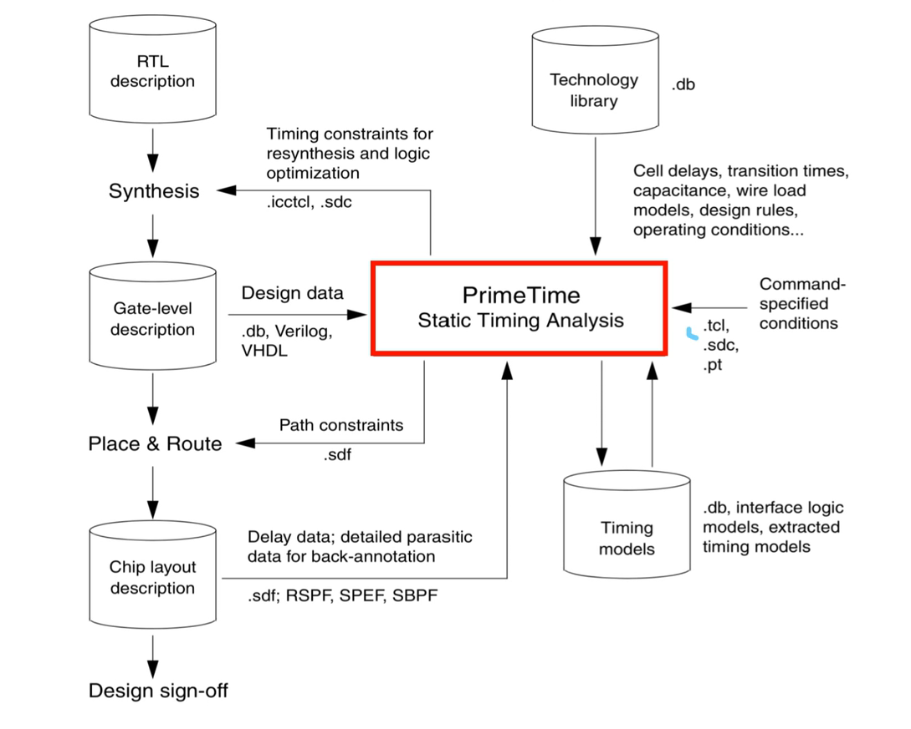
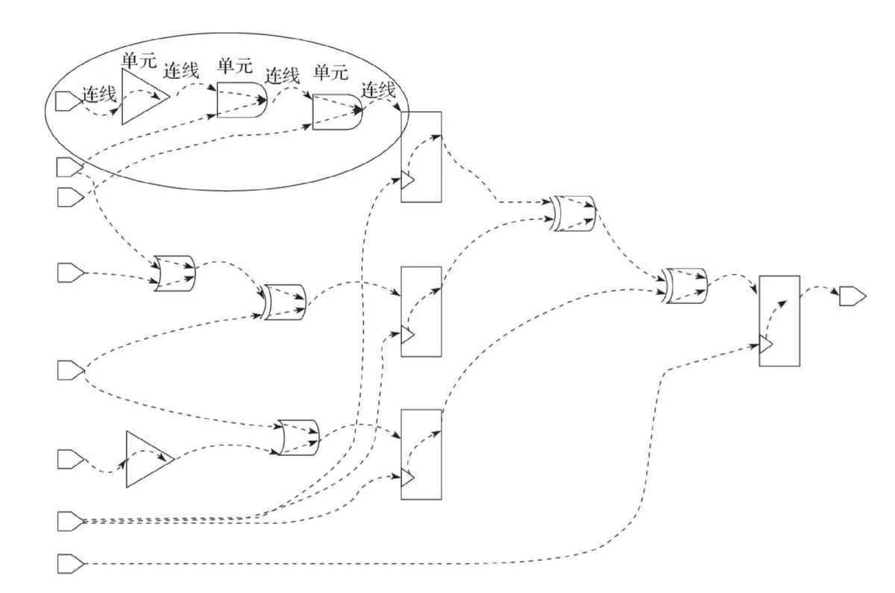

# TCL&STA


## TCL简介

TCL的特点如下：

- ​			减少开发时间。
- ​			功能强大和简单的用户界面工具包整合传统知识。
- ​			一次编写，随处运行。它可以运行在Windows，Mac OS X和几乎所有的Unix平台。
- ​			有经验的程序员很容易上手，因为语言就是这么简单，可以在几个小时或几天学习Tcl就可以搞定。
- ​			可以轻松地用Tcl扩展现有的应用程序。另外，也可以包括Tcl的用C，C++或Java来扩展Tcl，或反之亦然。
- ​			有一组功能强大的网络功能。
- ​			最后，它的开源，免费的，可以用于其他无任何限制商业应用。

Tcl是一种通用的语言，可以随便就能找到Tcl应用的例子。它包括

- ​			这通常是由数据库支持的可扩展的网站。
- ​			高性能的网络服务器建立的TclHttpd。
- ​			TCL基于CGI的网站。
- ​			桌面GUI应用程序。
- ​			嵌入式应用。
- ​            **静态时序约束。**

## 基本语法

### 特殊变量

argc 		 						指命令行参数的个数。 	 	 		 			
argv 		 						指包含命令行参数的列表。 	 	 		 			
argv0 		 		 		 	是指被解释的文件或由调用脚本的名称的文件名。 	 	 		 			
env 		 						  用于表示是环境变量数组元素。 	 	 		 			
errorCode 		 			    为最后的Tcl错误的错误代码。 	 	 		 			
errorInfo 		 				  为最后Tcl错误的堆栈跟踪信息。 	 	 		 			
tcl_interactive 		 		  分别将其设置为1和0交互和非交互模式之间切换。 	 	 		 			
tcl_library 		 				 用于设置的标准Tcl库的位置。 	 	 		 			
tcl_pkgPath 		 			 提供一般都安装包的目录列表。 	 	 		 			
tcl_patchLevel 		 		 指的是Tcl解释目前的补丁级别。 	 	 		 			
tcl_platform 		 			 用于表示使用对象，包括byteOrder, machine, osVersion平台和操作系统数组元素。 	 	 		 			tcl_precision 		 			指的是精度，即位数转换为浮点数时，字符串保留。默认值是12。 	 	 		 			
tcl_prompt1 		 			 指的是主提示符。 	 	 		 			
tcl_prompt2 		 			 指无效的命令二次提示。 	 	 		 			
tcl_rcFileName 		 		为用户提供了具体的启动文件。 	 	 		 			
tcl_traceCompile 		 	 用于控制字节码编译的跟踪。用0表示无输出，1为概要和2为详细。 	 	 		 			
tcl_traceExec 		 		   用于控制执行的字节码的跟踪。用0表示无输出，1为概要和2为详细。 	 	 		 			
tcl_version 		 			   返回Tcl解释器的最新版本。 

### 保留字

​	下面列出了一些在Tcl中的保留字。这些保留的字可以不被用作常量或变量，或任何其他的标识符名称。

| after       | append     | array           | auto_execok  |
| ----------- | ---------- | --------------- | ------------ |
| auto_import | auto_load  | auto_load_index | auto_qualify |
| binary      | Bgerror    | break           | catch        |
| cd          | Clock      | close           | concat       |
| continue    | Dde        | default         | else         |
| elseif      | Encoding   | eof             | error        |
| eval        | Exec       | exit            | expr         |
| fblocked    | Fconfigure | fcopy           | file         |
| fileevent   | Flush      | for             | foreach      |
| format      | Gets       | glob            | global       |
| history     | If         | info            | interp       |
| join        | Lappend    | lindex          | linsert      |
| list        | Llength    | load            | lrange       |
| lreplace    | Lsearch    | lsort           | namespace    |
| open        | Package    | pid             | pkg_mkIndex  |
| proc        | Puts       | pwd             | read         |
| regexp      | Regsub     | rename          | resource     |
| return      | Scan       | seek            | set          |
| socket      | Source     | split           | string       |
| subst       | Switch     | tclLog          | tell         |
| time        | Trace      | unknown         | unset        |
| update      | Uplevel    | upvar           | variable     |
| vwait       | While      |                 |              |

### 标识符

​	一个Tcl标识符是用来标识**变量**，**函数**，或任何其它用户定义的项目的名称。一个标识符开始以字母A到Z或a〜z或后跟零个或多个字母下划线（_），下划线，美元（$）和数字（0〜9）。

​	TCL不允许标点字符，如@和％标识符。TCL是大小写敏感的语言。因此Manpower 和manpower 在Tcl是两个不同的标识符。这里是可接受的标识符的一些例子：

```tcl
mohd       zara    abc   move_name  a_123
myname50   _temp   j     a23b9      retVal
```

### 空格

仅包含空格，可能与注释行，被称为一个空行和Tcl解释完全忽略它。

空白格是Tcl中用来描述空格，制表符，换行符和注释的术语。空格分开一声明中的一个组成部分，使解释器来识别，其中在声明一个元件，如puts, ends和下一个元素开始。

```tcl
(Desktop) 1 % puts"hello world"
invalid command name "puts"hello"
(Desktop) 2 % puts "hello world" 
hello world
(Desktop) 3 % puts  "hello world"
hello world
```


## 命令

```
commandName argument1 argument2 ... argumentN
```

### 命令替换

在命令替换，方括号是用来计算在方括号中的脚本。一个简单的例子，两个数字相加如下所示。

```tcl
puts [expr 1 + 6 + 9]
```

​	当上述代码被执行时，它会产生以下结果。

```tcl
16
```

### 变量替换

​	在变量替换，$使用在变量名之前，这将返回该变量的内容。一个简单的例子为一个值设置为变量并打印如下所示。

```tcl
set a 3
puts $a
```

​	当上述代码被执行时，它会产生以下结果。

```tcl
3
```

### 反斜杠替换

​	这些通常被称为转义序列，每个反斜线后跟有自己的含义字母。一个简单的例子换行符替换如下所示。

```tcl
puts "Hello\nWorld"
```

​	当上述代码被执行时，它会产生以下结果。

```tcl
Hello
World
```


## 数据类型

在Tcl中，无论它是一个整数，布尔，浮点数，或一个字符串。当使用一个变量，可以**直接赋值**给它，Tcl没有声明一步。

### 字符串表示

​	不同于其他语言，在TCL，**不需要包含双引号**，它只有一个字。一个例子如下，

```tcl
set myVariable hello
puts $myVariable
```

​	当上述代码被执行时，它会产生以下结果。

```tcl
hello
```

当我们想表示多个字符串，可以使用双引号或大括号。它如下所示。

```tcl
set myVariable "hello world"
puts $myVariable
set myVariable {hello world}
puts $myVariable
```

​	当上述代码被执行时，它会产生以下结果。

```
hello world
hello world
```

### List

列表不过是一组元素。一组单词或者使用双引号或大括号可以用来表示一个简单的列表。一个简单的列表如下所示。

```tcl
set myVariable {red green blue}
puts [lindex $myVariable 2]
set myVariable "red green blue"
puts [lindex $myVariable 1]
```

当上述代码被执行时，它会产生以下结果。(注意使用 [ ] )

```
blue
green
```

### 关联数组

​	关联数组有一个索引（key）但不一定是整数。人们普遍认为就像键值对是字符串。一个简单的例子如下所示。

```tcl
set  marks(english) 80
puts $marks(english)
set  marks(mathematics) 90
puts $marks(mathematics)
```

​	当上述代码被执行时，它会产生以下结果。

```
80
90
```

### 句柄

​	TCL句柄通常用于表示文件和图形对象。这些可以包括句柄网络请求以及其它渠道，如串口通讯，套接字或I/O设备。下面是创建一个文件句柄的例子。

```tcl
set myfile [open "filename" r]
```


## 变量

在TCL，变量声明没有概念。当遇到一个新的变量名，TCL将定义一个新的变量。

### 变量命名

变量的名称可以包含任何字符和长度。甚至可以存在空格被封闭在大括号中的变量，但不建议这样做。

set命令用于指定值的变量。set 命令的语法是：

```tcl
set variableName value
```

变量的几个例子如下所示。

```tcl
set variableA 10
set {variable B} test
puts $variableA
puts ${variable B}
```

当上述代码被执行时，它会产生以下结果。

```
10
test
```

正如可以在上面的方案看到，$variableName 用于获取变量的值。

### 动态类型

TCL是一种动态类型语言。变量的值可以在需要时被动态地转换为所需的类型。例如，一个数字5，其被存储为字符串将做的算术运算时被转换为数字。它如下所示。

```tcl
set variableA "10"
puts $variableA
set sum [expr $variableA +20];
puts $sum
```

当上述代码被执行时，它会产生以下结果。

```tcl
10
30
```

### 数学表达式

正如在上面的例子中看到，expr是用于表示数学表达式。 Tcl默认精度为12位。为了得到浮点运算的结果，我们应该增加至少一个十进制小数。一个简单的例子说明了上述情况。

```tcl
set variableA "10"
set result [expr $variableA / 9];
puts $result
set result [expr $variableA / 9.0];
puts $result
set variableA "10.0"
set result [expr $variableA / 9];
puts $result
```

当上述代码被执行时，它会产生以下结果。

```tcl
1
1.1111111111111112
1.1111111111111112
```

在上面的例子中，可以看到三种情况。第一种情况，被除数和除数是整数，得到一个整数作为结果。第二种情况，除数是小数以及第三种情况，分数是一个十进制数。在第二和第三情况下，得到的是十进制数作的结果。

在上面的代码，可以使用**tcl_precision**特殊变量改变精度。它如下所示。

```tcl
set variableA "10"
set tcl_precision 5
set result [expr $variableA / 9.0];
puts $result
```

当上述代码被执行时，它会产生以下结果。

```tcl
1.1111
```


## 运算符

运算符是一个符号，告诉编译器执行特定的数学或逻辑操作。 Tcl语言有丰富的内置运算符，运算符提供的以下几种类型：

- ​		算术运算符
- ​		关系运算符
- ​		逻辑运算符
- ​		位运算符
- ​		三元运算符

### 算术运算符

| 运算符 | 描述                         | 实例        |
| ------ | ---------------------------- | ----------- |
| +      | 两个操作数相加               | A + B = 30  |
| -      | 第一个操作数减去第二个操作数 | A - B = -10 |
| *      | 两个操作数相乘               | A * B = 200 |
| /      | 除法分子通过去分母           | B / A = 2   |
| %      | 模运算及整数除法后的余数     | B % A = 0   |

### 关系运算符

| 操作符 | 描述                                                         | 例子                |
| ------ | ------------------------------------------------------------ | ------------------- |
| ==     | 检查两个操作数的值是否相等，如果是的话那么条件为真。         | (A == B) 不为 true. |
| !=     | 检查两个操作数的值是否相等，如果值不相等，则条件为真。       | (A != B) 为 true.   |
| >      | 检查左边的操作数的值是否大于右操作数的值，如果是的话那么条件为真。 | (A > B) 不为  true. |
| <      | 检查左边的操作数的值是否小于右操作数的值，如果是的话那么条件为真。 | (A < B) 为 true.    |
| >=     | 检查左边的操作数的值是否大于或等于右操作数的值，如果是的话那么条件为真。 | (A >= B) 不为 true. |
| <=     | 检查左边的操作数的值是否小于或等于右操作数的值，如果是的话那么条件为真。 | (A <= B) 为 true.   |

### 逻辑运算符

下表列出了所有Tcl语言支持的逻辑运算符。假设变量A=1和变量B=0，则：

| 运算符 | 描述                                                         | 例子                |
| ------ | ------------------------------------------------------------ | ------------------- |
| &&     | 所谓逻辑与操作。如果两个操作数都非零，则条件变为真。         | (A && B) 为 false.  |
| \|\|   | 所谓的逻辑或操作。如果任何两个操作数是非零，则条件变为真。   | (A \|\| B) 为 true. |
| !      | 逻辑非运算符。使用反转操作数的逻辑状态。如果条件为真，那么逻辑非运算符为假。 | 、                  |

### 位运算符

位运算符适用于位并进行逐位操作。&, |, 和 ^ 的真值表如下：

| p    | q    | p & q | p \| q | p ^ q |
| ---- | ---- | ----- | ------ | ----- |
| 0    | 0    | 0     | 0      | 0     |
| 0    | 1    | 0     | 1      | 1     |
| 1    | 1    | 1     | 1      | 0     |
| 1    | 0    | 0     | 1      | 1     |

| 运算符 | 描述                                                         | 例子                            |
| ------ | ------------------------------------------------------------ | :------------------------------ |
| &      | 二进制和操作符副本位的结果，如果它存在于两个操作数。         | (A & B) = 12, 也就是 0000 1100  |
| \|     | 二进制或操作拷贝位，如果它存在一个操作数中。                 | (A \| B) = 61, 也就是 0011 1101 |
| ^      | 二进制异或操作符的副本，如果它被设置在一个操作数而不是两个比特。 | (A ^ B) = 49, 也就是 0011 0001  |
| <<     | 二进制左移位运算符。左边的操作数的值向左移动由右操作数指定的位数。 | A << 2 = 240 也就是 1111 000    |
| >>     | 进制向右移位运算符。左边的操作数的值由右操作数指定的位数向右移动。 | A >> 2 = 15 也就是 0000 1111    |

### 三元运算符

| 运算符 | 描述    | 示例                 |
| ------ | ------- | -------------------- |
| ? :    | Ternary | 条件为真 ? X : 否则Y |

### Tcl运算符优先级

高到低依次为：

1. 函数调用
2. 括号（改变了运算符的默认优先级）
3. 幂（指数运算）
4. 一元正负号
5. 乘除法和取模
6. 加减法
7. 字符串拼接（用于连接两个字符串）
8. 关系运算符（大于、小于、等于等）
9. 逻辑运算符（与、或、非等）
10. 赋值运算符（用于给变量赋值）


## 语句

###  if...else语句

Tcl语言的if ... else语句的语法是：

```tcl
if {boolean_expression 1} {
   # Executes when the boolean expression 1 is true
} elseif {boolean_expression 2} {
   # Executes when the boolean expression 2 is true 
} elseif {boolean_expression 3} {
   # Executes when the boolean expression 3 is true 
} else {
   # executes when the none of the above condition is true 
}
```

### Switch语句

```tcl
set grade B;

switch $grade {
   A {
     puts "Well done!"
   }
   B {
     puts "Excellent!"
   }

   C {
     puts "You passed!"
   }
   F {
     puts "Better try again"
   }
   default {
     puts "Invalid grade"
   }
}
puts "Your grade is  $grade"
```

当上述代码被编译和执行时，它产生了以下结果：

```
Excellent
Your grade is B
```

### while循环

```tcl
set a 10
while { $a < 20 } {
   puts "value of a: $a"
   incr a
}
```

当上述代码被编译和执行时，它产生了以下结果：

```tcl
value of a: 10
value of a: 11
value of a: 12
value of a: 13
value of a: 14
value of a: 15
value of a: 16
value of a: 17
value of a: 18
value of a: 19
```

### For循环

```tcl
for { set a 10}  {$a < 20} {incr a} {
   puts "value of a: $a"
}
```

​	当上述代码被编译和执行时，它产生了以下结果：

```tcl
value of a: 10
value of a: 11
value of a: 12
value of a: 13
value of a: 14
value of a: 15
value of a: 16
value of a: 17
value of a: 18
value of a: 19
```

###  break语句

break语句用于终止循环。当循环中遇到break语句，循环立即终止，程序控制继续循环体后面的语句。

```tcl
set a 10
while {$a < 20 } {
   puts "value of a: $a"
   incr a
   if { $a > 15} {
      # terminate the loop using break statement 
          break
   }
}
```

当上述代码被编译和执行时，它产生了以下结果：

```tcl
value of a: 10
value of a: 11
value of a: 12
value of a: 13
value of a: 14
value of a: 15
```

### continue语句

```tcl
set a 10
# do loop execution 
while { $a < 20 } {
   if { $a == 15} {
     #skip the iteration 
	 incr a
     continue
   }
   puts "value of a: $a"
   incr a     
}
```

当上述代码被编译和执行时，它产生了以下结果：

```tcl
value of a: 10
value of a: 11
value of a: 12
value of a: 13
value of a: 14
value of a: 16
value of a: 17
value of a: 18
value of a: 19
```


## 数组

常规数组的语法如下所示。

```tcl
set ArrayName(Index) value
```

### 数组大小

用于计算数组大小的语法，如下所示。

```tcl
[array size variablename]
```

用于打印数组的大小的示例如下所示。

```tcl
set languages(0) Tcl
set languages(1) "C Language"
puts  [array size languages]
```

​	当上述代码被执行时，它会产生以下结果。

```tcl
2
```

### 数组迭代

虽然数组索引可以是非连续的，像索引1，然后索引10等指定的值。但是如果它们是连续的，我们可以用数组迭代访问数组的元素。一个简单的数组迭代的打印元素，如下所示。

```tcl
set languages(0) Tcl
set languages(1) "C Language"
for { set index 0 }  { $index < [array size languages] }  { incr index } {
      puts "languages($index) : $languages($index)"
}
```

当上述代码被执行时，它会产生以下结果。

```tcl
languages(0) : Tcl
languages(1) : C Language
```

### 关联数组

​	在TCL，所有数组本质是相关联的。数组存储并没有任何具体的顺序进行检索。关联数组使用索引但不一定都是数字。一个简单的例子，关联数组与非数字索引如下所示。

```tcl
set personA(Name) "Dave"
set personA(Age) 14
puts  $personA(Name)
puts  $personA(Age)
```

当上述代码被执行时，它会产生以下结果。

```tcl
Dave
14
```

### 数组的索引

用于检索数组索引的语法如下所示。

```tcl
[array names variablename]
```

​	用于打印数组的大小的示例如下所示。

```tcl
set personA(Name) "Dave"
set personA(Age) 14
puts [array names personA]
```

当上述代码被执行时，它会产生以下结果。

```
Age Name
```

### 关联数组迭代

可以使用数组的索引来遍历数组。如下例子所示。

```tcl
set personA(Name) "Dave"
set personA(Age) 14
foreach index [array names personA] {
   puts "personA($index): $personA($index)"
}
```

当上述代码被执行时，它会产生以下结果。

```tcl
personA(Age): 14
personA(Name): Dave
```


## 字符串

### 字符串表示

​	不同于其他语言，在TCL，只有一个字时，不需要包含双引号。示例如下，

```tcl
set myVariable hello
puts $myVariable
```

​	当上述代码被执行时，它会产生以下结果。

```
hello
```

​	当要表示多个字符串，我们可以使用双引号或大括号。它如下所示。

```tcl
set myVariable "hello world"
puts $myVariable
set myVariable {hello world}
puts $myVariable
```

​	当上述代码被执行时，它会产生以下结果。

```
hello world
hello world
```

### 字符串转义序列

​	字符文字可以是一个普通的字符（例如，'x'），转义序列（如“\t'），或通用字符（例如，'\u02C0'）。

​	Tcl有一些字符，当他们前面加一个反斜杠他们将有特殊的含义，它们被用来表示类似的换行符（\n）或制表符（\t）。在这里，有一些转义序列代码的列表：

| 转义序列 | 意思     |
| -------- | -------- |
| \\       | \ 字符   |
| \'       | ' 字符   |
| \"       | " 字符   |
| \?       | ? 字符   |
| \a       | 警报或铃 |
| \b       | 退格     |
| \f       | 换页     |
| \n       | 新一行   |
| \r       | 回车     |
| \t       | 水平制表 |
| \v       | 垂直制表 |

### 字符串命令

子命令字符串命令列表列如下表。

| SN   | 方法及描述                                                   |
| ---- | :----------------------------------------------------------- |
| 1    | compare** string1 string2 			 	    比较字string1和string2字典顺序。相等返回0，如果string1在string2出现之前返回-1，否则返回1。 |
| 2    | **fitst** string1 string2 			 				返回string1中第一次出现string1索引的位置。如果没有找到，返回-1。 |
| 3    | **index** string index 			 				返回索引的字符。 |
| 4    | **last** string1 string2 			 				返回索引string1在string2中出现的最后一次。如果没有找到，返回-1。 |
| 5    | **length** string 			 				      返回字符串的长度。 |
| 6    | **match pattern** string 			 				返回1，如果该字符串匹配模式。 |
| 7    | **range** string index1 index2 			 	返回指定索引范围内的字符串，index1到index2。 |
| 8    | **tolower** string 			 				      返回小写字符串。 |
| 9    | **toupper** string 			 			      	返回大写字符串。 |
| 10   | **trim** string ?trimcharacters? 			 			删除字符串两端的trimcharacters。默认trimcharacters是空白。 |
| 11   | **trimleft** string ?trimcharacters? 			 	    删除字符串左侧开始的trimcharacters。默认trimcharacters是空白。 |
| 12   | **trimright** string ?trimcharacters? 			 	删除字符串左端trimcharacters。默认trimcharacters是空白。 |
| 13   | **wordend** findstring index 			 				返回索引字符findstring包含字符索引单词。 |
| 14   | **wordstart** findstring index 			 				返回findstring中第一个字符的含有索引中的字符索引的单词。 |

​	一些常用的Tcl字符串子命令的例子在下面给出。

### 字符串比较

```tcl
set s1 "Hello"
set s2 "World"
set s3 "World"
puts [string compare s1 s2]
if {[string compare s2 s3] == 0} {
puts "String \'s1\' and \'s2\' are same."; 
} 

if {[string compare s1 s2] == -1} {
puts "String \'s1\' comes before \'s2\'.";
}

if {[string compare s2 s1] == 1} {
puts "String \'s2\' comes before \'s1\'.";
}
```

​	让我们编译和运行上面的程序，这将产生以下结果：

```
-1
String 's1' comes before 's2'.
String 's2' comes before 's1'.
```

### 字符串索引

```tcl
set s1 "Hello World"
set s2 "o"
puts "First occurrence of $s2 in s1"
puts [string first $s2 $s1]
puts "Character at index 0 in s1"
puts [string index $s1 0]
puts "Last occurrence of $s2 in s1"
puts [string last $s2 $s1]
puts "Word end index in s1"
puts [string wordend $s1 20]
puts "Word start index in s1"
puts [string wordstart $s1 20]
```

​	让我们编译和运行上面的程序，这将产生以下结果：

```tcl
First occurrence of o in s1
4
Character at index 0 in s1
H
Last occurrence of o in s1
7
Word end index in s1
11
Word start index in s1
6
```

### 字符串长度

```tcl
set s1 "Hello World"
puts "Length of string s1"
puts [string length $s1]
```

​	让我们编译和运行上面的程序，这将产生以下结果：

```tcl
Length of string s1
11
```

### 处理大小写

```tcl
set s1 "Hello World"
puts "Uppercase string of s1"
puts [string toupper $s1]
puts "Lowercase string of s1"
puts [string tolower $s1]
```

让我们编译和运行上面的程序，这将产生以下结果：

```
Uppercase string of s1
HELLO WORLD
Lowercase string of s1
hello world
```

### 修整字符

```tcl
set s1 "Hello World"
set s2 "World"
puts "Trim right $s2 in $s1"
puts [string trimright $s1 $s2]

set s2 "Hello"
puts "Trim left $s2 in $s1"
puts [string trimleft $s1 $s2]

set s1 " Hello World "
set s2 " "
puts "Trim characters s1 on both sides of s2"
puts [string trim $s1 $s2]
```

让我们编译和运行上面的程序，这将产生以下结果：

```tcl
Trim right World in Hello World
Hello 
Trim left Hello in Hello World
 World
Trim characters s1 on both sides of s2
Hello World
```

### 匹配字符串

```tcl
set s1 "test@test.com" 
set s2 "*@*.com"
puts "Matching pattern s2 in s1"
puts [string match "*@*.com" $s1 ]
puts "Matching pattern tcl in s1"
puts [string match {tcl} $s1]
```

让我们编译和运行上面的程序，这将产生以下结果：

```tcl
Matching pattern s2 in s1
1
Matching pattern tcl in s1
0
```

### Append 命令

```tcl
set s1 "Hello" 
append s1 " World"
puts $s1
```

让我们编译和运行上面的程序，这将产生以下结果：

```
Hello World
```

### Format 命令

Tcl显示格式format说明如下列表。

| 指示符 | 使用             |
| ------ | ---------------- |
| %s     | 字符串表示       |
| %d     | 整数表示         |
| %f     | 浮点表示         |
| %e     | 指数形式浮点表示 |
| %x     | 十六进制表示     |

一些简单下面的例子给出。

```tcl
puts [format "%f" 43.5]
puts [format "%e" 43.5]
puts [format "%d %s" 4 tuts]
puts [format "%s" "Tcl Language"]
puts [format "%x" 40]
```

​	让我们编译和运行上面的程序，这将产生以下结果：

```tcl
43.500000
4.350000e+01
4 tuts
Tcl Language
28
```

### Scan命令

scan命令用于分析基于对格式说明的字符串。一些例子如下所示。

```tcl
puts [scan "90" {%[0-9]} m]
puts [scan "abc" {%[a-z]} m]
puts [scan "abc" {%[A-Z]} m]
puts [scan "ABC" {%[A-Z]} m]
```

当上述代码被编译和执行时，它产生了以下结果：

```tcl
1
1
0
1
```


## 列表

### 创建一个列表

列表的一般语法如下。

```tcl
set listName { item1 item2 item3 .. itemn }
# or
set listName [list item1 item2 item3]
# or 
set listName [split "items separated by a character" split_character]
```

一些例子如下面给出。

```tcl
set colorList1 {red green blue}
set colorList2 [list red green blue]
set colorList3 [split "red_green_blue" _]
puts $colorList1
puts $colorList2
puts $colorList3
```

当上述代码被执行时，它会产生以下结果。

```tcl
red green blue
red green blue
red green blue
```

### 追加项目到列表

追加项目到列表的语法如下。

```
append listName split_character value
# or
lappend listName value
```

​	一些例子如下面给出。

```tcl
set var orange
append var " " "blue"
lappend var "red" 
lappend var "green" 
puts $var
```

​	当上述代码被执行时，它会产生以下结果。

```
orange blue red green
```

### 列表长度

列表长度的语法如下。

```tcl
llength listName
```

例如，列表长度如下例所示。

```tcl
set var {orange blue red green}
puts [llength $var] 
```

当执行上面的代码，产生以下结果：

```
4
```

### 列表索引项

用于选择在指定索引的列表项如下。

```tcl
lindex listname index
```

例如，列表索引项目如下所示。

```tcl
set var {orange blue red green}
puts [lindex $var  1]
```

当执行上面的代码，产生以下结果：

```
blue
```

### 插入索引项目

在列表特定索引插入项目的语法如下。

```tcl
linsert listname index value1 value2..valuen
```

例如，在列表特定的索引插入项目如下。

```tcl
set var {orange blue red green}
set var [linsert  $var 3 black white]
puts $var
```

当执行上面的代码，产生以下结果：

```
orange blue red black white green
```

### 更换项目索引

用于替换列表项以特定索引的语法如下。

```tcl
lreplace listname firstindex lastindex value1 value2..valuen
```

例如用于替换列表项以特定的索引如下。

```tcl
set var {orange blue red green}
set var [lreplace $var 2 3 black white]
puts $var
```

当执行上面的代码，产生以下结果：

```
orange blue black white
```

### 设置指数项目

用于设置列表项在特定索引下面的语法给出。

```tcl
lset listname index value 
```

例如设置列表项的索引具体如下。

```tcl
set var {orange blue red green}
lset var 0 black 
puts $var
```

当执行上面的代码，产生以下结果：

```
black blue red green
```

### 转换列表变量

复制值到变量的语法如下。

```
lassign listname variable1 variable2.. variablen
```

例如，用于将列表到变量如下。

```tcl
set var {orange blue red green}
lassign $var colour1 colour2
puts $colour1
puts $colour2
```

当执行上面的代码，产生以下结果：

```
orange
blue
```

### 排序列表

排序列表的语法如下。

```
lsort listname
```

进行列表的排序如下例子。

```tcl
set var {orange blue red green}
set var [lsort $var]
puts $var
```

当执行上面的代码，产生以下结果：

```
blue green orange red
```

### 合并列表

```tcl
concat &list1 $list2
```


## 字典

词典是用于值映射到键的布置。常规字典的语法如下所示。

```tcl
dict set dictname key value
# or 
dict create dictname key1 value1 key2 value2 .. keyn valuen
```

用于创建字典的一些例子如下所示。

```tcl
dict set colours  colour1 red 
puts $colours
dict set colours  colour2 green
puts $colours

set colours [dict create colour1 "black" colour2 "white"]
puts $colours
```

当执行上面的代码，产生以下结果：

```
colour1 red
colour1 red colour2 green
colour1 black colour2 white
```

### 字典的大小

用于获取字典的大小语法如下所示。

```tcl
[dict size dictname]
```

​	用于打印的尺寸一个例子如下所示。

```tcl
set colours [dict create colour1 "black" colour2 "white"]
puts [dict size $colours]
```

​	当执行上面的代码，产生以下结果：

```
2
```

### 字典迭代

打印键和字典的值一个简单的字典迭代如下图所示。

```tcl
set colours [dict create colour1 "black" colour2 "white"]
foreach item [dict keys $colours] {
    set value [dict get $colours $item]
    puts $value
}
```

当执行上面的代码，产生以下结果：

```
black
white
```

### 字典的键值

字典键检索值的语法如下所示。

```
[dict get $dictname $keyname]
```

用于键检索值的示例如下面给出。

```tcl
set colours [dict create colour1 "black" colour2 "white"]
set value [dict get $colours colour1]
puts $value
```

当执行上面的代码，产生以下结果：

```
black
```

### 字典中的所有键

用于检索在字典的所有键的语法如下所示。

```
[dict keys $dictname]
```

用于打印所有的键一个例子如下所示。

```tcl
set colours [dict create colour1 "black" colour2 "white"]
set keys [dict keys $colours]
puts $keys
```

当执行上面的代码，产生以下结果：

```tcl
colour1 colour2
```

### 字典中的所有值

用于检索在字典中的所有值的语法如下所示。

```tcl
[dict values $dictname]
```

用于打印的所有值一个例子如下所示。

```tcl
set colours [dict create colour1 "black" colour2 "white"]
set values [dict values $colours]
puts $values
```

当执行上面的代码，产生以下结果：

```tcl
black white
```

### 关键存在于字典

检查一个键是否存在于字典的语法如下所示。

```tcl
[dict values $dictname]
```

用于检查一个键是否存在于字典的一个例子如下所示。

```tcl
set colours [dict create colour1 "black" colour2 "white"]
set result [dict exists $colours colour1]
puts $result
```

当执行上面的代码，产生以下结果：

```tcl
1
```


## 过程

程序是什么，只不过代码块的一系列命令，提供了一个可重复使用的特定功能。它被用于避免相同的代码被重复在多个位置。程序相当于许多编程语言中使用的功能，并提供Tcl proc命令的帮助。

创建一个简单程序的语法如下所示。

```tcl
proc procedureName {arguments} {
   body
}
```

一个简单程序的例子如下。

```tcl
proc helloWorld {} {
   puts "Hello, World!"
}
helloWorld
```

当执行上面的代码，产生以下结果：

```tcl
Hello, World!
```

### 过程的多个参数

对于程序带参数如下图的例子所示。

```tcl
proc add {a b} {
   return [expr $a+$b]
}
puts [add 10 30]
```

当执行上面的代码，产生以下结果：

```tcl
40
```

### 过程的可变参数

对于程序带参数如下图的例子所示。

```tcl
proc avg {numbers} {
    set sum 0
    foreach number $numbers {
      set sum  [expr $sum + $number]
	}
    set average [expr $sum/[llength $numbers]]
    return $average
}
puts [avg {70 80 50 60}]
puts [avg {70 80 50 }]
```

当执行上面的代码，产生以下结果：

```tcl
65
66
```

### 过程使用默认参数

默认参数是用来提供一种可如果未提供任何参数值时，可以使用默认值。对于程序用其有时称为隐式参数默认参数，一个例子如下所示。

```tcl
proc add {a {b 100} } {
   return [expr $a+$b]
}
puts [add 10 30]
puts [add 10]
```

当执行上面的代码，产生以下结果：

```tcl
40
110
```

### 递归过程

递归过程的示例如下所示。

```tcl
proc factorial {number} {
   if {$number <= 1} {
      return 1
   } 
   return [expr $number * [factorial [expr $number - 1]]]

}
puts [factorial 3]
puts [factorial 5]
```

当执行上面的代码，产生以下结果：

```tcl
6
120
```


## 文件I/O

### 打开文件

TCL使用open命令在Tcl中打开文件。打开文件的语法如下。

```tcl
open fileName accessMode
```

​	在这里，文件名是字符串文字，用它来命名文件名，accessMode可以是以下值之一：

| 模式 | 描述                                                         |
| ---- | ------------------------------------------------------------ |
| r    | 打开一个现有的文本文件读取并且文件必须存在。这是没有指定accessMode时使用的默认模式。 |
| w    | 打开用于写入的文本文件中、，如果它不存在，则一个新文件创建，其他现有的文件将被截断。 |
| a    | 打开写在追加模式，文件必须存在一个文本文件。在这里，程序将开始追加到现有的文件内容的内容。 |
| r+   | 打开用于读取和写入的文本文件。文件必须已经存在。             |
| w+   | 打开用于读取和写入的文本文件。如果它存在首先截断文件为零长度，否则创建该文件。 |
| a+   | 打开用于读取和写入两种的文本文件。如果它不存在，创建该文件。读数将从头开始，但写只能追加。 |

### 关闭文件

要关闭一个文件，请使用close命令。close 的语法如下。

```tcl
close fileName 
```

当程序完成使用该文件已被打开的一个程序中的任何文件都必须关闭。在大多数情况下，文件不需要被明确地关闭;它们会自动关闭，当文件对象会自动终止。

### 写入文件

puts命令用于写入一个打开的文件。

```tcl
puts $filename "text to write"
```

一个简单写入文件的例子如下所示。

```tcl
set fp [open "input.txt" w+]
puts $fp "test"
close $fp
```

当上述代码被编译和执行时，它创建根据目录的新文件input.txt（在该程序的工作目录）。

### 读取文件

以下是简单从文件中读取的命令：

```tcl
set file_data [read $fp]
```

读与写一个完整的例子如下所示。

```tcl
set fp [open "input.txt" w+]
puts $fp "test"
close $fp
set fp [open "input.txt" r]
set file_data [read $fp]
puts $file_data
close $fp
```

当上述代码被编译和执行时，它读取在前面的部分创建的文件，并且产生以下结果：

```
test
```

下面是另一个例子读取文件，文件一行一行直到结束。

```tcl
set fp [open "input.txt" w+]
puts $fp "test\ntest"
close $fp
set fp [open "input.txt" r]

while { [gets $fp data] >= 0 } {
   puts $data
}
close $fp
```

当上述代码被编译和执行时，它读取在前面的部分来创建的文件，并且产生以下结果：

```tcl
test
test
```


## 内置函数

Tcl提供了一些内置的功能(程序)，用于各种操作。这包括，

- ​			列表处理函数。
- ​			字符串处理函数。
- ​			数组处理函数。
- ​			字典处理函数。
- ​			文件I/O处理函数。
- ​			命名空间和包处理函数。
- ​			数学处理函数。
- ​			操作系统处理函数。

数学和系统函数以外的都包含在前面的章节。数学与系统内置函数说明如下。

### 数学函数

Tcl的数学函数可列于下表中。

| SN   | 方法名称      | 描述                                                         |
| ---- | ------------- | ------------------------------------------------------------ |
| 1    | **abs** arg   | 计算arg的绝对值。                                            |
| 2    | **acos** arg  | 计算arg的反余弦值。                                          |
| 3    | **asin** arg  | 计算arg的反正弦。                                            |
| 4    | **atan** arg  | 计算arg的反正切。                                            |
| 5    | **atan2** y x | 计算其参数的比值（y/x）的反正切。                            |
| 6    | **ceil** arg  | 计算比最小整数大于或等于的一个数。                           |
| 7    | **cos** arg   | 计算arg的余弦值。                                            |
| 8    | **cosh** arg  | 计算arg的双曲余弦值。                                        |
| 9    | **double**    | 计算arg如果是一个浮点值，返回arg，否则arg转换为浮点，并返回转换后的值。 |
| 10   | **exp** arg   | 计算指数函数（e的arg次幂）。                                 |
| 11   | **floor** arg | 计算比最大的整数小于或等于arg。                              |
| 12   | **fmod** x y  | 由y计算x相除的浮点余数。如果y是0，则返回一个错误。           |
| 13   | **hypot** x y | 计算一个直角三角形的斜边的长度 sqrt(x*x+y*y).                |
| 14   | **int** arg   | 计算，如果arg是相同的宽度的机器字的整数值，则返回arg，否则转换arg为整数。 |
| 15   | **log** arg   | 计算arg的自然对数。                                          |
| 16   | **log10** arg | 计算以10为底arg的对数。                                      |
| 17   | **pow** x y   | 计算x的y的幂值。如果x为负，y必须是一个整数值。               |
| 18   | **rand**      | 计算0和1之间的伪随机数。                                     |
| 19   | **round** a   | 计算a的四舍五入为最接近的整数的值。                          |
| 20   | **sin** arg   | 计算arg的正弦值。                                            |
| 21   | **sinh** arg  | 计算arg的双曲正弦。                                          |
| 22   | **sqrt** arg  | 计算arg的平方根。arg必须为正。                               |
| 23   | **srand** arg | 计算0和1之间所述arg一个伪随机数，它必须是一个整数。          |
| 24   | **tan** arg   | 计算arg的正切值。                                            |
| 25   | **tanh** arg  | 计算arg的双曲正切值。                                        |
| 26   | **wide** arg  | 计算用于arg，如果它不是整数值至少64位宽（。                  |

使用数学函数的一些例子如下。

```tcl
namespace import ::tcl::mathfunc::*
puts [tan 10]
puts [pow 10 2]
puts [ceil 10.34]
puts [hypot 10 20]
puts [srand 45]
puts [log 10]
puts [srand 45]
```

当执行上面的代码，它产生了以下结果。

```
0.6483608274590866
100.0
11.0
22.360679774997898
0.0003521866166741525
2.302585092994046
0.0003521866166741525
```

### 	系统函数

​	在Tcl中包含重要的系统函数如下，

- ​			clock - 秒函数返回当前时间以秒为单位。
- ​			clock  format- 格式化函数格式化秒到的日期和时间。
- ​			clock scan- 扫描函数扫描输入字符串，并将其转换为秒。
- ​			open - 函数用于打开一个文件。
- ​			exec - 函数用于执行一个系统命令。
- ​			close - 函数用于关闭一个文件。

​	对于上述函数的一些实例在下面列出。

```tcl
#get seconds
set currentTime [clock seconds]
puts $currentTime
#get format 
puts "The time is: [clock format $currentTime -format %H:%M:%S]"
puts "The date is: [clock format $currentTime -format %D]"

set date "Jun 15, 2014"
puts [clock scan $date -format {%b %d, %Y}]

puts [exec ls]
puts [exec dir]

set a  [open input.txt]
puts [read $a];
puts $a
close $a
```

​	当执行上面的代码，产生以下结果：

```
1402819756
The time is: 03:09:16
The date is: 06/15/2014
1402808400
input.txt
main.tcl
input.txt  main.tcl
This is the file you can use to provide input to your program and later on open it inside your program to process the input.
file3
```

​	下表提供了可用于格式化的日期和时间的列表字符串。

| SN   | 格式   | 描述                         |
| ---- | ------ | ---------------------------- |
| 1    | **%a** | 天缩写形式，例如：Sun.       |
| 2    | **%A** | 天完全形式，例如：Sunday.    |
| 3    | **%b** | 月份缩写形式。               |
| 4    | **%B** | 月份完整形式。               |
| 5    | **%d** | 月份中日期                   |
| 6    | **%j** | 年份的Julian日期。           |
| 7    | **%m** | 月数字形式。                 |
| 8    | **%y** | 年份两位数。                 |
| 9    | **%Y** | 年份四位数。                 |
| 10   | **%H** | 24小时制的小时。             |
| 11   | **%I** | 12小时制的小时。             |
| 12   | **%M** | 分钟.                        |
| 13   | **%S** | 秒.                          |
| 14   | **%p** | AM 或 PM.                    |
| 15   | **%D** | 日期数字形式，如, mm /dd/yy. |
| 16   | **%r** | 时间12小时制。               |
| 17   | **%R** | 时间以24小时时钟，没有秒。   |
| 18   | **%T** | 时间以24小时制的时钟秒。     |
| 19   | **%Z** | 时区名称如 GMT, IST, EST 等  |


## 正则表达式

正则表达式（英文：Regular Expression，简写为 regex）是一种用来匹配字符串的模式。它的设计思想是用一种描述性的语言来给字符串定义一个规则，凡是符合规则的字符串，我们就认为它“匹配”了，否则，该字符串就是不合法的。

在 TCL 中，正则表达式通常用来做两件事：模式匹配和替换。

用直白的话来说，正则表达式就是利用26个英文字符与一些特殊符号的配合来进行文字内容比对的方法，绝大部分情况下，26个英文字符都代表它们本身，但在特殊符号的辅助下，这些英文字符也会有其他的含义，正则表达式比较困难的地方，也就在这种字符的**2义性**上面

| 特殊字符 | 简要说明                                       |
| -------- | ---------------------------------------------- |
| .        | 一个点，匹配任意一个字符                       |
| *        | 星号，匹配前面模式中的零个或者任意个           |
| +        | 加号，匹配前面模式中的一个或者任意个           |
| ?        | 问号，匹配前面模式中的零个或者一个             |
| ()       | 括号，创建一个子模式                           |
| \|       | 竖号，交替匹配                                 |
| []       | 中括号，用来表示一个区间                       |
| ^        | 尖号，将一个模式挂靠在要匹配的字符串的最前面   |
| $        | 美元号，将一个模式挂靠在要匹配的字符串的最后面 |

字符关键字：
这部分关键字包括26个英文字符（上面的表格没有列出来）。这些关键字的特点就是它们匹配自身。

数量关键字：
这部分关键字包括 . （点） * （星号） + （加号） ? （问号）这4个关键字，这中间 . （点）这个关键字稍微特殊一点，因为它有2个作用：既可以作为字符关键字表示任何字符，又可以作为数量关键字代表1个字符。

**【任何字符】**这个含义很深，因为——空字符也算任何字符，也就是说一个点可以表示有一个字符，也可以表示没有字符，这个概念是新手很容易犯错的地方。

数量关键字本身没有任何用处，它必须和【模式】这个概念一起共同作用，在正则表达式中，【模式】可以说是最为核心也最为广泛的内容。总体来说，模式就是用来表示自己想匹配字符的方法，但实际上模式的概念要更为复杂和广泛，这部分内容我会在后面有更详细的描述，就现在来说，你只要理解，数量关键字必须与模式一起共用就可以了。

模式关键字
（） （括号） | （竖号） [] （中括号） ^ （尖号） $ （美元号）这5个符号都属于模式关键字，它们要么代表模式本身（括号、竖号、中括号），要么作用于模式为模式提供其他更高级的功能（尖号、美元号）。

#### 什么是模式

模式就是一组用来匹配字符的关键字集合，一个最小的模式只有一个关键字，而大的模式则可以有无数个关键字：

A   这是一个模式，代表A这个字符本身

A+   这也是一个模式，代表一个或者任意多个A字符

正则表达式中，数量关键字都是作用于左边模式的，上面的例子中，A是一个没有数量关键字的模式，而A+中的+号就向左作用于前面这个A模式，如果没有A这个模式，+号本身是没有任何意义的，这里A虽然是一个字符，但是我觉得把A称为模式能更清楚的理解模式的含义。

正则表达式的核心就是对模式的掌握和操作，理解了模式就等于拿到了开启大门的钥匙。

这里我介绍一个TCL语言中的命令：regexp，这个命令的作用就是利用正则表达式来获取想要的字符，它的使用方法如下：

regexp [选项] <正则表达式> <匹配的原始字符串> <保存匹配后字符串的变量> [其他保存子模式匹配字符串的变量]

上面regexp中用[]括起来的部分是可选的，其他<>括起来的部分是必须的，如果正则表达式匹配从原始字符串中匹配到了内容，则命令返回1并且将匹配到的内容<保存匹配后字符串的变量>中。下面我们来看1个简单的例子：

```tcl
regexp {A+} "AABBCC" matchreg

puts $matchreg
```

```
AA
```

#### ()  子模式匹配关键字

小括号用来将一个大模式分为几段更小的模式，这样就可以更加精细的控制匹配方式了，我们来看一个例子：

regexp -- {(AA)(BB)(CC)} "AABBCC" match sub1 sub2 sub3

puts "The match is:$match"

puts "The sub1 is:$sub1"

puts "The sub2 is:$sub2"

puts "The sub3 is:$sub3"

The match is:AABBCCThe sub1 is:AAThe sub2 is:BBThe sub3 is:CC

#### |   交替匹配关键字

交替匹配用来匹配|符号二边的一个模式，比如下面的例子：

TOPSEC|topsec

上面的表达式表示匹配要么是全部大写的TOPSEC，要么是全部小写的topsec，不能2个都同时匹配。

**[]  区间匹配**

区间匹配用来表示匹配一系列字符串中间的一个，比如下面的例子：

```tcl
regexp {[ADEFG]} "AAABBBCCC" match

puts $match
```

```
A
```

上面的表达式表示匹配ABCDE这5个字符中的一个，注意：只是一个

如果想匹配多个呢？可以使用数量关键字辅助：

```tcl
regexp {[ADEFG]+} "AAABBBCCC" match

puts $match
```

```
AAA
```

区间匹配还可以使用[a-z]这样的语法来表示匹配从小写a到小写z这26个小写字母中的一个

这个关键字使用必须非常小心，因为在TCL语言中[]还有另外一个含义：所有处于[]中的内容是一条TCL命令，因此在regexp中使用的时候，必须用{}将[]的其他含义取消掉，如果将{}换成""，那么上面的命令会报错。

#### ^   挂靠匹配，将模式挂靠在字符串的开头

这是一个很特殊的关键字，它不像其他关键字是作用于左边的模式上，而是作用于右边的模式上，千万注意这一点！它表示从要匹配的字符串的最前面开始匹配，我们来看一个比较的例子：

```tcl
regexp {(AAA)} "BBBAAACCC" match
```

可以匹配到，match中的值是AAA，但是我们加上挂靠匹配字符之后呢：

```tcl
regexp {^(AAA)} "BBBAAACCC" match
```

无法匹配，match中的值为空，因为^符号要求必须从要匹配的字符最前面开始匹配，可惜要匹配的字符最前面是BBB，所以无法匹配到。

这个字符也有2义性，如果把它放在中括号里面的话，它表示【非】的意思，比如`[^a-z]`表示匹配不是a-z字母的其他字符，但是不在中括号里面，比如^ab表示必须最前面是ab这2个字符，这是很容易搞混的地方，一定要注意了。

#### **$   挂靠匹配，将模式挂靠在字符串的结尾

这个关键字与^关键字作用相反，但是它和其他关键字一样，是作用于左边的模式上，还是看看例子：

regexp {(AAA)$} "BBBCCCAAA" match

可以匹配到，因为要匹配的字符最后面是AAA，如果要匹配的字符是BBBAAACCC这样的，就无法匹配到了。

#### 数量关键字

. （点） * （星号） + （加号） ? （问号）用来表示数量。

**.   匹配任意一个字符**（点）是一个比较特殊的字符，它虽然表示匹配任意一个字符，但实际上任意字符也包括空字符。

\*    匹配前面模式中的零个或任意多个

零个这个概念很重要，也就是说不管有没有都会匹配，所以一般我们都会用.*这样的方式来表示任意多个任意字符，不管有没有都可以。

\+   匹配前面模式中的1个或任意多个

?   匹配前面模式中的0个或1个

/*   表示一个星号本身

/+   表示一个加号本身

//   表示一个反斜杠

### 高级正则表达式

高级正则表达式是基本正则表达式的扩展

#### 反斜杠字符序列

个人认为反斜杠字符序列应该是高级正则表达式最为实用的扩展了，利用反斜杠加上特定字符，可以表示复杂的含义，下面的表格就是根据我的经验使用最多的反斜杠序列，我会根据使用频率从上到下的安排顺序。

| 反斜杠序列 | 简要说明                                                     |
| ---------- | ------------------------------------------------------------ |
| /b         | 匹配单词边界，即单词与旁边的空格                             |
| /B         | **匹配非单词边界，即单词内部**                               |
| /d         | 表示0-9之间的数字                                            |
| /D         | 除了0-9之间数字的其他字符，与/d作用相反                      |
| /s         | 空白符，包括空格、换行、回车、制表、垂直制表、换页符等       |
| /S         | 非空白符，与/s作用相反                                       |
| /w         | 数字、字母和下划线                                           |
| /W         | 非数字、字母和下划线的其他字符                               |
| /uXXXX     | 16位Unicode字符编码.中文unicode编码范围[\u4e00-\u9fa5]也可以用非双字节 [^\x00-\xff],其中包含中文 |
| /n         | 换行符，Unicode码是/u000A                                    |
| /r         | 换页符，Unicode码是/u000D                                    |
| /t         | 制表符，Unicode码是/u0009                                    |

#### 字符类

除了反斜杠字符序列，高级正则表达式还支持字符类匹配，字符类就是利用一个单词代表复杂意思，大部分的字符类与反斜杠序列含义相同，但也有一些字符类是特有的，比如匹配16进制字符的xdigit，几乎所有情况下只要使用字符类就必须将它们放在[[: :]]符号中，下面的表格列出了所有字符类：

| 字符类       | 简要说明                                |
| ------------ | --------------------------------------- |
| [[:alnum:]]  | 大小写字母和数字，不包括下划线          |
| \[[:alpha:]] | 大小写字母                              |
| [[:blank:]]  | 空格和制表符                            |
| [[:cntrl:]]  | 控制字符，也就是ASCII码表中1-31号的字符 |
| [[:digit:]]  | 0-9之间的数字，与/d的含义相同           |
| [[:graph:]]  | 所有可以显示的字符                      |
| [[:lower:]]  | 小写字母                                |
| [[:print:]]  | alnum的另外一种表示方法                 |
| [[:punct:]]  | 所有标点字符                            |
| [[:space:]]  | 空白字符，与/s的含义相同                |
| [[:upper:]]  | 所有大写字母                            |
| [[:xdigit:]] | 所有16进制数字，包括0-9 a-f A-F         |

#### 扩展的正则表达式语法

扩展语法中，我认为最为重要和方便的就是{}语法，它可以精确指定前面模式匹配的次数，{}语法有3种基本使用方法：

{m}    匹配前面模式的m次

{m,}   匹配前面模式最少m次，最多无限次

{m,n}   匹配前面模式最少m次，最多n次

在实际使用时还可以在{}语法后面加上 ? 号表示非贪婪匹配。

### 实例

```tcl
set dumpoutput {
16:49:52.278091 IP 10.11.105.15.2093 > 10.11.105.102.ssh: . ack 167128 win 14944
16:49:52.292780 IP 10.11.105.15.2093 > 10.11.105.102.ssh: . ack 167332 win 16232}

set pattern {.*(10.11.105.15)/.+?(/d+)/s+?>+?}
set status [regexp $pattern $dumpoutput tp iptp port]
puts "ip is:$iptp"
puts "port is: $port"
```

```
ip is:10.11.105.15

port is: 2093
```


## STA简介

静态时序分析简称STA，它是一种穷尽的分析方法。它依照同步电路设计的要求。依据电路网表的拓扑结构，计算并检查电路中每个DFF（触发器）的建立和保持时间以及其它基于路径的时延要求是否满足。

STA作为FPGA设计的主要验证手段之中的一个，不需要设计者编写测试向量，由软件自己主动完毕分析，验证时间大大缩短，测试覆盖率可达100%。

静态时序分析的前提就是设计者先提出要求，然后时序分析工具才会依据特定的时序模型进行分析，给出正确是时序报告。

进行静态时序分析。主要目的就是为了提高系统工作主频以及添加系统的稳定性。

对非常多数字电路设计来说，提高工作频率非常重要，由于高工作频率意味着高处理能力。通过附加约束能够控制逻辑的综合、映射、布局和布线，以减小逻辑和布线延时。从而提高工作频率。



## 单元延时和连线延时



### 

