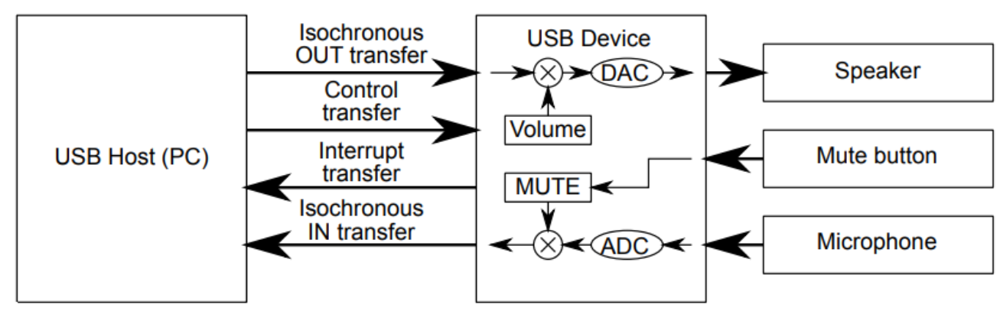
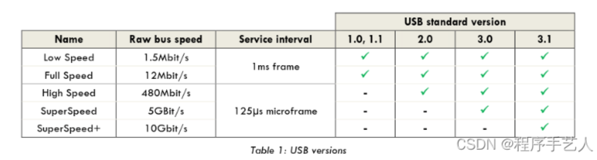
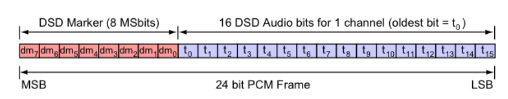
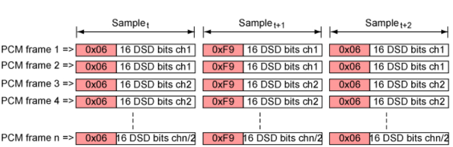

```c
bLength                  : 0x12 (18 bytes)
bDescriptorType          : 0x01 (Device Descriptor)
bcdUSB                   : 0x200 (USB Version 2.00)
bDeviceClass             : 0x00 (defined by the interface descriptors)
bDeviceSubClass          : 0x00
bDeviceProtocol          : 0x00
bMaxPacketSize0          : 0x40 (64 bytes)
idVendor                 : 0x12D1 (Huawei Technologies Co., Ltd.)
idProduct                : 0x0206
bcdDevice                : 0x0100
iManufacturer            : 0x01 (String Descriptor 1)
 Language 0x0409         : "bestechnic"
iProduct                 : 0x02 (String Descriptor 2)
 Language 0x0409         : "HUAWEI Sound Joy"
iSerialNumber            : 0x03 (String Descriptor 3)
 Language 0x0409         : "20160406.1"
bNumConfigurations       : 0x01 (1 Configuration)
Data (HexDump)           : 12 01 00 02 00 00 00 40 D1 12 06 02 00 01 01 02   .......@........
                           03 01                                             ..
```


# data fomat

usb只支持pcm


DSD源码的Native传输是直接把DSD数据流送出来。

DOP是把DSD源码分成一段一段的，把每一段装入PCM数据块中（因为PCM是以数据块的形式传输，不是以数据流），到了后端再从PCM数据块中把DSD数据卸下来，重新整队成为DSD数据流。

不管是Native还是DOP，最后获得的都是一模一样的DSD数据流。原理是一样的，只不过标准不同，核心还是DSD。

各大厂商联合定制了「DoP（DSD Audio over PCM Frames）

把 dsd 的 1bit 信号伪装成 pcm 来通过 usb 传输

DSD具有1 位元的取样大小以及2.8224MHz的取样频率，换言之，它的资料量有2.8224Mbits/sec，这相当于是16 位元 PCM格式于176.4kHz取样频率下的资料量

为了要明确的在PCM的串流资讯中辨识出何时是DSD或是何时是PCM的 资料，我们需要额外的位元，PCM比较高的规格是24位元/176.4kHz，这给予我们8个位元来当做辨识的标记，这感觉有点太多了，因为8位元有 256种状态可以标示，而我们其实只需要分别两个状态(DSD & PCM)，但我们会看到这些多余的部份如何派上用场



如上所述，Windows平台基本上提供了一个解决方案，其中包含ASIO驱动程序和USB Audio 2.0支持的原始数据格式。虽然没有通过USB拥有专用的DSD路径那么理想，但这是安全且直接的。由于Apple OS只允许PCM路径，我们必须找到一种方法将DSD音频数据放入PCM帧中，然后通过本机USB驱动程序发送。

**双速率DSD (128FS)及更高的解决方案**

