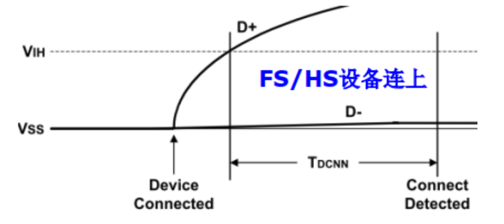
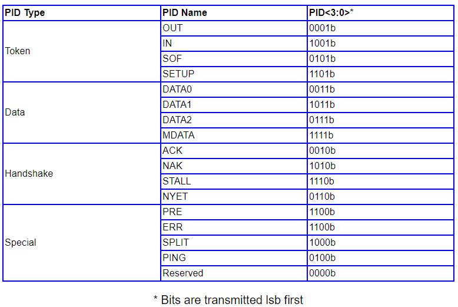
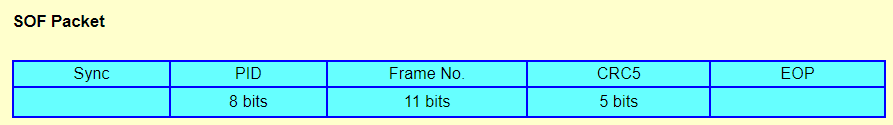
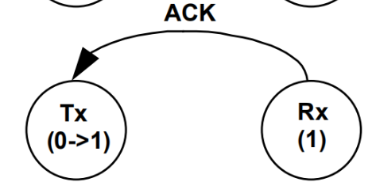
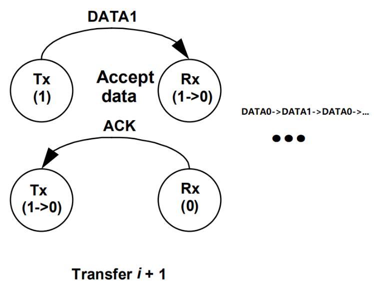
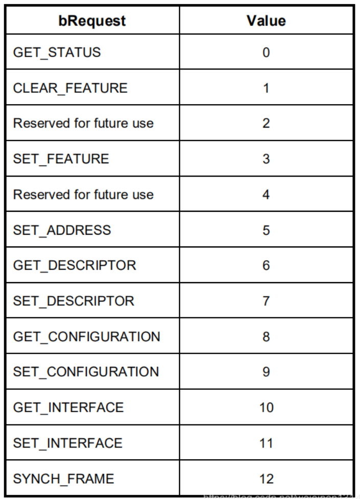
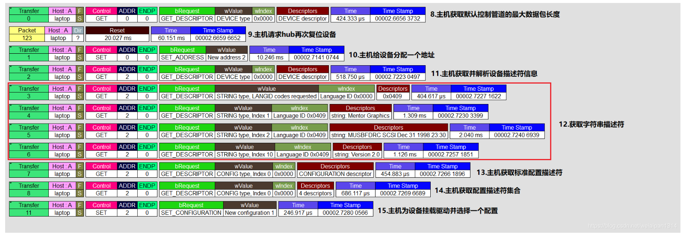

# 物理体系

usb主控制器：HOST

usb根集线器：ROOT HUB

usb集线器：HUB

usb应用设备：FUNC

# 概念

USB传输、事务、包是从不同层次上去说明一次数据交互的三个概念。

举个例子可能更好些，**"某领导和一个早起的程序员进行了一次交流，说了5件事"**

**"这次交流"**就相当于USB的一次传输，**"说了5件事"**就相当于这次传输过程中的5个事务，当然每件事肯定有**若干句对话**，就相当于每个事务里面的各种包。

#### **配置（Configuration）**

一个领导招聘了一个小弟，可以让这个小弟去写代码（配置1），或者让这个小弟去画电路图（配置2）等等

USB设备可能有一个或者多个配置，我们常见到的USB设备一般都只有一个配置

#### **接口（Interface）**

 好了，领导让这个小弟去写代码，可以只写C++软件，当然为了提高效率，有时候既要写C++软件，也要写C#软件，还得写Python软件。其实每个配置信息里面包含了接口的数量，一个接口就是一个功能，一个配置可以有多个接口（一个小弟可以会多种语言），也就是一个USB设备通过接口可以扩展多个功能

#### **端点（Endpoint）**

 **一个接口完成一种功能**，每种接口（功能）配有1个或者多个端点。 端点是主机与设备之间通讯数据的接收或来源，要实现通讯功能，接口必须有端点的配备才可以，主机要给设备发送数据，端点就是数据的接收器，主机要给设备要数据，端点就是数据的发送器

# USB2.0和USB3.0对比

| 特  性           | USB 3.0                                                      | USB 2.0                                                      |
| ---------------- | ------------------------------------------------------------ | ------------------------------------------------------------ |
| 支持的传输速度   | 低速 Low-Speed (1.5Mbit/s) 全速 Full-Speed (12Mbit/s) 高速 High-Speed (480Mbit/s) 超高速 SuperSpeed (5.0Gbit/s) | 低速 Low-Speed (1.5Mbit/s) 全速 Full-Speed (l2Mbit/s) 高速 High-Speed (480Mbi(/s) |
| 如大传输速度名称 | 超速 SuperSpeed USB (SS)                                     | 高速 Hi-Speed USB (HS)                                       |
| 最大传输速度     | 5.0Gbit/s                                                    | 480Mbit/s                                                    |
| 最大距离         | 3米（常规条件下）                                            | 5米                                                          |
| 数据接口         | Dual simplex,四线差分信号与USB2.0信号分离，同时实 现双向数据流 | 半双工,2线差分信号                                           |
| 总线事物协议     | 主机导向，界步传输流，USB包传输有确定路由                    | 主机导向,轮询传输流,USB包广播到 所有设备                     |
| 编码             | 8B/10B                                                       | NRZi                                                         |
| 总线类型         | USB 3.0采用了对偶单纯型四线制差分信号线，进行点对点 全双工通信 | USB 2.0基于半双工二线制总线,进行广播模式的通信               |
| 线缆             | USB 3.0 采用多核 SDP (Shielded Differential Pair.有遮蔽 差分信号对)线 | USB 2.0所采用的纤细的、非屏蔽的双 绞线（Unshielded Twisied Pair） |
| 线缆信号个数     | 共6个其中4个用于超髙速数据传输（SSTX+、SSTX-、SSRX+、SSRX-）另外两个用于一般传输（D+、D-） | 2 个（D+、D-）                                               |
| 端口状态         | 端口硬件检测连接事件.并将端口置为操作状态以备超高 速数据通信 | 端口硬件检测连接事件.系统软件使用端口命令来切换端口使能状态  |
| 数据传输类型     | 具有超高速约束的USB类型                                      | 仅支持4种基本传输类型                                        |
| 电源管理         | 多级电源管理，支持待机、休眠、暂停及启用                     | 仅支持设备级别的电源管理                                     |
| 总线供电能力     | 低功耗设备：5V,最大150mA高功耗设备：5V,最大900mA             | 低功耗设备：5V,最大100mA高功耗设备：5V.最大500mA             |

# 电气特性

Vbus  D-  D+  GND

USB 信号默认为高阻态

四根线中没有时钟线，所以需要时钟恢复，先发送一个同步头 8‘b01010101

# 上电

## **1.连接状态(Attached)**

USB设备可以从USB总线上**连接**或**断开**。当USB设备与USB总线断开时，它的状态USB规范没有定义

## **2.上电状态(Powered)**

USB设备的电源可来自外部电源，也可从USB接口的集线器而来。设备电源来自外部电源的USB设备被称作自供电设备(self-powered)。虽然自供电设备在连接到USB之前可能已经被供电，但是不会被认为处于上电状态，只有当设备连接到USB总线上面并且Vbus电源给设备上电时设备才进入上电状态。

设备对电源支持的能力是通过[配置描述(configuration descriptor)]中的**bmAttributes**来反映的

## **3.默认状态(Default)**

在设备供电后，它必须在收到来自总线的**复位信号**之前不响应任何总线事务。

备上电后，它不响应任何总线处理，直到设备接收到总线的复位信号为止。在设备复位完成后，设备***\*进入默认状态\****。

当复位过程完成后，USB设备在正确的速度下操作(即低速/全速/高速)，低速和全速的数据选择由设备的终端电阻决定

高速设备和全速设备的电气环境一样，只是设备复位成功后，高速设备还必须要成功地响应特定描述符请求并返回正确的信息。

## **4.地址状态(Address)**

所有USB设备在最初供电或设备被重置后使用默认地址。每一设备在正常复位后由主机分配一个唯一的地址，当主机给设备分配完毕地址之后，设备**进入地址状态**。当USB设备被[挂起]状态时，设备的地址保持不变。

## **5.配置状态( Configured )**

在使用USB设备的功能之前，必须配置该设备。从设备的角度来看，配置包括设备需要正确的响应主机SetConfiguration（非零）请求操作。当设备被正确配置完成后，设备**进入配置状态。**

## **6.挂起状态（Suspended）**

为了节省电源，当设备在指定的时间内没有观察到总线有数据传输时，USB设备自动***\*进入挂起状态\****。当挂起时，USB设备会保存任何之前的状态，包括上电状态、默认状态、地址状态、配置状态。

所有的设备在一段特定的时间内检测不到总线活动时必须进入挂起状态。

USB设备在总线活动时结束挂起状态，返回保存的上一次的状态。USB设备还可以通过远程唤醒电信号请求主机让自己退出挂起模式。

当设备**连接到USB总线，且已通电，且已被主机复位，且已被分配唯一地址，且已配置，且未暂停**。 主机才可以使用设备提供的功能，也就是和设备进行正常数据交互

**供电 → 复位 → 获取设备描述符前8个byte → 复位 → 分配地址 → 获取设备描述符 → 获取配置描述符 → 获取字符串描述符 → 配置**

USB设备可以使用2种供电方式：

- 自供电：使用外部电源进行供电。
- 总线供电：使用USB总电的VBUS（5V）进行供电。

对于由总线供电的设备，根据功耗可区分低功耗设备和高功耗设备：

- 低功耗设备：最大电源供电为100mA
- 高功耗设备：在设备枚举过程中配置供电为100mA,在正常使用过程中为500mA.

新的[全速](https://www.usbzh.com/article/detail-851.html)、[高速](https://www.usbzh.com/article/detail-852.html)或低速设备的存在可通过 D- 或 D+ 信号的变化来识别。低速设备将 5 V 置于 D- 上，[高速](https://www.usbzh.com/article/detail-852.html)和[全速](https://www.usbzh.com/article/detail-851.html)设备将 5 V 置于 D+ 上。连接信号由[集线器](https://www.usbzh.com/article/detail-25.html)检测并报告给主机。一旦检测到设备，主机就会向设备发出RESET 命令

# 设备枚举

新的全速、高速或低速设备的存在可通过 D- 或 D+ 信号的变化来识别。低速设备将 3.3V 置于 D- 上，高速和全速设备将 3.3V 置于 D+ 上。连接信号由集线器检测并报告给主机。一旦检测到设备，主机就会向设备发出RESET 命令。

- 没有设备连接到主机时：D+和D-数据线上的下拉电阻起作用，使得两者都在低电平;主机端看来就是个SE0状态，同样地，当数据线上的SE0状态持续一断时间后，就被主机认为是断开状态。
- 设备连接到主机时：当主机检到某一个数据线电平拉高并保持了一段时间，就认为有设备连上来了。 主机必需在驱动SE0状态以复位设备之前， 立刻采样总线状态来判断设备的速度

# BIT LEVEL

## Byte/Bit Ordering  

先发 LSB bit

多 byte 下**小端传输**到总线，即先发 LSB

## 编码方式 NRIZ

时钟同步方式在通讯链路上具有时钟信号（IIC、SPI），自同步方式在通讯链路中没有同步信号（PCIE、USB）

RZ 编码（Return-to-zero Code），也叫做归零编码。在 RZ 编码中，正电平代表逻辑 1，负电平代表逻辑 0，并且，每传输完一位数据，信号返回到零电平，也就是说，信号线上会出现 3 种电平：正电平、负电平、零电平

**NRZ 编码（**Non-return-to-zero Code）就出现了，和 RZ 的区别就是 NRZ 是不需要归零的

**NRZI 编码**（Non-Return-to-Zero Inverted Code）和 NRZ 的区别就是用信号的**翻转**代表一个逻辑，信号保持**不变**代表另外一个逻辑。

**NRZI编码同步原理**

在 USB 中，每个 USB 数据包，最开始都有个同步域（SYNC），这个域固定为 0000 0001，这个域通过 NRZI 编码之后，就是一串方波（NRZI 遇 0 翻转，遇 1 不变），接受者可以用这个 SYNC 域来同步之后的数据信号

因为在 USB 的 NRZI 编码下，逻辑 0 会造成电平翻转，所以接受者在接受数据的同时，根据接收到的翻转信号不断调整同步频率，保证数据传输正确。

## 用Bit-Stuffing来同步时钟信号

如果要传输的数据中有 6个连续的 1，发送前就会在第 6 个 1 后面强制插入一个 0，让发送的信号强制出现翻转

接受者只要删除 6 个连续 1 之后的 0，就可以恢复原始的数据了

# 总线状态

## IDLE

上电 / 空闲 进入 IDLE 状态，此时认为为 J 状态

## 复位

保持 SE0 大于10ms

## EOP

end of packet                                                                   

## Suspend

省电模式，待机模式																					

此时为 **J** 状态

## Resume

恢复，退出挂起															

主机反转信号线，保持最少20ms；即进入 K 状态

自己唤醒：至少待机超过5ms，自己反转1-15ms，等待主机接管

## Keep Alive 

隔一段时间保持待机设备的有效挂载								

# 数据包

是最小传输单位，总线在数据包前后处于IDLE状态

由 SOP -> sync 开始，做到 receiver 的同步，发送字符后，由一个 EOP 结尾

## 名词

endpoints 端点

pipe 数据连接管道

transactions 传输事务 在这里由包 packet 构成

## SYNC

**SOP域**之后就是**同步域（SYNC）**的开始，全速/低速设备SYNC被定义长度为8位（0000 0001），
高速长度定义为32位（0000 0000 0000 0000 0000 0000 0000 0001）

## Packet Formats ( PID ) 

首个 byte 表示 packet id，这个 id 为 4 bits 长，而后互补重复 4 bits

四种包格式：**Token	Data    Handshake    Special**

7 bit 地址，可以寻址127个设备，4 bit endpoint，每个设备可以有 16 个端点

Used for DATA0, DATA1, DATA2 and MDATA packets.

Used for ACK, NAK, STALL and NYET packets. 

## 关于 DATA0 和 DATA1

**通过数据 DATA0 包和 DATA1 包的切换来实现主机和设备传输错误检测以及重发机制**

主机会根据当前状态先发送DATA0类型数据包给设备，当设备正确收到数据包后会对自己的状态进行反转（变为1）

主机发送应答数据包，当主机正确接收到应答包后会对自己的状态进行反转（变为1）

而后开始传 **DATA1**

在之后再传 **DATA0**

以此交替

### 数据被破坏的传输原理

在发送数据之前，主机和设备状态都是0，主机会先发送DATA0类型数据包给设备，当设备发现数据存在问题后**不会对自己的状态进行切换**，
**并给主机发送非应答数据包**

主机会在适当的时刻对DATA0数据包进行**重传（Retry）**，直到设备接收正常

### 应答包故障

当主机收到一个校验有问题应答包主机会在合适的时间对 **DATA0** 数据包进行重发，但是当前设备的状态是**1**，**因此设备会忽略该数据包并保持现在的状态**

# 传输事务

**transactions**

一个成功的传输事务是由三个 packets 组成的
等时传输 IN OUT 事务只需要 2 个 packets

## OUT Transaction

DATAx is either a DATA0 or a DATA1.

## IN Transaction

DATAx is either a DATA0 or a DATA1.

## SETUP Transaction

SETUP transaction always uses a DATA0 to start

形式上像 OUT Transaction，但是数据负载只有 8 byte

# 传输类型

## 批量传输：Bulk Transfer

为了无错误大量传输而设计

### **主机批量读**

当主机准备接收批量数据时，它发出IN令牌，设备端点通过返回数据包或（如果无法返回数据）NAK或STALL握手来响应主机。 NAK表示设备暂时无法返回数据，而STALL表示端点永久停止。 如果主机收到 一个有效的数据包，它用ACK握手来响应。 如果主机在接收数据时检测到错误，则不会向设备返回握手包。

### **主机批量写**

当主机准备发送批量数据时，它首先发出一个OUT令牌包，然后是一个数据包。 如果设备接收数据包时没有错误，则设备将返回三个(或四个，包括NYET，用于高速操作的设备)握手中的一个。

- ACK：表示没有错误，并通知主机它可以发送下一个数据包。

- NAK：表示接收数据没有错误，但是主机应该重新发送数据，因为有可能设备处于临时条件拒绝接受数据（例如缓冲区满）。

- STALL：如果端点被停止，则返回STALL以指示主机不应该重试传输，表示设备可能存在错误。

- NYET：只用在高速设备中，表示设备没有准备好数据。

- Error：如果收到的数据包带有CRC或位错误，则不返回握手。
  

批量传输就是用上文所写的 DATA1 和 DATA0 切换来实现传输

### 包最大长度

**批量传输不支持低速传输**                  

## 中断传输：Interrupt Transfer

中断传输和批量传输类似，中断传输只由**一个中断事务**组成 **Only One Transaction**

依然通过 DATA0 和 DATA1 包切换来实现错误检测和重发

中断endpoint在端点描述符中要报告主机对此端点的查询时间，主机会保证在小于这个时间间隔的范围内安排一次传输，比如HOST主机1ms内向鼠标设备请求一次数据。

**对于全速端点**，中断传输的时间间隔在1ms到255ms之间，**对于低速端点**，时间间隔限制在10ms到255ma之间，**对于高速端点**，时间间隔为2^(bInterval-1) x 125us，bInterval的值在1-16之间。

到了设备端点指定的时间时主机控制器如果检测到 IRP 挂起，会对设备进行数据请求，设备如果把数据准备好了，则会把数据发送给主机，主机驱动程序会把接收到数据放入消息队列等待应用软件使用ReadFile函数来取数据，应用如果长时间不取数据，数据就会丢失。当然设备如果没有准备好数据，则会返回主机 NACK

## 同步传输：Isochronous Transfers

同步传输由多个同步事务组成
**没有握手包**

（1）**全速**设备或主机控制器**能够**接受PID 为DATA0或DATA1的数据包。

（2）**全速**设备或主机控制器**只能**发送PID为DATA0的数据包。

（3）**高速**主机控制器**必须**能够接受和发送 PID为DATA0、DATA1、DATA2或MDATA的数据包。

（4）高速设备，每个微帧最多有一个事务，必须只能发送PID为DATA0的数据包。

（5）高速高带宽端点一个微帧可以接收或者发送多个PID为DATA0、DATA1、DATA2或MDATA的数据包。

## 控制传输：Control Transfer

制传输由三个阶段组成，**设置阶段**、**可选的数据阶段**、**状态阶段**
其中设置阶段由**1个SETUP事务**组成，数据阶段由0个或者**多个IN/OUT事务**组成，状态阶段由**1个IN/OUT事务**组成

### 设置阶段

设置阶段由1个设置事务组成，SETUP事务由**SETUP令牌包**、**DATA0数据包**、**ACK握手包**组成。

Setup Data就是DATA0数据包里面的8个字节的数据Data，包含主机的很多设置信息（数据传输方向、数据类型、目标类型、附加数据、数据阶段传输的数据长度等等），这8个字节含义如下

#### **bRequest(什么请求)**

此字段指定特定的请求类型，**bmRequestType**字段中的Type和**bmRequest**可组合出不同设置

####  **wValue**

此域用来传送当前请求的参数，随请求不同而变。

#### **wIndex**

该字段的内容根据请求而有所不同。它用于将参数传递给设备，特定于请求。

当bmRequestType的Recipient字段为接口或端点时，wIndex域用来表明是哪一个接口或端结。

#### **wLength**

表明第二阶段的数据传输长度，第二阶段的数据传输方向由bmRequstType的Direction位指出。wLength域为0则表明无数据传输。在输入请求下，设备返回的数据长度不应多于wLength（但是可以少于），在输出请求下，wLength指出主机发出的真实的数据量。如果主机发送多于wLength的数据，设备会作出未知响应。

## 数据阶段

## 状态阶段

如果第二阶段指定数据传输方向为设备到主机，则主机接收完毕数据后，主机请求一个OUT事务告诉设备数据的接收状态。

# 配置过程

在完成 reset 之后

- Get Device Descriptor
- Get Configuration Descriptor
- Get String Descriptor

在完成配置之前只可以用 control transfer，只能用双向的 endpoint 0

## Configurations, Interfaces, and Endpoints.

设备可以有许多 descriptors

比如一个电话，它有 2 endpoints 给音频传输，加上一个 只有一个 endpoint 的 HID interface 给键盘输入

接下来处理 setup packet

# USB设备的枚举过程

USB主机检测到USB设备插入后，就要对设备进行枚举了。
枚举的作用就是从设备是那个读取一些信息，知道设备是什么样的设备，然后通信，这样主机就可以根据这些信息安装合适的驱动程序。
USB设备的枚举过程如下：

1. USB设备插入USB接口后，主机检测D+/D-线上的电压，确认有设备连接，USB[集线器](https://www.usbzh.com/article/detail-25.html)通过中断[IN](https://www.usbzh.com/article/detail-450.html)通道，向主机报告有USB设备连接。
2. 主机接到通知后，通过[集线器](https://www.usbzh.com/article/detail-25.html)设备类请求[GetPortStatus](https://www.usbzh.com/article/detail-1162.html)获取更多的信息。然后主机等待100ms等待设备稳定，然后发送[集线器](https://www.usbzh.com/article/detail-25.html)设备类请求SetPortStatus,对USB设备进行复位，复位后USB设备的地址为0，这样主机就可以使用地址0与USB设备进行通信,复位后的设备可以从USB总线上获取小于100mA的电流，用于使用默认地址对管道0控制[事务](https://www.usbzh.com/article/detail-691.html)响应。
3. 主机向地址为0（即刚插入的USB设备）的设备端点0（默认端点）发送获取[设备描述符](https://www.usbzh.com/article/detail-104.html)的[标准请求](https://www.usbzh.com/article/detail-417.html)GetDescriptor。
4. USB设备收到请求后，将其预设的[设备描述符](https://www.usbzh.com/article/detail-104.html)返回给主机。
5. 主机收到设备描述符后，返回一个0长度的数据确认包。
6. 主机对设备再次复位，复位后主机对地址为0的设备端点0发送一个设置地址SetAddress请求（新的设备地址在数据包中）。
7. 主机发送请求状态返回，设备返回0长度的状态数据包。
8. 主机收到状态数据包后，发送应答包[ACK](https://www.usbzh.com/article/detail-452.html)给设备，设备收到[ACK](https://www.usbzh.com/article/detail-452.html)后，启用新的设备地址。
9. 主机再次使新的地址获取设备描述符GetDescriptor，设备返回地址描述符。
10. 主机获取第一次[配置描述符](https://www.usbzh.com/article/detail-67.html)有前8个字节，设备返回[配置描述符](https://www.usbzh.com/article/detail-67.html)的前8个字节，其数据包中含有配置描述符的总长度。
11. 主机根据配置描述符的总长度再次获取配置描述符，设备返回全总的配置描述符。
12. 如果还有[字符串描述符](https://www.usbzh.com/article/detail-53.html)，系统还会获取[字符串描述符](https://www.usbzh.com/article/detail-53.html)。像[HID](https://www.usbzh.com/article/detail-76.html)设备还有[报告描述符](https://www.usbzh.com/article/detail-48.html)，它也需要单独获取。

**设备描述符的长度是自定义的，前18个byte最为重要，因为主机最先收到这18个byte，然后才开始后面的**

# 描述符

USB standard descriptors主要包含以下几种描述符：

-  device descriptor 设备描述符， 一个usb设备只能有一份设备描述符

-  configuration descriptor 配置描述符，一份设备描述符可以包含多个配置描述符，通常情况下只有一份
-  interface descriptor 接口描述符，一份配置描述符可以包含多个接口描述符，每个接口会有多个alternateSetting备选接口
-  endpoint descriptor 端点描述符，一份接口描述符中会包含多个端点
-  string descriptor 字符描述符

## 设备描述符

设备描述符是USB主机枚举USB设备申请的第1个描述符，每个设备**有且仅有一个**设备描述符

## 配置描述符

配置描述符描述有关特定设备配置的信息。该描述符包含bConfigurationValue字段，该字段的值在用作SetConfiguration（）请求的参数时，使设备采用所描述的配置。

## 接口描述符

接口描述符不能单独返回USB主机，必须跟在配置描述符后面返回。

## 端点描述符

端点描述符包含主机要确定每个端点的带宽要求所需要的信息

端点描述符也不能单独返回给USB主机，主机会请求获得配置描述符集合，配置描述符集合主要由标准配置描述符、接口描述符、端点描述符、类描述符，报告描述符和物理描述符是单独返回给USB主机

## 字符串描述符

描述的属性包括设备厂商名字、产品名字、产品序列号、各个配置名字、各个接口名字，还有就是由我们用户自己定义的字符串

