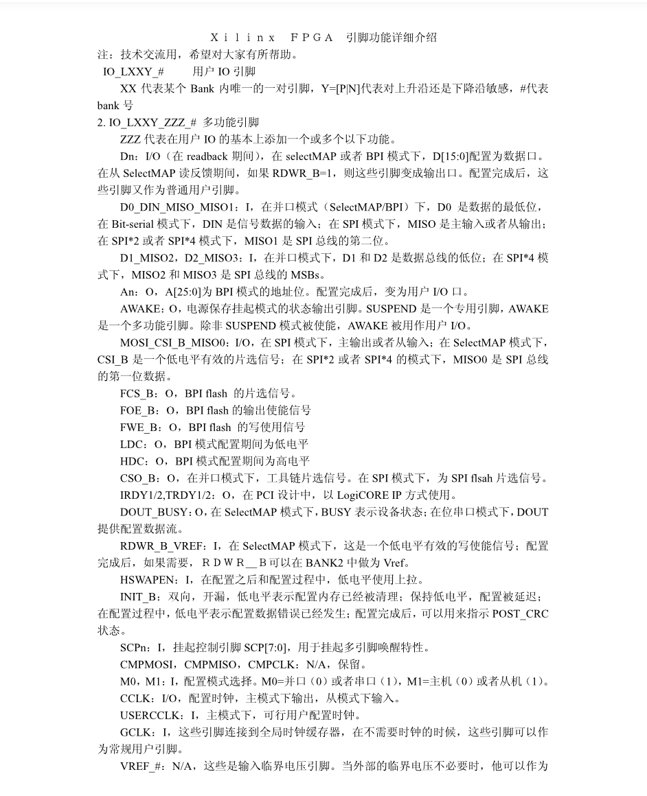
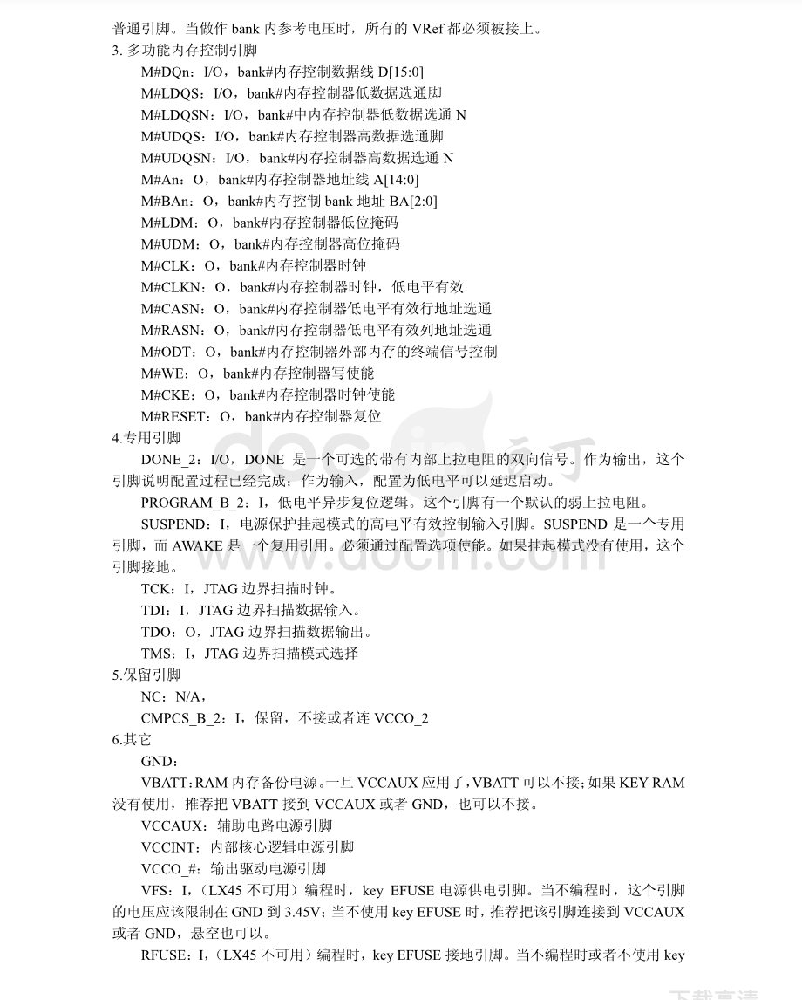
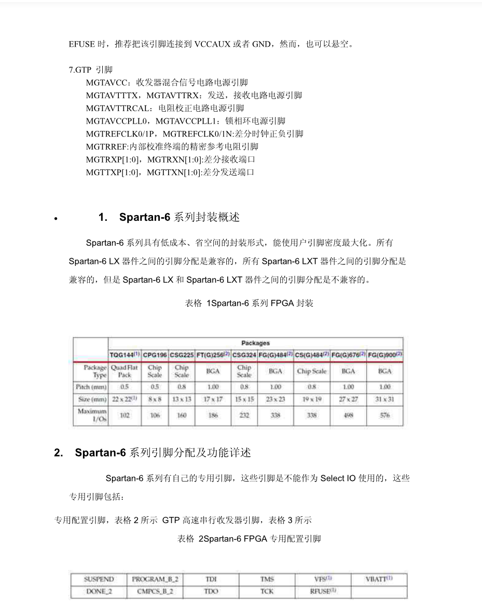
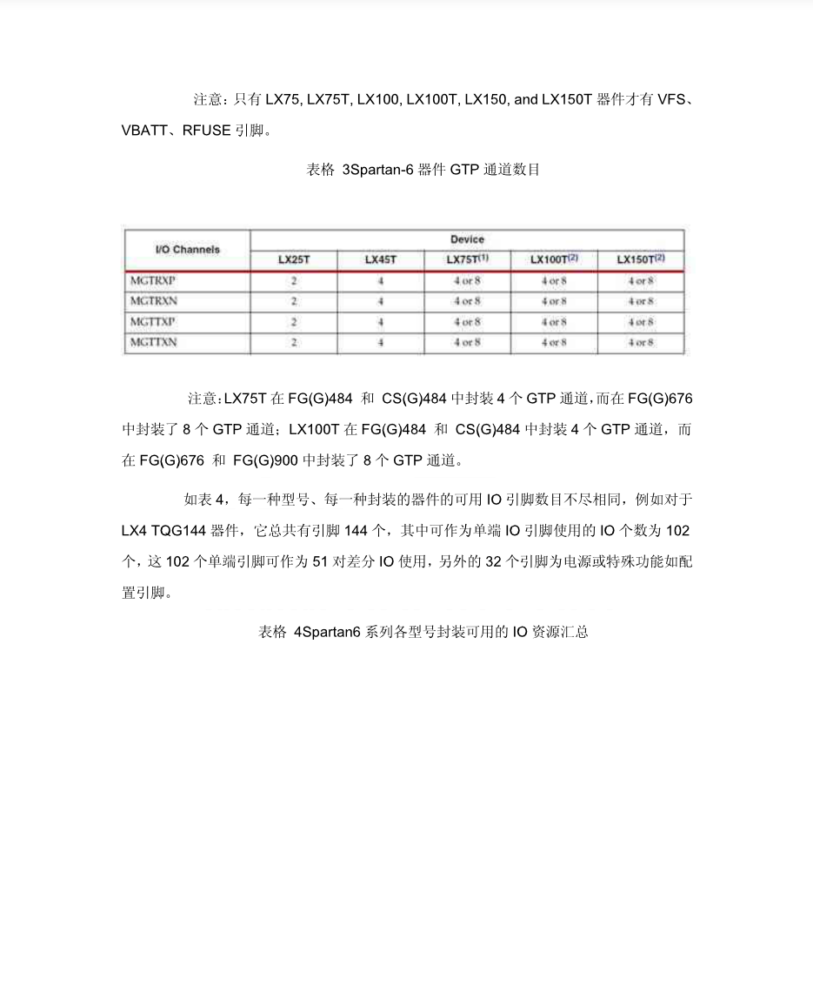
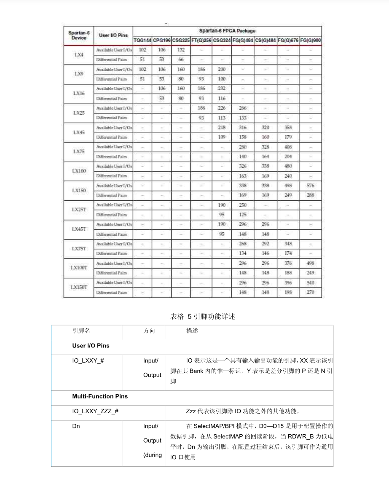
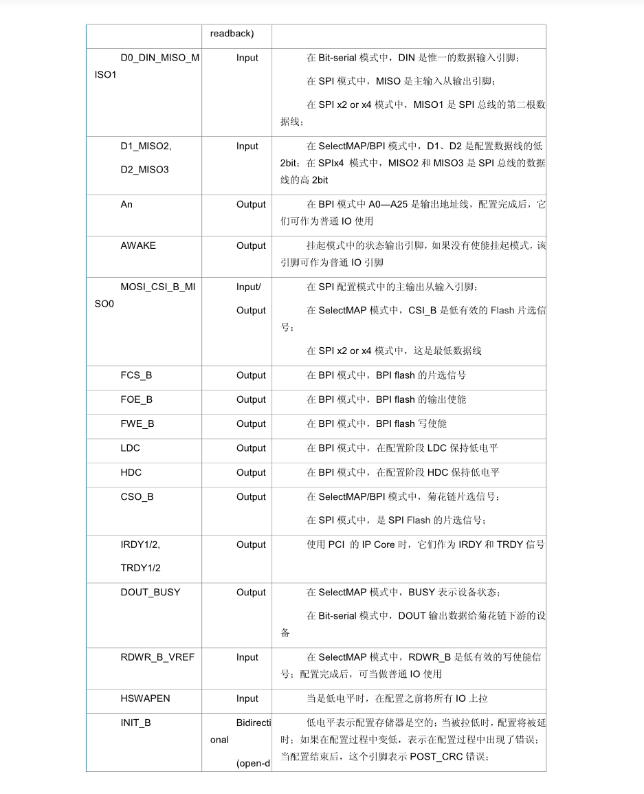
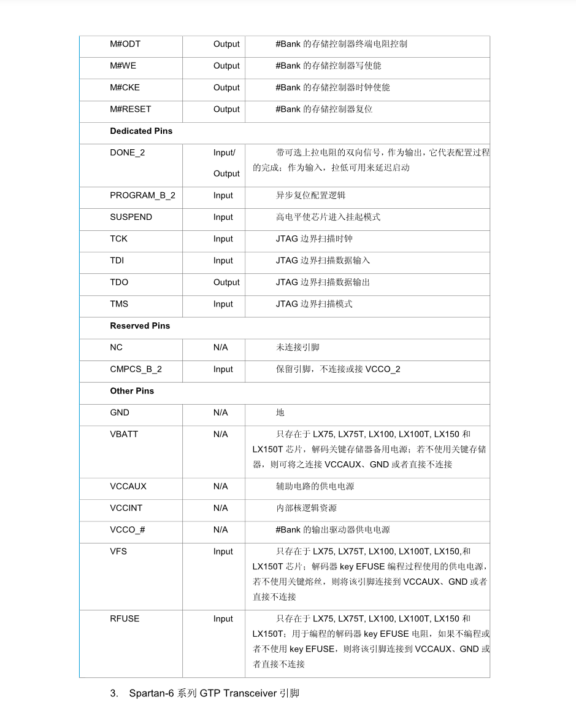
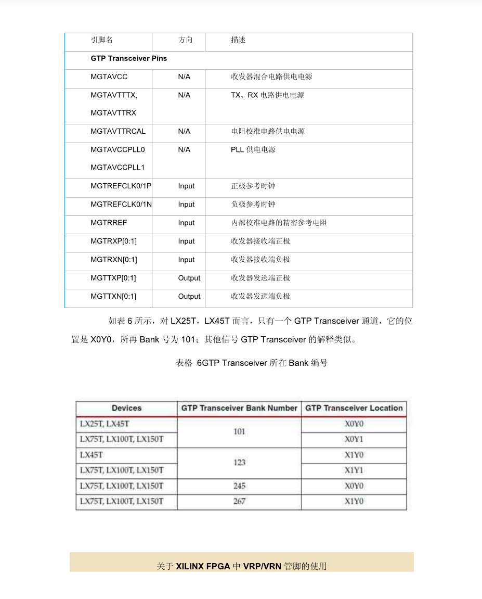
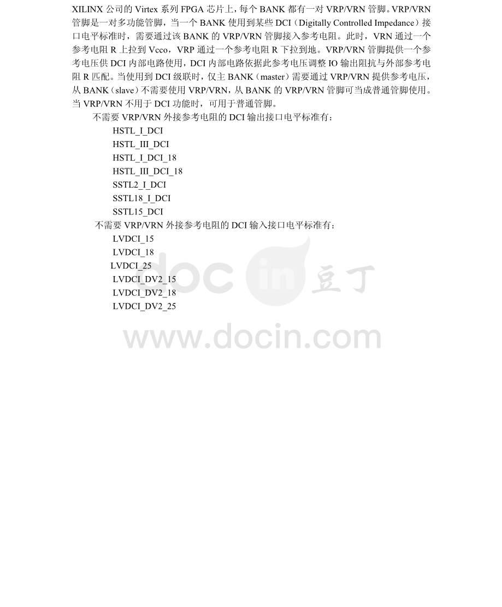

#                                                 Xilinx FPGA pin type

​                                        

​                                        

​                                         

​                                          

​                                          

​                                           

​                                            

​                                            

