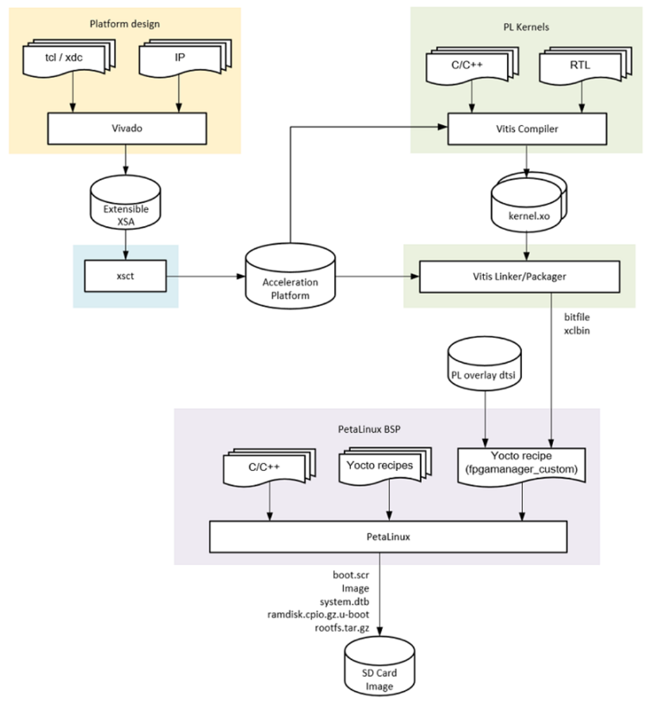

# Xilinx kv260

**对于AI玩家：VITIS AI，和硬件没多大关系，只需要把模型（tensorflow等）转化给FPGA处理器运行，基本使用python，VITIS 和 　　　　　　　　　　　　　VITIS AI 是两个完全独立的平台，是两个完全不同的软件**

**对于硬件玩家：VITIS（原SDK），将加速器打包进基础平台，无需重新建立硬件平台，重新设计后秩序接入原来的平台上就可以，原来的平台会预留一些AXI接口，将自己写的加速器link到平台上。但如果自己要重新设计平台就要使用vivado**

**Petalinux：高性能固件值得搭载Linux，自己设计soc后编译、移植需要很多的处理，Petalinux是一套工具，如果要实时切换设备树、硬件、驱动，就可以用Petalinux重新刷，重新打包进系统**

