## Architecture Overview

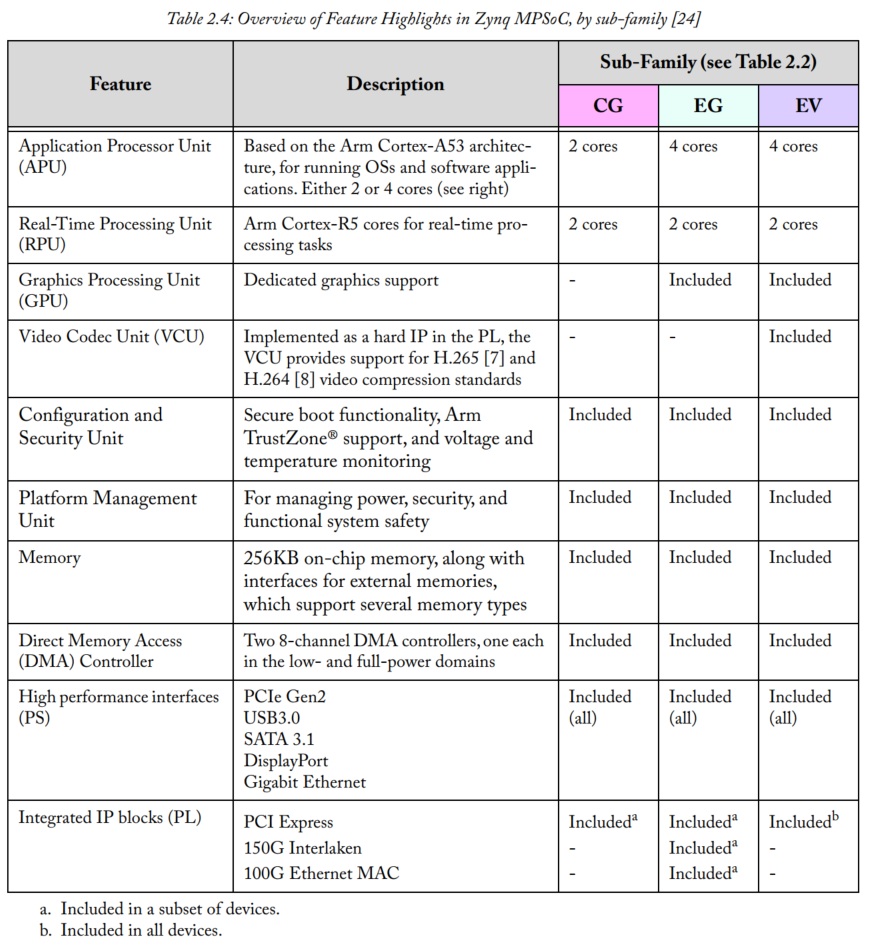

## Processing System

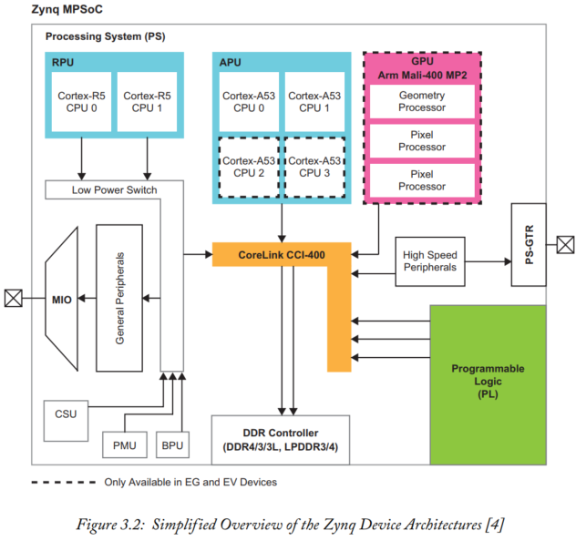

1. Each processing unit is connected to an interconnect known as the Cache Coherent Interconnect (CCI) to ensure coherency and up-to-date data.
2. EG and EV family contain the Arm Mali-400 MP2 GPU. OpenGL and OpenVG APIs are supported, allowing the APU to offload graphics processing to the GPU.
3. Connectivity with general purpose peripherals is achieved using the Multiplexed Input/Output (MIO). High-speed connectivity uses a multi-gigabit transmit and receive channel pair, known as a PS-GTR transceiver.
4. There is also a dedicated Platform Management Unit (PMU), Configuration Security Unit (CSU), and Battery Power Unit (BPU). In addition to the physical processing resources within the PS, power domains and communication paths between processing elements are also of great importance.  

### APU

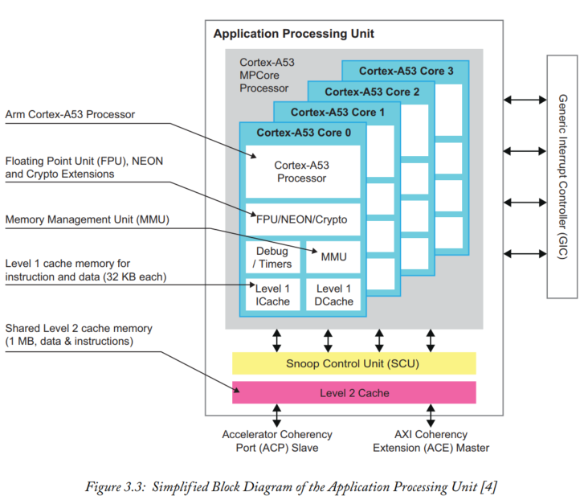

1. The CCI within the Zynq MPSoC is connected to the APU’s master bus interface using a 128-bit AXI Coherency Extension (ACE).
2. APU uses an external Generic Interrupt Controller (GIC) to support system interrupts. This GIC is the Arm CoreLink GIC-400 IP.

### RPU

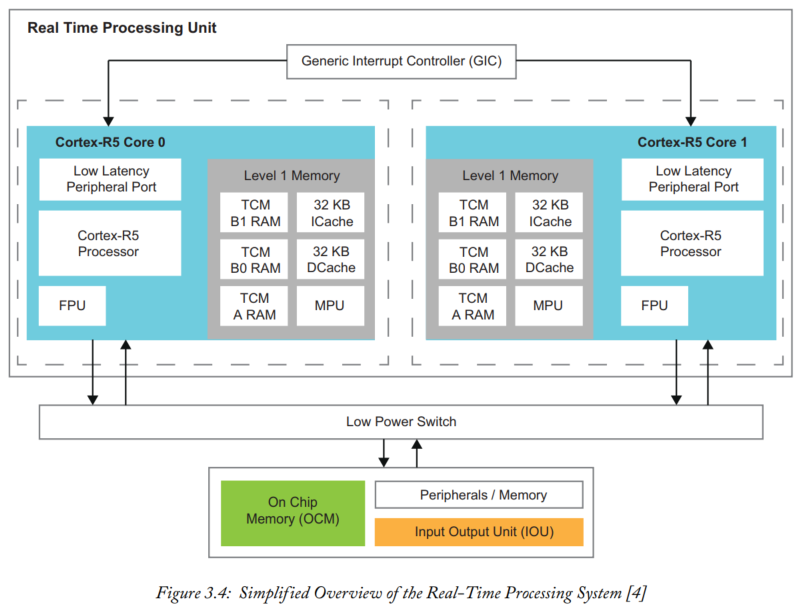

1. The Cortex-R5 processing cores within the RPU can operate at up to 600 MHz in EV and EG devices, and 533 MHz in CG devices.   
2. As the RPU is part of the lowpower domain, it is entirely operational when the Zynq MPSoC is in low-power mode.
3. The MPU manages access requests to the Level 1 memory and external memory, permitting customisation and partitioning of the memory into regions.   

### GPU

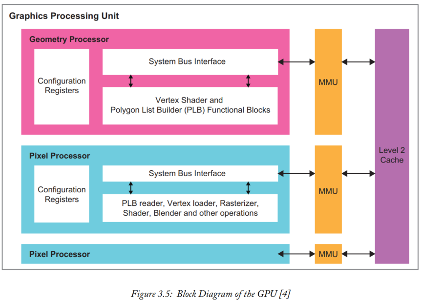

1. The GPU can achieve two-dimensional (2D) and three-dimensional (3D) graphic acceleration up to 667 MHz.  
2. The Level 2 cache has 64 KB of addressable space and an Advanced Peripheral Bus (APB) [16] slave interface. The APB allows other devices, acting as a master, to control the Level 2 cache.  

### Connectivity

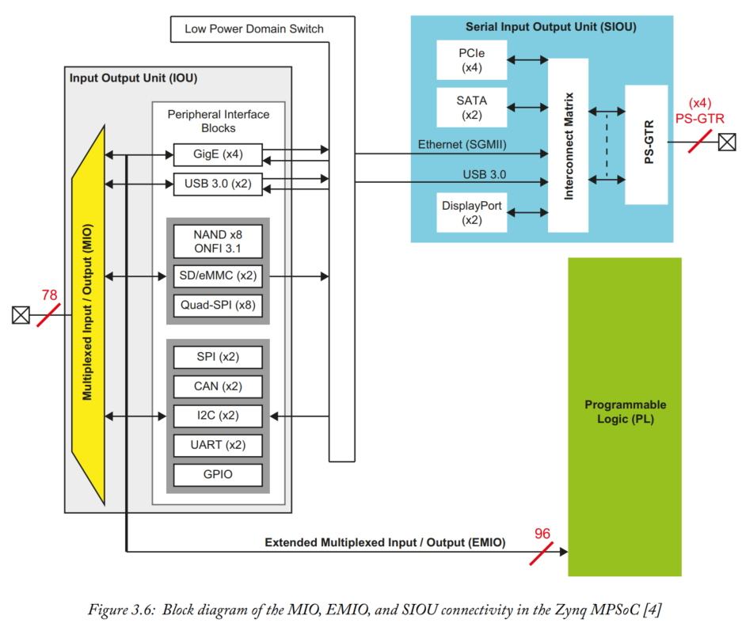

**Multiplexed Input/Output**

The MIO can be thought of as a very large multiplexer. It is capable of routing several different peripheral interfaces to a set of 78 pins.   

| I/O Interface        | Description                                                  |
| -------------------- | ------------------------------------------------------------ |
| UART (x2)            | Universal Asynchronous Receiver Transmitter Low rate data modem interface for serial communication. **Often used for Terminal connections to a host PC.** |
| SPI (x2)             | Serial Peripheral Interface [18] Standard for serial communications based on a 4-pin interface. Can be used either in master or slave mode. |
| CAN (x2)             | Controller Area Network Bus interface controller compliant with ISO 118980-1, CAN 2.0A and 2.0B standards. |
| I2C (x2)             | I2C Bus [19] Compliant with the I2C bus specification, version 2. Supports master and slave modes. |
| GPIO                 | General Purpose Input/Output There are 3 banks of GPIO, each of 26-bits. |
| GigE (x4)            | Ethernet (RGMII) Ethernet MAC peripheral, supporting 10 Mbps, 100 Mbps and 1 Gbps modes. The PS MIO only supports the Reduced Gigabit Media Independent Interface (RGMII). |
| NAND x8 and ONFI 3.1 | NAND Flash Memory Interface Support for NAND flash memory interface and Open NAND Flash Interface (ONFI) 3.1 |
| USB 3.0 (x2)         | Universal Serial Bus Compliant with USB 3.0, and can be used as a host, device or flexibly (“on-the-go” or OTG modes, meaning that it can switch between host and device modes). |
| SD/eMMC (x2)         | Secure Digital and embedded MultiMediaCard Memory Interface Supports SD 3.0 and eMMC 4.51 |
| Quad-SPI x8          | Quad Serial Peripheral Interface Serial Communications based on the SPI standard that uses a quad I/O (four-bit data bus). This increases data throughput so that it is faster than a standard SPI interface. |

**Serial Input Output Unit**

The SIOU contains four high-speed peripheral controllers that each use a single multi-gigabit transmit and receive channel pair, known as a PS-GTR transceiver.   

The PS-GTR is capable of supporting data rates up to 6.0 Gb/s and can interface to any of the high-speed peripheral blocks using the interconnect matrix.

| I/O Interface | Description                                                  |
| ------------- | ------------------------------------------------------------ |
| DisplayPort   | DisplayPort Interface [20] A digital display interface primarily used to carry video but can also be used for audio, USB and other forms of data. Up to two channels can be interfaced to the PS-GTR transceivers. |
| USB 3.0 (x2)  | Universal Serial Bus Compliant with USB 3.0, and can be used as a host, device or flexibly (“on-the-go” or OTG modes, meaning that it can switch between host and device modes). |
| SATA (x2)     | Serial Advanced Technology Attachment SATA uses differential wire pairs for serial communication primarily with storage devices at rates of 1.5, 3.0 and 6.0 Gb/sec depending on the SATA generation (1, 2 or 3 respectively). |
| PCIe          | Peripheral Component Interconnect Express Standard for high-speed, serial computer expansion communications. |
| GigE (x4)     | Ethernet (SGMII) Ethernet MAC peripheral, supporting 10 Mbps, 100 Mbps and 1 Gbps modes. The SIOU only supports the Serial Gigabit Media Independent Interface (SGMII) to the GigE periph eral interface block. SGMII uses differential pairs for transmit and receive data ports and clocks. |

## Platform Management (PMU)

1. Platform management within Zynq MPSoC devices is handled by the Platform Management Unit (PMU) within the PS.   
2. The PMU is responsible for the powering-up, resetting and resource monitoring of the entire Zynq MPSoC infrastructure.   
3. The PMU can issue requests and retrieve status information to and from units, independent of other system processors and elements.  

### Power Modes  

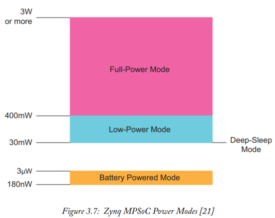

Additionally, there is a deep-sleep mode through which the device consumes the lowest possible amount of power while still maintaining the boot and security state of the entire system. During this state, the PMU configures itself to enter a state of sleep or suspension. The PMU will then await a trigger from the MIO, USB or Real-Time Clock (RTC) before waking itself up to perform a pre-specified action.   

### Power Domains  

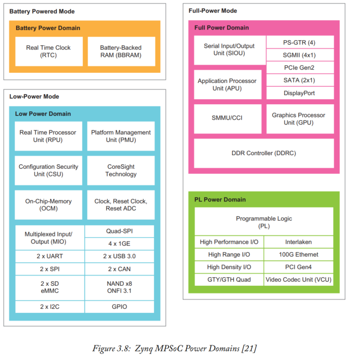

There are four primary power domains in the Zynq MPSoC: low-power domain (LPD), full-power domain (FPD), PL power domain (PLPD) and battery power domain (BPD).   

### Platform Management Unit 

1. There are two primary memories within the PMU: a ROM and a 128 KB RAM. The ROM stores code for the PMU start-up sequence, power control routines and interrupt. The 128 KB RAM stores program data and user/firmware code.   

2. The typical Zynq MPSoC user will not need to write their own firmware, and can simply use or modify the firmware provided by Xilinx.  

## Programmable Logic

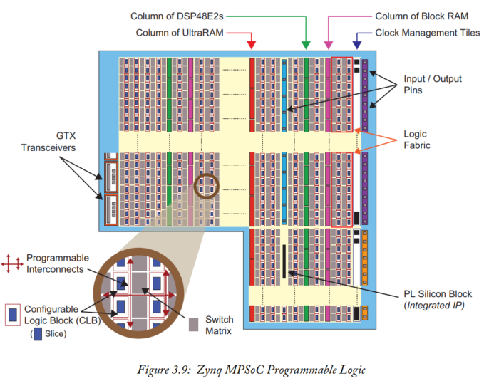

The PL uses the 16nm Kintex UltraScale+ FPGA fabric.

### The Logic Fabric  

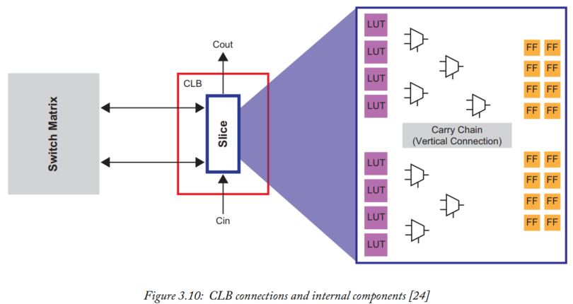

1. CLBs can connect to other similar resources using programmable interconnects.  
2. A CLB is composed of slice, Each slice element within Zynq MPSoC devices is compose of 8 x 6-input Lookup Tables (LUTs), 16 Flip-Flops (FFs), and additional routing logic.   
3. Vertically adjacent slices can be chained together to implement large arithmetic circuits through the use of carry logic.
4. LUTs can be used as small local memories, or connected together to form a larger memory array. This structure is known as Distributed RAM.

### Storage 

1. In addition to the logic fabric, there are three other primary resources for storing and processing data within the Zynq MPSoC PL. These are Block RAMs, UltraRAMs and DSP48E2 slices.  
2. Each of these specialised resources are implemented in dedicated silicon.   

#### Block RAM Tiles

1. Block RAMs in Zynq MPSoC devices can be configured to operate as RAM, ROM or FIFO.
2. It is possible to **cascade Block RAMs** with other vertically adjacent Block RAMs, creating memory arrays.  
3. Each Block RAM can store up to 36 KB of information configured as one 36 KB RAM, or two individual 18 KB RAMs. Block RAMs can be ‘reshaped’ so that elements of smaller or larger wordlengths can optimise the allocated array of memory.   

#### UltraRAM Tiles  

1. A single UltraRAM is capable of storing up to 288 Kb.  
2. UltraRAM have a synchronous, dual port interface and can be cascaded to form larger memory arrays of up to 100 Mb.   
3. Neighbouring logic circuits can store data within an UltraRAM array and achieve low latency and high capacity storage.
4. It is not possible to reshape UltraRAM blocks. However, they support an addressing scheme of 4096 elements x 72-bits.   

### Signal Processing

#### DSP48E2 Slices

1. A hardware multiplier that offers high-speed, efficient signal processing. They are arranged in columns throughout the FPGA fabric  
2. It is possible to cascade multiple DSP48E2 if an arithmetic circuit requires greater wordlengths than a single DSP48E2 can provide.   

### PL Peripherals  

Zynq MPSoC devices may include a set of dedicated silicon blocks, also known as Hard IP blocks or Integrated IP, within the PL. There are currently five Hard IP blocks, these are: PCI Express, Interlaken, 100G Ethernet, Xilinx System Monitor (SYSMON) and Video Codec Unit (VCU).   

### Video Codec Unit  

1. The VCU, contained only in the PL of EV devices.
2. The VCU supports High-Efficiency Video Coding (HEVC) H.265 and Advanced Video Coding (AVC) H.264. 

### General Purpose Input/Output

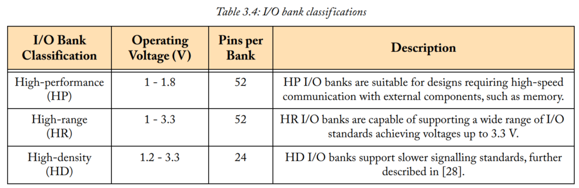

Each IOB contains one pad for communicating with external components.  

### High-Speed Connectivity  

1. A further means of communicating between the PL and the outside world is using Gigabit Transceivers(GTX). 
2. There are two types of GTX transceiver availa ble within the Zynq MPSoC’s PL. **GTH** transceivers provide low power, high-performance communication at 16.3 Gb/s [29]. **GTY** transceivers are capable of 32.75 Gb/s.

### JTAG Interface  

1. The Joint Test Action Group (JTAG) ports are responsible for programming and debugging.
2. Preferred to have more secure methods of programming the PL with a bitstream, and monitoring the device.  

## Interfaces

There are many different types of interfaces; however, the Arm AMBA open standard is the basis of most of the interfaces contained in Zynq MPSoC.

### The Arm AMBA Open Standard

These are the Advanced eXtensibile Interface (AXI), AXI Coherency Extensions (ACE), Advanced High-Performance Bus (AHB), Advanced Peripheral Bus (APB), and Advanced Trace Bus (ATB).   

### AXI - Advanced eXtensible Interface

1. **AXI4**	This protocol is for connections requiring memory-mapped links between processingelements and IP blocks.  
2. **AXI4-Lite**	A simple, memory-mapped link with reduced handshaking signals, resulting in lower resource allocation than full AXI4.   
3. **AXI4-Stream**	AXI4-Stream supports point-to-point data streaming. It provides burst transfers of an unrestricted (infinite) size.   

### ACE - AXI Coherency Extension

The ACE protocol is an extension of the AXI interface and consists of five additional channels; three for ‘snooping’ and two for acknowledgements.   

### AHB - Advanced High-Performance Bus

1. The AHB is in contrast to AXI, which includes a multi-channel bus with dedicated read, write and response channels.  
2. The AHB is for high-bandwidth communication with other processing elements at a reduced cost of channel resources.  
3. The protocol is considerably simpler than AXI and can still achieve single beat and burst transfers.

### APB - Advanced Peripheral Bus

1. The APB is the preferred protocol for low bandwidth communication between peripherals.
2. There are no handshaking signals between buses.   
3. The APB is present in every processing unit within the Zynq MPSoC’s PS, and also in the PL for control of component registers.  

### ATB - Advanced Trace Bus

1. The ATB protocol is primarily used to transport format-independent trace information throughout the infrastructure of a device using Arm CoreSight technology.   
2. Xilinx has used Arm CoreSight SoC-400 components to provide debugging functionality to the Zynq MPSoC’s PS and PL.   

### PS to PL Interconnects and Interfaces

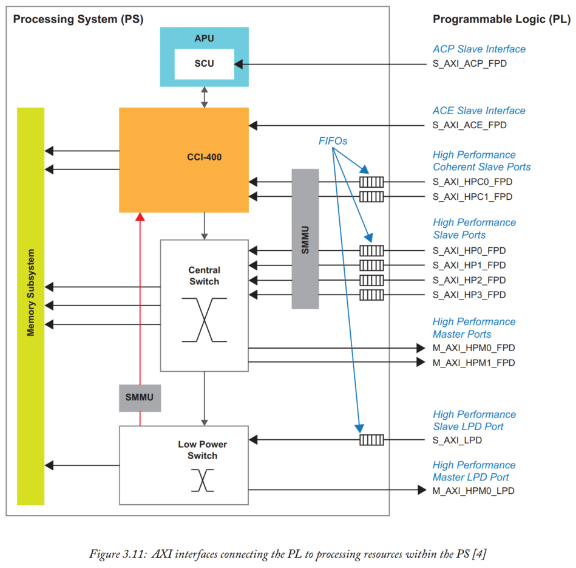

These are the CCI-400, APU (and SCU), system memory management unit (SMMU). 

The memory subsystem has also been included to illustrate the various memory resources within the PS that each switch and interconnect can access.  

The SMMU provides address translation between the PS and the PL, so that the PL can use virtual addresses.  

An ‘**S**’ indicates that the PS is the slave, an ‘**M**’ indicates that the PS is the master. Additionally, **FPD** specifies that the port is part of the fullpower domain, while **LPD** specifies that the port is part of the low-power domain.  

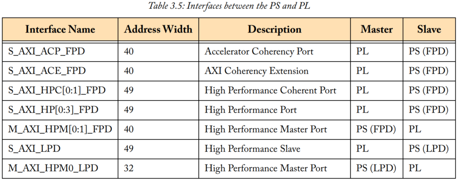

1. **AXI Coherency Extension** — The ACE can access the system memory and also the local memory of the APU, via the CCI; sharing up-to-date information.
2. **High-Performance Coherent Ports** — These high-performance ports are directly connected to the CCI to allow data communication between the PL and PS. Both ports include FIFO buffers to permit burst transfers and high rate communications between the PS and elements in the PL.
3. **Accelerator Coherency Port** — The ACP uses a subset of the ACE-Lite protocol and provides a single asynchronous connection between the PL and the SCU, within the APU. This connection allows hardware accelerators within the PL to maintain coherency with the Level 1 and Level 2 caches of the APU.

### EMIO Interfaces

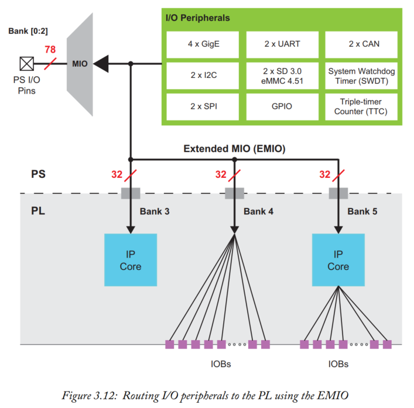

1. By using the Extended MIO (EMIO) to transfer signals between both systems, an Input/Output (I/O) peripheral block within the PS can connect to resources within the PL.
2. Each bank is independent of the others and can only be observed and controlled by software. EMIO does
   not support USB, NAND and QSPI.

### Other PS to PL Interfaces  

There are interfacescommitted to connecting the PL to the Gigabit Ethernet Controller and DisplayPort units contained inside the PS. Other signals include watchdog timers, reset signals, interrupts, Direct Memory Access (DMA) protocol messages and direct GPIO connections to the PMU.  

## Security and Configuration(CSU)

Zynq MPSoC devices contain a broad range of security features and capabilities within their infrastructure.
These include a variety of encryption blocks, secure boot facilities, tamper detection and much more.  

### Configuration Security Unit  

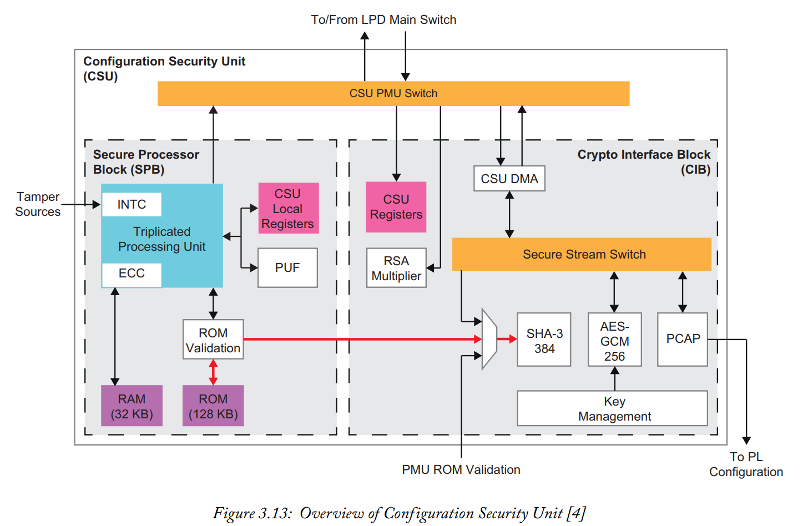

1. two main blocks known as the Secure Processor Block (SPB) and crypto interface block (CIB)  
2. The SPB’s triple-redundant processor manages the secure boot of the Arm processors within the Zynq MPSoC.   
3. Each Arm processor will have a boot process specific to its requirements, each of which will be executed by the SPB.   
4. There are thirteen tamper response registers which can be enabled while the Zynq MPSoC is operating in secure mode  
5. Data passes through the CSU PMU switch to the DMA. The DMA is then responsible for transferring data to and from the secure stream switch, otherwise known as the CIB. Data may travel between systems using the CIB without risk of tampering, allowing multiple systems to connect to the same switch.   

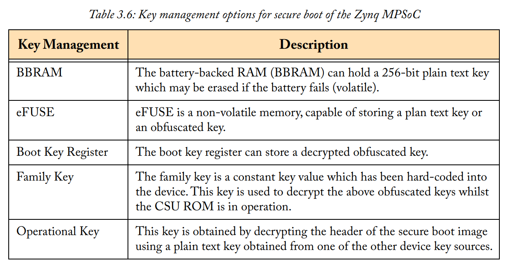

1. Additionally, all code stored in the processor ROM must pass an integrity check before being executed.   
2. A key is generated using the SHA-3 crypto algorithm when the SPB ROM stores software code.  
3. RSA provides authentication for the boot image data when the device is in a secure configuration.   

# AXI_DMA 	IP核

## 6个接口

S_AXI_LITE：是ARM配置dma寄存器的接口

M_AXI_SG是 from/to 存储器 加载/上传 buffer descriptor 的接口

S2MM和MM2S表示数据的方向

AXI 是存储器一侧的接口，AXI-S 是FPGA一侧的接口

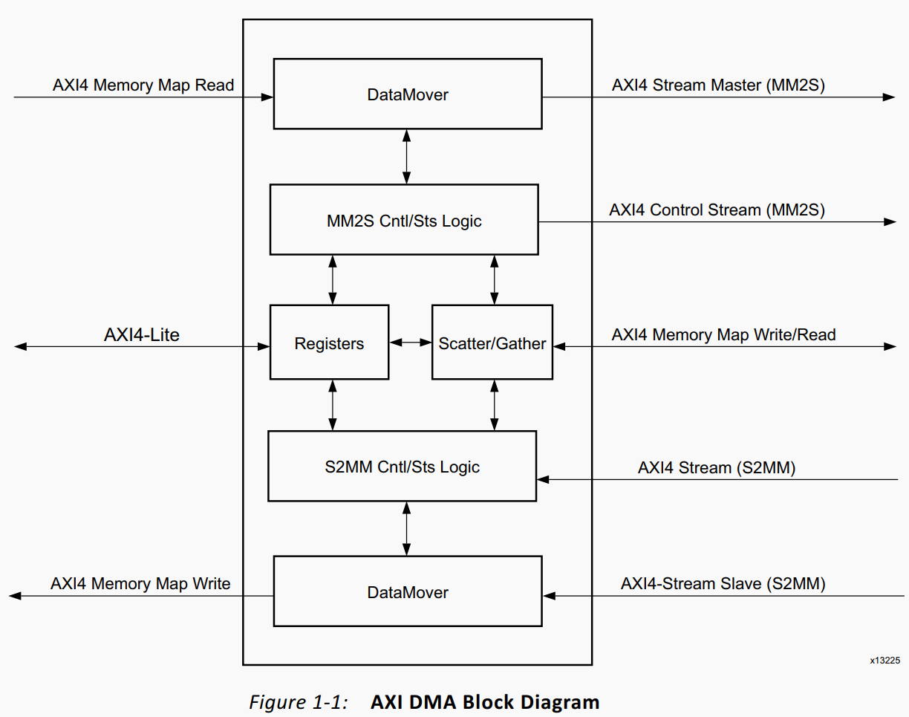

AXIDMA IP和 ARM 自带的DMA是很像的，只不过不具备从存储器到存储器的功能，当然如果将S2MM和MM2S的AXIS接口直接连接也是可以实现的

AXIDMA工作模式分为两种，分别是Direct Register Mode和Scatter/Gather Mode。

Direct Register Mode具备DMA的基本功能，除了控制寄存器和状态寄存器之外，给出源（目的）地址和传输长度之后就可以开启一次传输了。Direct Register Mode 的特点是配置完一次寄存器之后只能完成存储器连续地址空间的读写，如果有需求往不同地址空间搬运数据，那就需要重新配置寄存器开启一次新的传输

