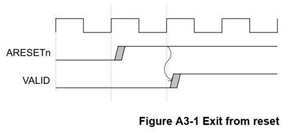

# ZYNQ

## 简介


### PS  AND  PL

**PS**: 处理系统 （Processing System) , 就是与 FPGA 无关的 ARM 的 SOC 的部分  

**PL**: 可编程逻辑 (Progarmmable Logic), 就是 FPGA 部分  

PL 和 PS 数据交互通路是 ZYNQ 芯片设计的重中之重  


### AXI     

AXI 全称 Advanced eXtensible Interface，是 Xilinx 从 6 系列的 FPGA 开始引入的一个接口协
议，主要描述了主设备和从设备之间的数据传输方式。在 ZYNQ 中继续使用，版本是 AXI4，所
以我们经常会看到 AXI4.0， ZYNQ 内部设备都有 AXI 接口。其实 AXI 就是 ARM 公司提出的
AMBA（Advanced Microcontroller Bus Architecture）的一个部分，是一种**高性能、高带宽、低延**
**迟的片内总线**，也用来替代以前的 AHB 和 APB 总线。第一个版本的 AXI（AXI3）包含在 2003
年发布的 AMBA3.0 中， AXI 的第二个版本 AXI（AXI4）包含在 2010 年发布的 AMBA 4.0 之中。  

AXI 协议主要描述了主设备和从设备之间的数据传输方式，主设备和从设备之间通过握手
信号建立连接。当从设备准备好接收数据时，会发出 **READY** 信号。当主设备的数据准备好
时，会发出和维持 **VALID** 信号，表示数据有效。数据只有在 **VALID 和 READY 信号都有效**的时候
才开始传输。  


**AX14, AX14 - Lite** : 均采用内存映射控制方式，即 ARM 将用户自定义 IP 编入某一地址进行访问，读
写时就像在读写自己的片内 RAM，编程也很方便，开发难度较低。代价就是资源占用过多，
需要额外的读地址线、写地址线、读数据线、写数据线、写应答线这些信号线。  

**AXI4-Stream **: 这是一种连续流接口，不需要地址线（很像 FIFO，一直读或一直写就行）。对于这类 IP，
ARM 不能通过上面的内存映射方式控制（FIFO 根本没有地址的概念），必须有一个转换装置，这种接口适合做实时信号处理。

AXI4 和 AXI4-Lite 接口包含**5 个**不同的通道：

- Read Address Channel
- Write Address Channel
- Read Data Channel
- Write Data Channel
- Write Response Channel

其中每个通道都是一个独立的 AXI 握手协议。  


​	只有两个 AXI-GP 是 Master Port，即主机接口，其余 7 个口都是 Slave Port。

​	主机接口具有发起读写的权限， ARM 可以利用两个 AXI-GP 主机接口主动访问 PL 逻辑，其实就是把 PL 映射到某个地址，读写 PL 寄存器如同在读写自己的存储器。其余从机接口就属于被动接口，接受来自 PL 的读写，逆来顺受。
​	另外这 9 个 AXI 接口性能也是不同的。 GP 接口是 32 位的低性能接口，理论带宽600MB/s，而 HP 和 ACP 接口为 64 位高性能接口，理论带宽 1200MB/s。有人会问，为什么高性能接口不做成主机接口呢？这样可以由 ARM 发起高速数据传输。答案是高性能接口根本不
需要 ARM CPU 来负责数据搬移，真正的搬运工是位于 PL 中的 DMA 控制器。  

下面为几个常用的 AXI 接口 **IP** 的功能介绍：

- **AXI-DMA**：实现从 PS 内存到 PL 高速传输高速通道 AXI-HP<---->AXI-Stream 的转换
- **AXI-FIFO-MM2S**：实现从 PS 内存到 PL 通用传输通道 AXI-GP<----->AXI-Stream 的转换
- **AXI-Datamover**：实现从 PS 内存到 PL 高速传输高速通道 AXI-HP<---->AXI-Stream 的转换，只不过这次是完全由 PL 控制的， PS 是完全被动的。
- **AXI-VDMA**： 实现从 PS 内存到 PL 高速传输高速通道 AXI-HP<---->AXI-Stream 的转换，（只不过是专门针对视频、图像等二维数据的）
- **AXI-CDMA**：这个是由 PL 完成的将数据从内存的一个位置搬移到另一个位置，无需 CPU 来插手  

AXI Interconnect **基本连接模式**有以下几种：

- N-to-1 Interconnect
- 1-to-N Interconnect
- N-to-M Interconnect (Crossbar Mode)
- N-to-M Interconnect (Shared Access Mode)  


## Vivado

### 编写约束管脚的方法

编写.xdc文件来绑定和约束管脚，文件是一个TCL脚本

**一般语法**

- 管脚约束如下：

- ```tcl
  set_property PACKAGE_PIN "引脚编号" [get_ports “端口名称” ]
  ```

- 电平信号的约束如下：

- ```tcl
  set_property IOSTANDARD "电平标准" [get_ports “端口名称” ]  
  ```

  需要注意文字的大小写，端口名称是**数组的话用{ }**刮起来，端口名称必须和源代码中的名字一致，且端口名字不能和关键字一样  

```tcl
set_property PACKAGE_PIN U18 [get_ports sys_clk]
set_property PACKAGE_PIN M14 [get_ports {led[0]}]
set_property PACKAGE_PIN M15 [get_ports {led[1]}]
set_property IOSTANDARD LVCMOS33 [get_ports {led[1]}]
set_property IOSTANDARD LVCMOS33 [get_ports {led[0]}]
set_property IOSTANDARD LVCMOS33 [get_ports sys_clk]
```


## HDMI

Mizar Z7 板载一个输入HDMI一个输出HDMI

HDMI系统架构由**信源端**和**接收端**组成。

某个设备可能有一个或多个HDMI输入,一个或多个HDMI输出。

这些设备上,每个HDMI输入都应该遵循HDMI接收端规则,每个HDMI输出都应该遵循HDMI信源端规则。


- HDMI线缆和连接器提供四个差分线对,组成 TMDS 数据时钟通道。
- DDC是用于配置和在一个单独的信源端和一个单独的接收端交换状态。
- CEC提供高水平的控制功能。
- HEAC在连接的设备中提供以太网兼容的网络数据和一个TMDS相对方向的音频回返通道。
- 


## HELLO   WORLD   实验


1. 创建工程
2. Creat Block Design
3. ADD IP 选择 ZYNQ Processing System
4. 进入配置界面
5. I/O Pins 配置时查阅原理图：  
6. DDR Cfinguration  选择 XC7Z010 的开发板 **MT41J128M16 HA-125**  
7. 在PS-PL Configuration中取消掉一些不用的PL设置勾选
8. Run Block Automation
9. 保存当前文件，然后Validate Design
10. Generate Output Products(Global)
11. 对于用到的PL部分添加引脚约束并进行综合生成Bitstream文件
12. 菜单栏 File > Export > Export hardware
13. launch SDK
14. 在SDK中创建工程
15. 选择模板
16. 保存编译
17. 菜单栏选择 Window > Show View > Other
18. 在terminal连接串口
19. 菜单中 Run as > 1 Launch on Hardware


## GPIO

ZYNQ 芯片的 IO 分为三种， 分别是 MIO、 EMIO 和 AXI_GPIO， 其中 

- MIO是 PS 的专用 I/O， 作为普通输入输出或者外设驱动 I/O 来使用， 
- EMIO 是扩展的MIO， 当 MIO 不够时， 可以使用部分 PL 的 I/O 做为 MIO 来使用， 
- AXI_GPIO 是一个可以实现 GPIO 功能的 IP 核， PS 端可以通过 AXI 总线对其进行操作。 在需要众多 I/O 口的应用场合， AXI_GPIO 可以将所有可用引脚作为 I/O 口使用。


​	GPIO分为 4 个 Bank， 其中 Bank0 有 32bit、Bank1 有 22bit，共 54bit 属于 MIO， Bank2和 Bank3 各有 32bit 属于可扩展的 EMIO， 所以对于用户而言有最多 64 个 I/O 可以使用。 

​	MIO 是沟通 PS 内核和外设的桥梁， PS 所有的外设都可以通过 MIO 访问，也可以将外设与 MIO 连接， 在使用上具有极大的灵活性， 为项目硬件设计提供了许多便利， 降低了电路板布局布线的难度。   

### MIO

- MIO即multiuse I/O多用IO
- MIO的功能是把来自PS外设和静态存储器接口的访问**多路复用**到PS引脚上。PS中的IO外设和静态内存接口最多可使用54个引脚。
- IO外设和静态存储器接口都要连接在MIO上，但MIO只有54个不太够用，因此引入多路复用的概念。

当UART和I2C都想使用两个引脚时，就先连接在MIO上，通过MIO连接到外部引脚上，再通过软件编程决定MIO是给UART还是I2C使用。

```
The general purpose I/O (GPIO) peripheral provides software with observation and control of up to 54 device pins via the MIO module. It also provides access to 64 inputs from the Programmable Logic (PL) and 128 outputs to the PL through the EMIO interface. The GPIO is organized into four banks of registers that group related interface signals.
```

- GPIO外设通过MIO模块为软件提供多达54个设备引脚做观测和控制。它同样通过EMIO接口提供PL端的64个输入和128个到PL的输出访问。GPIO根据接口信号被分成4组寄存器（4 bank）。
- 观测即观测器件引脚上的高低电平，作输入控制，把高低电平读入软件程序，比如GPIO通过外部引脚接到按键，假设按下按键为低电平，读取高低电平即可确定按键状态
- 控制即控制引脚的输出，把GPIO接到外部引脚LED上，通过GPIO控制引脚上的高低电平，从而控制LED的亮灭
- GPIO可独立且动态的编程作为输入，输出和中断感知（中断模式）。软件可以通过load指令读取bank里所有GPIO的值，通过一个独立的store指令写入bank里GPIO的值。GPIO的控制和状态寄存器存储映射到基地址 0xE000_A000。
- 软件通过一组 **存储映射(memory-mapped)** 的寄存器来控制GPIO。
- 存储即操作对象位于存储器内，映射指读写操作给定寄存器的地址
- 如果需要使用超过54个IO引脚，可以把这些引脚连接到PL上。这个特性被称为可扩展多路复用IO（EMIO）
- GPIO还可以连接到EMIO，即extendable MIO，EMIO属于PL部分。PS可以通过EMIO连接到FPGA的引脚上
- USB和静态存储器不能连接在EMIO上，看连线也能看出只能连接到MIO上。Static Memory Controller (SMC)


### 寄存器


GPIO bank control (for Bank0 and Bank1) is summarized as follows:

• **DATA_RO**: This register enables software to observe the value on the device pin. If the GPIO
signal is configured as an output, then this would normally reflect the value being driven on the
output. Writes to this register are ignored.
	Note: If the MIO is not configured to enable this pin as a GPIO pin, then DATA_RO is
unpredictable because software cannot observe values on non-GPIO pins through the GPIO
registers.  

• **DATA**: This register controls the value to be output when the GPIO signal is configured as an
output. All 32 bits of this register are written at one time. Reading from this register returns the
previous value written to either DATA or MASK_DATA_{LSW,MSW}; it does not return the current
value on the device pin.  

• **MASK_DATA_LSW**: This register enables more selective changes to the desired output value.
Any combination of up to 16 bits can be written. Those bits that are not written are unchanged
and hold their previous value. Reading from this register returns the previous value written to
either DATA or MASK_DATA_{LSW,MSW}; it does not return the current value on the device pin.
This register avoids the need for a read-modify-write sequence for unchanged bits.  

• **MASK_DATA_MSW**: This register is the same as MASK_DATA_LSW, except it controls the
upper16 bits of the bank.  

• **DIRM**: Direction Mode. This controls whether the I/O pin is acting as an input or an output.
Since the input logic is always enabled, this effectively enables/disables the output driver. When
DIRM[x]==0, the output driver is disabled.

• **OEN**: Output Enable. When the I/O is configured as an output, this controls whether the output
is enabled or not. When the output is disabled, the pin is 3-stated. When OEN[x]==0, the output
driver is disabled.
	Note: If MIO TRI_ENABLE is set to 1, enabling 3-state and disabling the driver, then OEN is
ignored and the output is 3-stated.  


### 配置电压

mio[8:7]在系统复位过程中作为vmode引脚作为输入配置bank电压，复位结束后只能作为输出；


### 配置技巧

1. 在bsp的include文件夹下包含了xilinx的各种头文件，如本章用到的GPIO，用到了xgpiops.h，
   在此文件中可以看到各种宏定义，在调用 GPIO 函数时可以使用这些宏定义，提高可读性。  


同时也包含外设自带的函数声明  


2. 在 xparameters.h 头文件中定义了各个外设的基地址，器件 ID，中断等  


3. 在 libsrc 文件夹中，包含外设函数的定义，使用说明  


4. 在 src 文件夹下的 lscript.ld 中，定义了可用 memory 空间，栈和堆空间大小等，可根据需要修改。  


### Programming Guide  (in UG585)

#### Start-up Sequence

Main Example: Start-up Sequence

1. Resets: The reset options are described in section 14.4.2 Resets.
2. Clocks: The clocks are described in section 14.4.1 Clocks.
3. GPIO Pin Configurations: Configure pin as input/output is described in section 14.3.2 GPIO Pin
Configurations.
4. Write Data to GPIO Output pin: Refer to example in section 14.3.3 Writing Data to GPIO
Output Pins.
5. Read Data from GPIO Input pin: Refer to example in section 14.3.4 Reading Data from GPIO
Input Pins .
6. Set GPIO pin as wake-up event: Refer to example in section GPIO as Wake-up Event


### SDK Programming

1. 在system.mss查看手册和example

2. 打开 `xgpiops_polles_example.c`看见它把示例程序封装成一个独立的函数，按住ctrl点击`GpioPolledExample`进入函数

3. 查看函数GpioPolledExample，找到第1步初始化GPIO设备，把这两行代码复制进main.c，status用来接收返回状态可以去掉（可以看提示出错的地方）。先查找GPIO_DEVICE_ID可以看到上面有个宏定义，点击定义内容可以看见跳转至xparameters.h内，这个头文件包含了很多宏定义。关注的是GPIO驱动的宏定义，第一个是DEVICE_ID，第二个是基地址0xE000A000（寄存器起始地址），第三个是结束地址。

   

4. 查找函数XGpioPs_LookupConfig() 进入xgpiopsps_sinit.c这个文件，查看XGpioPs_LookupConfig()函数的说明，根据器件ID查找器件配置信息，输入DeviceId返回一个指针类型变量 XGioPs_Config *。对应这行代码ConfigPtr = XGpioPs_LookupConfig(GPIO_DEVICE_ID);可以知道 ConfigPtr 是 XGioPs_Config *型变量。
   

5. 查看`XGioPs_Config *`，选择第一个进入`xgpiops.h`，可以看出这是一个结构体类型变量，里面有两个变量器件ID和寄存器基地址
6. `ConfigPtr`实际上在下一个函数`XGpioPs_CfgInitialize()`中作为参数用到了
7. 查找XGpioPs_CfgInitialize()函数进入到xgpiops.c文件，可以看到这个函数功能是初始化XGpioPs驱动，第一个参数是XGpioPs实例型指针XGpioPs *，第二个变量是上一节讲得ConfigPtr，同样为指针类型变量 XGioPs_Config *，第三个变量是有效地址
8. 在 `xgpiops_polles_example.c`文件下查看参数`Gpio`发现转到一处定义`XGpioPs Gpio;`，拷贝进main.c
9. 查看`XGpioPs`，这个结构体变脸驱动实例数据(instance data)。对GPIO所有操作都是通过`XGpioPs`进行
10. 可以看到`XGpioPs_CfgInitialize()`定义第一个变量是指针类型变量，故输入`&Gpio`用于取地址
11. 在示例程序`xgpiops_polles_example.c`往下看找到运行输出示例，查看函数`GpioOutputExample()`，可以看到两行设置输出方向和输出使能
    

12. 进入第一个函数`XGpioPs_SetDirectionPin()`，函数功能设置输出方向。第一个参数是指针指向XGpioPs实例`XGpioPs Gpio;`，第二个参数是操作的引脚，第三个参数是方向，0作为输入，1作为输出。
13. 确定器件引脚MIO，此处需要看板子的原理图
14. 进入设置输出使能函数查看`XGpioPs_SetOutputEnablePin()`，第三个参数为1是打开输出使能
15. 准备写数据，在示例中点击`XGpioPs_WritePin()`查看函数的定义。重点看第三个参数Data，这是准备写到指定引脚的数，虽然是u32类型数据只能写0或1。1代表高电平。添加这行就可以点亮LED`XGpioPs_WritePin(&Gpio, MIO_LED, 1);`

### EMIO

(14.2.2)

The register interface for the EMIO banks is the same as for the MIO banks described in the previoussection. However, the EMIO interface is simply wires between the PS and the PL, so there are a fewdifferences:

• The inputs are wires from the PL and are unrelated to the output values or the OEN register.They can be **read** from the **DATA_RO register** when **DIRM** is set to 0, making it an input.

• The output wires are **not 3-state capable**, so they are unaffected by OEN.(But can comb input, OEN, output to implement 3-state) The value to be outputis programmed using the DATA, MASK_DATA_LSW, and MASK_DATA_MSW registers. DIRM mustbe set to 1, making it an output.

• The output enable wires are simply outputs from the PS. These are controlled by the DIRM/OENregisters as follows: EMIOGPIOTN[x] = DIRM[x] & OEN[x]  


### Interrupt

- INT_TYPE中断类型，检测电平中断（level）和边沿（edge）中断
- INT_POLARITY中断极性，正和负。电平中断检测低电平和高电平（low or high），边沿中断检测上升沿和下降沿（falling or rising）
- INT_ON_ANY设置为1时，同时支持上升沿和下降沿。当是电平触发时（INT_TYPE is set to level sensitive）该寄存器被忽略。


​	

- 中断检测逻辑将当前中断状态寄存在INT State寄存器里，寄存器清零(Clr)端口连接到INT_STAT。对INT_STAT写1可以清除INT State寄存器，INT State寄存器的输出端口连接到INT_STAT，读INT_STAT可以获取当前中断状态，是否有中断产生。

INT State寄存器输出与另外三个寄存器通过与门连接

- INT_MASK（mask: 屏蔽）只读寄存器，读取GPIO哪个引脚中断被屏蔽或打开，屏蔽通过INT_DIS和INT_EN
- INT_DIS(disable)关闭使能，即屏蔽某个引脚的中断，被屏蔽引脚的状态从INT_MASK读取
- INT_EN(enable)使能某个中断，GPIO有4个bank共32位可以使能某个引脚也可以使能某个bank，使能的方法就是写INT_EN寄存器某位为1

- 当检测到中断时INT State输出1，中断没有被屏蔽时输出1，检测到引脚中断和中断没有被屏蔽则输出一个中断到GIC。中断检测逻辑和中断使能逻辑通过与门向GIC发送中断请求


- Generic Interrupt Controller (GIC) 中断控制器。在block diagram可以看到GIC可以接收来自PL和PS的中断请求信号，GIC需要对中断请求信号进行编号（ID）。中断控制器通过ID判断中断来自哪个外设。


### 中断配置

**把MIO引脚12配置成上升沿中断**

1. 把触发类型设置为上升沿
2. 向中断类型寄存器写1设置为边沿触发，INT_TYPE_0 [12] = 1
3. 向极性寄存器写1设置为上升沿（0是下降沿），INT_POLARITY_0 [12] = 1
4. 只是配置成上升沿，向INT_ANY寄存器写0（1是上升沿和下降沿均可以）INT_ANY_0 [12] = 0
5. 使能中断向INT_EN寄存器写1，INT_EN_0 [12] = 1
6. 查看中断状态是否触发读INT_STAT寄存器，当INT_STAT_0 [12] =1时表明一个中断事件发生（在MIO 12引脚上产生了一个上升沿）比如MIO12连接到一个按键，按键按下是低电平，在释放时产生一个上升沿，中断代表按键释放这个时间
7. 中断处理完后关闭中断使能信号，INT_DIS_0 [12] = 1


### AXI_GPIO

- AXI GPIO提供通用输入输出接口到AXI接口，32位软核，设计与AXI4-Lite接口进行连接。
- IOP中GPIO是硬核，芯片中已经实现的硬件电路，AXI GPIO是在PL端用逻辑实现的软核。
- AXI互联属于功能接口，]又分AXI_ACP，AXI_HP和AXI_GP。实现了PL和PS间数据传输

**特性**

- 支持AXI4-Lite接口
- 支持配置成单通道或双通道（配置界面两个通道选择）
- 配置通道位宽从1位到32位
- 针对GPIO每一位支持动态编程为输入或输出
- 支持每个通道的独立配置
- 复位信号
- 可选中断请求信号的生成（在Vivado下勾选Enable Interrupt）

功能描述

- AXI GPIO提供了一个通用的输入输出接口到AXI4-Lite接口。可以配置成单通道或双通道。每个通道可以独立进行配置。
- GPIO端口可以动态配置输入或输出通过使能或者关闭使能三态的缓冲器。每个通道可以配置成当一个转化（电平状态改变从0到1或从1到0）在输入引脚发生时产生中断信号。


**寄存器空间（Register Space）**

- GPIO_DATA是数据寄存器（Data Register），读数据和写数据都是通过这个寄存器。
- GPIO_TRI是三态控制寄存器，控制GPIO引脚作为输入还是输出
- GIER是全局使能中断寄存器（Global Interrupt Enable Register）
- IP IER，打开某一个通道的中断功能
- IP ISR，通道状态寄存器、
- GPIO_DATA可以读和写端口即读用作输入，写用作输出
- GPIO_TRI被置为1时，用作输入；被清除为0时用作输出
  - set 1 in
  - clear 0 out
- GIER打开全局中断
- IP IER打开各通道独立的中断
- IP ISR状态寄存器可以读取当前中断状态

**端口描述（Port Descriptions）**

**编程指导（ch3 Programming Sequence）**

- 作为输入打开中断
  - 把三态控制寄存器GPIO_TRI写1配置成输入
  - 打开通道的中断，同时打开**全局中断**(GIER)
  - 当接受到中断时（说明输入引脚电平发生变化），从GPIO_DATA读取输入数据，对应位写1清除中断状态寄存器**IP ISR**（清除中断状态方便检测下次中断的产生）
- 不使用中断作为输入
  - 配置成输入
  - 从GPIO_DATA读数据
  - 输出
  - 把端口配置成输出
  - 往端口写数据

### use AXI_GPIO

#### IP

- 实验原理图如下，PS端的M_AXI_GP0作为主端口与PL端的AXI GPIO IP核以AXI4-Lite总线相连。AXI互联(AXI Interconnect)用于连接AXI的存储映射(memory-mapped)的主器件和从器件。


- 配置ZYNQ核，允许接收PL的[中断](https://so.csdn.net/so/search?q=中断&spm=1001.2101.3001.7020)，MIO打开UART1和GPIO，其他保持不变
- 配置的ZYNQ PS核
- 添加AXI GPIO核
- 配置AXI GPIO，按键只有1位故配置GPIO Width为1
- AXI Interconnect IP核用于将一个（或多个）AXI存储器映射的主器件连接到一个（或多个）存储器映射的从器件。互联(Interconnect)：互联实际上是一个开关，管理并指挥所连接的AXI接口的通信。橙色高亮的两组信号表明，AXI互联实现了由主器件ZYNQ7 PS到从器件AXI GPIO一对一的连接。它也可以实现一对多、多对一及多对多的AXI接口连接。


- Processor System Reset IP核为整个处理器系统提供复位信号。它会处理输入端的各种复位条件，并在输出端产生相应的复位信号。在本次实验中，Processor System Reset（ext_reset_in，外部复位）接收ZYNQ7 PS输出的异步复位信号FCLK_RESET0_N。然后产生一个同步到PL时钟源FCLK_CLK0的复位信号peripheral_arestn，用于复位PL端的各种外设。
  

- 时钟信号，点开zynq核打开Clock Config下PL Fabric Clocks可以看到输出时钟FCLK_CLK0为100MHz。

- 将AXI GPIO的中断输出连接到PS的中断输入端口
- 将AXI GPIO引出端口修改名字为AXI_GPIO_BUTTON
- 验证、Generate Output Products 并 Create HDL Wrapper、添加PL端按键引脚的约束文件
- 生成比特流，export hardware包含比特流，最后launch sdk

#### SDK

- axi_gpio是PL端gpio（FPGA资源搭建的软核），ps7_gpio是ps端gpio（硬核）

  

- 用到了AXI GPIO导入头文件，根据mss文件描述axi_gpio叫做gpio故导入文件xgpio.h。
- ps端gpio叫做gpiops故导入文件xgpiops.h


- 导入AXI GPIO的器件ID

  

- 中断信号是PL到PS端的一个中断，在ug585 ch7 Interrupts 7.2.3 Shared Peripheral Interrupts (SPI) 查看中断号（zynq核中同样可以查看）。来自PL的中断共16个，分成两部分[63:61]和[91:84]，使用一个中断ID为61。
  

- 在示例程序中查看定义，跳转到宏定义数值为61

- AXI GPIO有两个通道，用到了一个通道定义为1。添加宏定义即可以使用通道1的端口。

- ```c
  #define GPIO_CHANNEL1		1
  ```

- 仿照对PS端GPIO初始化，对AXI GPIO进行初始化，在xgpio.h头文件查找需要的函数声明，找到 XGpio_Initialize() 点进去查看函数定义。LookupConfig和CfgInitialize被封装进XGpio_Initialize()，直接调用Initialize即可。
  


- PS GPIO设置为输出并打开输出使能，这部分代码不用修改，接着参考pg144配置AXI GPIO。第一个首先设置数据输入和输出方向，第二个打开全局中断和通道中断，初始化部分就算完成了。

- 在xgpio.h头文件找到 XGpio_SetDataDirection() 函数用来设置数据输入和输出**方向**（注释：给GPIO独立通道设置输入和输出方向）。第三个参数DirectionMask32位，对应GPIO每一位信号的输入和输出。最低位为输入设置为1化作十六进制为0x00000001（对32位数据需要8个十六位数据来表示，一个十六位数据对应4位，如果最高位设置为1前4位为1000转换为十六进制为0x80000000）。

  

- 打开全局[中断]`XGpio_InterruptGlobalEnable()` 和 打开通道中断对应的信号 `XGpio_InterruptEnable()`。Mask同样为32位，每一位对应着一路信号，设置为1对应着打开中断的使能。

```c
XGpio_SetDataDirection(&AXI_Gpio, GPIO_CHANNEL1, 0x00000001); // 设置为输出
XGpio_InterruptGlobalEnable(&AXI_Gpio); 		// 打开全局中断使能
XGpio_InterruptEnable(&AXI_Gpio, 0x00000001);	// 打开通道信号对应的使能
```

- 设置中断系统，完成最后一步获取中断并读取数据
- 修改设置中断系统的参数，把第二个参数xgpiops改为xgpio void SetupInterruptSystem(XScuGic *GicInstancePtr, XGpio * AXI_Gpio, u16 AXI_GpioIntrId); 函数里参数名字也跟着修改，初始化xscugic的部分保持不变
- 去实例函数找如何设置，发现一个 XScuGic_SetPriorityTriggerType() 函数。根据触发类型为高有效电平敏感型设置Trigger为01，优先级保持与实例程序一致。


```c
// 0xA0: 中断源的优先级 0x1: 中断类型为高有效电平敏感型
XScuGic_SetPriorityTriggerType(GicInstancePtr, AXI_GpioIntrId, 0xA0, 0x1);
```

- 修改完成设置中断系统函数

```c
void SetupInterruptSystem(XScuGic *GicInstancePtr, XGpio * AXI_Gpio,
            u16 AXI_GpioIntrId)
{
    // 查找GIC器件配置信息，并进行初始化
    IntcConfig = XScuGic_LookupConfig(INTC_DEVICE_ID);
    XScuGic_CfgInitialize(GicInstancePtr, IntcConfig, IntcConfig->CpuBaseAddress);

    // 初始化ARM处理器异常句柄
    Xil_ExceptionInit();
    // 来给 IRQ 异常注册处理程序
    Xil_ExceptionRegisterHandler(XIL_EXCEPTION_ID_INT,
                (Xil_ExceptionHandler) XScuGic_InterruptHandler,
                GicInstancePtr);
    // 使能处理器的中断
    Xil_ExceptionEnableMask(XIL_EXCEPTION_IRQ);

    // 关联中断处理函数
    XScuGic_Connect(GicInstancePtr, AXI_GpioIntrId,
                (Xil_ExceptionHandler)IntrHandler,
                (void *)AXI_Gpio);
    // 为AXI GPIO器件使能中断
    XScuGic_Enable(GicInstancePtr, AXI_GpioIntrId);
    // 0xA0: 中断源的优先级 0x1: 中断类型为高有效电平敏感型
    XScuGic_SetPriorityTriggerType(GicInstancePtr, AXI_GpioIntrId, 0xA0, 0x1);
    // 打开AXI GPIO IP的中断使能
    XGpio_InterruptGlobalEnable(AXI_Gpio); 		// 打开全局中断使能
    XGpio_InterruptEnable(AXI_Gpio, 0x00000001);	// 打开通道信号对应的使能
```

- 修改中断服务函数`IntrHandler()`，将关闭PS GPIO中断修改为关闭AXI GPIO中断

```C
XGpio_InterruptDisable(&AXI_Gpio, 0x00000001);
```

- 修改主函数，将PS GPIO的清除中断状态修改为AXI GPIO的清除中断状态，在xgpio.h找到类似的函数定义XGpio_InterruptClear()

```C
XGpio_InterruptClear(&AXI_Gpio, 0x00000001);
```

- **TOTAL**

```c
#include "stdio.h"
#include "xparameters.h"
#include "xgpiops.h"
#include "sleep.h"
#include "xscugic.h"
#include "xgpio.h"

#define GPIO_DEVICE_ID XPAR_XGPIOPS_0_DEVICE_ID // PS GPIO 器件ID
#define INTC_DEVICE_ID XPAR_SCUGIC_SINGLE_DEVICE_ID // 中断控制器 器件ID
#define AXI_GPIO_ID		XPAR_GPIO_0_DEVICE_ID //AXI GPIO 器件ID
// AXI GPIO的中断号 61
#define AXI_GPIO_INTERRUPT_ID	XPAR_FABRIC_AXI_GPIO_0_IP2INTC_IRPT_INTR

// 核心板上PS端LED
#define MIO0_LED 7
//AXI GPIO 通道1
#define GPIO_CHANNEL1		1

XGpioPs_Config * ConfigPtr;
XScuGic_Config * IntcConfig;

XGpioPs Gpio;
XScuGic Intc;
XGpio AXI_Gpio;

void SetupInterruptSystem(XScuGic *GicInstancePtr, XGpio * AXI_Gpio, u16 AXI_GpioIntrId);
void IntrHandler();

u32 key_press = 0;

int main() {
    u32 led_value = 0;

    printf("AXI GPIO INTERRUPT TEST.\n\r");

    // 配置PS端器件GPIO并初始化
    ConfigPtr= XGpioPs_LookupConfig(GPIO_DEVICE_ID);
    XGpioPs_CfgInitialize(&Gpio, ConfigPtr, ConfigPtr->BaseAddr);

    // 对AXI GPIO进行初始化
    XGpio_Initialize(&AXI_Gpio, AXI_GPIO_ID);

    // 把PS GPIO设置为输出并打开输出使能
    XGpioPs_SetDirectionPin(&Gpio, MIO0_LED, 1);
    XGpioPs_SetOutputEnablePin(&Gpio, MIO0_LED, 1);

    // 对AXI GPIO进行配置
    XGpio_SetDataDirection(&AXI_Gpio, GPIO_CHANNEL1, 0x00000001); // 设置为输出
    XGpio_InterruptGlobalEnable(&AXI_Gpio); 		// 打开全局中断使能
    XGpio_InterruptEnable(&AXI_Gpio, 0x00000001);	// 打开通道信号对应的使能

    // 设置中断系统
    SetupInterruptSystem(&Intc, &AXI_Gpio, AXI_GPIO_INTERRUPT_ID);

    XGpioPs_WritePin(&Gpio, MIO0_LED, led_value);

    while(1){
        if(key_press) {
        	// 判断当前按键的状态，如果按键按下，就改变LED状态
        	if(XGpio_DiscreteRead(&AXI_Gpio,GPIO_CHANNEL1) == 1)
        		led_value = ~led_value;

            key_press = 0;

            // 清除之前的中断状态
            XGpio_InterruptClear(&AXI_Gpio, 0x00000001);

            // 将led_value的值写入LED
            XGpioPs_WritePin(&Gpio, MIO0_LED, led_value);
            // 延时消抖
            usleep(200000);
            // 重新打开通道1的中断使能
            XGpio_InterruptEnable(&AXI_Gpio, 0x00000001);
        }
    }

    return 0;
}

void SetupInterruptSystem(XScuGic *GicInstancePtr, XGpio * AXI_Gpio,
            u16 AXI_GpioIntrId)
{
    // 查找GIC器件配置信息，并进行初始化
    IntcConfig = XScuGic_LookupConfig(INTC_DEVICE_ID);
    XScuGic_CfgInitialize(GicInstancePtr, IntcConfig, IntcConfig->CpuBaseAddress);

    // 初始化ARM处理器异常句柄
    Xil_ExceptionInit();
    // 来给 IRQ 异常注册处理程序
    Xil_ExceptionRegisterHandler(XIL_EXCEPTION_ID_INT,
                (Xil_ExceptionHandler) XScuGic_InterruptHandler,
                GicInstancePtr);
    // 使能处理器的中断
    Xil_ExceptionEnableMask(XIL_EXCEPTION_IRQ);

    // 关联中断处理函数
    XScuGic_Connect(GicInstancePtr, AXI_GpioIntrId,
                (Xil_ExceptionHandler)IntrHandler,
                (void *)AXI_Gpio);
    // 为AXI GPIO器件使能中断
    XScuGic_Enable(GicInstancePtr, AXI_GpioIntrId);
    // 0xA0: 中断源的优先级 0x1: 中断类型为高有效电平敏感型
    XScuGic_SetPriorityTriggerType(GicInstancePtr, AXI_GpioIntrId, 0xA0, 0x1);
    // 打开AXI GPIO IP的中断使能
    XGpio_InterruptGlobalEnable(AXI_Gpio); 		// 打开全局中断使能
    XGpio_InterruptEnable(AXI_Gpio, 0x00000001);	// 打开通道信号对应的使能
}

void IntrHandler(){
    printf("interrupt detected!\n\r");
    key_press = 1;
    // 关闭通道1中断使能信号
    XGpio_InterruptDisable(&AXI_Gpio, 0x00000001);
}
```


## IP

### 自定义ip

Xilinx 官方为我们提供了非常丰富的 IP 核，如数学运算（乘法器、浮点运算器等）、信号处理（ FFT、DDS 等），我们可以通过调用这些 IP 核来快速完成设计。然而随着系统的设计越来越复杂，官方提供的免费 IP 核有时并不能很好的适用我们的设计，这个时候就需要我们自己来实现这些功能。为了使这些模块或代码以后能够复用，可以通过自定义 IP 核的方式将这些模块集成到 Vivado 中的 IP 库中，以达到简化系统设计和缩短产品上市时间的目的。


## 程序固化

  尝试把程序存储在非易失性存储器中， 在上电或者复位时让程序自动运行，这个过程需要启动引导程序的参与。 Boot Loader 会加载 FPGA 配置文件， 以及运行在 ARM 中的软件应用。  

ZYNQ SoC 的启动和配置过程中， 既需要 PS 的配置信息，又需要 PL 的配置信息。 为了简化配置 PS和 PL 的处理过程， ZYNQ 的配置顺序与 Xilinx FPGA 的配置顺序有所不同。 差异来源于以下两种类型的文件：  

1. FPGA BIT 文件——定义 PL 的行为
2. 软件 ELF 文件——运行在 PS 中的程序  

在 ZYNQ 中， PS 作为主器件， PL 可以看作是 PS 的一个外设，因此需要由 PS 来配置 PL。这个配置顺序的优势是它允许对 PS 单独上电的时候， 此时 PL 不上电，以减小功耗。 

不过也有例外， 就是我们在使用JTAG 下载程序的时候， 此时是使用电脑作为主机来配置 PL。

软件代码和配置 FPGA 的 BIT 文件可以存储在连接到 PS 端的配置存储器件中。 PS 支持多种片外非易失性存储器（ Quad SPI Flash， NAND Flash， NOR Flash 或 SD 卡） 。  

ZYNQ SoC 的启动由片上的 BootROM 开始。片上 BootROM 是 ZYNQ 芯片上的一块非易失性存储器，它包含了 ZYNQ 所支持的配置器件的驱动， 而且里面的代码是不可修改的。 BootROM 中的代码首先会在片外的非易失性存储器中寻找一个头文件， 头文件里定义了一些启动信息， 用于配置 BootROM 的运行。 这些启动信息包括是程序是否就地执行（ excute in place） ， FSBL 的偏移地址以及是否为安全模式等。头文件的存在确保 BootROM 能够按照配置器件被格式化后的方式操作。  

BootROM 执行之后，下一个配置阶段被称为 First-Stage Boot Loader （ FSBL）， 它是由设计者所创建的。FSBL 可以配置 DDR 存储器和硬件设计过程中所定义的一些外设。这些器件需要在加载软件应用及配置 PL 之前就初始化完毕。  

总结一下 FSBL 的工作内容：

1.  初始化 PS；
2.  如果提供了 BIT 文件，则配置 PL；
3.  加载裸机应用程序到 DDR 中，或者加载 Second-Stage Boot Loader（ SSBL）；
4.  开始执行裸机应用程序，或者 SSBL。  

PL 的配置是通过处理器配置访问接口（ Processor Configuration Access Port， PCAP） 进行的，它允许对
PL 进行部分配置或者完全配置。有关 PL 的部分配置我们会在其他章节予以介绍。 一旦 PS 启动运行之后，
PL 可以在任意时刻被配置， FSBL 和应用程序可以清除、 配置以及使能 PL。  

要重建一个 ZYNQ 的启动镜像我们需要执行以下文件：

1.  Boot ROM 头文件：控制 Boot ROM 设置，比如就地执行、 加密、 FSBL 偏移量、镜像文件大小等；
2.  First-Stage Boot Loader；
3.  PL 配置文件， 即 BIT 文件；
4.  运行在 PS 上的软件应用程序  

ZYNQ SoC 使用多个模式引脚来决定配置**器件的类型， 软件的存储位置以及其他的系统设置**， 
这些引脚共享 PS 端的 MIO 引脚。 总共有 7 个模式引脚， 分别为 MIO[8:2]。
其中，前四个引脚定义**启动模式**，第**五**个引脚定义是否使用 PLL， 第**六**个和第七个引脚定义上电过程中 **MIO bank0 和 bank1 的电压**。  


​	在上电复位（ Power On Reset， POR） 之后，硬件会采集模式引脚的状态， 禁用器件内部的模块，并根据模式引脚的设置选择是否使能 PS 的时钟锁相环（PLL）。

​	而在其他的复位条件下， 比如软复位， 硬件不会执行上 述的动作。 需要注意的是， PS 的复位按键，属于上电复位（ POR），如果按下 PS 的复位按键，硬件会重新采集模式引脚的状态。   

• Figure 6-1
	° Overview of bring-up and configuration
• Device Start-up
	° Power-up, resets, clocks, Boot mode pins
• BootROM
	° Execution flow, BootROM header
	° Boot modes, image search, multiboot
	° Error codes, system state post-BootROM
• Device Boot and PL Configuration
	° PL initialization, configuration, and enable
	° PS/PL bring-up examples
	° PCAP bridge, JTAG (cascade/independent)
• Reference Section
	° PL bring-up time factors, register overview, and device IDs 


## ZYNQ 双核 AMP 通信  

​	多核处理器从多核的结构上是否一致，分为两种基本架构：**同构多核架构和异构多核架构**。同构多核处理器是指系统中的处理器在结构上是相同的；而异构处理器是指系统中的处理器在结构上是不同的，这些处理器可以是通用处理器，也可以是解决某些特定应用的专用硬核。同构多核架构相比于异构多核架构，在硬件和软件设计上较为简单，通用性较高， 但在某些特定应用场合下，如异构多核架构专用的硬件加速硬核，异构多核架构的性能会更高。

Xilinx 的 ZYNQ SOC 融合了这两种架构， ZYNQ SOC 芯片包含两个独立的 Cortex-A9 内核，这两个核在结构上是相同的，同时又包括了可编程的逻辑单元（PL），使得 ZYNQ 整体系统成为了一个异构多核系统， 如同时使其具有较高的通用性和性能。  

- AMP：多个内核相对独立的运行不同的任务，每个内核相互隔离，可以运行不同的不操作系统（OS）或裸机应用程序。
- SMP：指多个处理器运行一个操作系统，这个操作系统同等的管理多个内核，如电脑。
- BMP：与 SMP 类似，但开发者可以指定将某个任务仅在某个指定核上执行。  


**双核通信的手段：**

1. 共享内存
2. SGI中断（software generated interrupts  ）

**CPU私有资源：**

1. L1 cache（一级缓存）；
2. CPU 私有外设中断（PPI）；
3. 内存管理单元（MMU）；
4. CPU 私有定时器。  

**CPU共享资源：**

1. 中断控制分配器（ICD） ；
2. DDR 内存；
3. 片内存储器（OCM）；
4. 全局定时器（Global Timer）；
5. SUC 和 L2 cache（二级缓存）。
6. 片上外设，例如 GPIO、 SD、 QSPI、 UART、 I2C、 SPI（共享外设中断）、 USB、 CAN、 SPI 等等。  

**ZYNQ**在上电之后，BootRom运行在CPU0上，以此来加载用户在PL端的bitstream和在PS端的代码；
BootRom启动之后CPU1进入等待事件模式(**WFE**)，此时必须**由CPU0来启动CPU1**，解除WFE；
当CPU1接收到CPU0给到的**SEV指令**后被唤醒，然后**立即读取0xFFFFFFF0内存地址**中的应用**程序入口地址**  ；

```c
#define sev()	__asm__ __volatile__ ("sev") // C内嵌汇编(ASM)
#define CPU1_RUN_ADDR 0x30000000
#define CPU1_COPY_ADDR 0xFFFFFFF0
static void StartCpu1(void)
{
Xil_Out32(CPU1_COPY_ADDR, CPU1_RUN_ADDR); // 将 0x30000000 拷贝到 0xFFFFFFF0 地址处
dmb(); // 等待内存写入完成（同步）
sev(); // 执行 sev 指令唤醒 CPU1
}9
/* CPU0.c 应用程序的 main 函数 */
int main(void)
{
StartCpu1(); // 启动 CPU1
}
```


### 宏定义-DUSE_AMP=1 

###  

L2 Cache属于CPU0和CPU1的共享资源，这对AMP运行模式来说是个麻烦，所以直接CPU1禁止使用L2 Cache，避免出现问题；

定义了这个宏之后，Cpu1就可以不使用L2 Cache了。


## AXI

**referance** ug1037 IHI0022D

AXI is part of ARM AMBA(advanced microcontroller bus architecture), a family of micro controller buses first introduced in 1996.   

既片内互联的一个**总线标准**，能够在多主机设计中实现多个控制器和多个外围设备之间的连接和管理；

released in 2010, includes the second major version of AXI, **AXI4**  

- • AXI4: For high-performance **memory-mapped** requirements.bursts of up to 256 data transfer cycles with just a single address phase.
- • AXI4-Lite: For simple, low-throughput memory-mapped communication (for example, to and from control and status registers).**single transaction** **memory-mapped** interface.
- • AXI4-Stream: For high-speed streaming data. **do not require an address** and allows
  **unlimited data burst size**  

**memory-mapped**: 当主机对从机进行读写使，指定一个目标地址对应存储空间，对该空间进行读写。

- Many IP providers support the AXI protocol.  
- A robust collection of third-party AXI tool vendors is available.


### Channel

Both **AXI4** and **AXI4-Lite** interfaces consist of five different channels:  

- ​	 Read Address Channel
- ​     Write Address Channel
- ​     Read Data Channel
- ​     Write Data Channel
- ​     Write Response Channel  


**Channel definition**

1. The information source uses the **VALID** signal to show when valid address, data or control information is available on the channel. The destination uses the **READY** signal to show when it can accept the information. Both the readdata channel and the write data channel also include a **LAST** signal to indicate the transfer of the final data item in a transaction  
2. **Read** and **write** transactions each have their own address channel. The appropriate address channel carries all of the required address and control information for a transaction  
3. The read data channel carries both the read data and the read **response information from the slave** to the master, and includes(slave -> master):
    •  the data bus, that can be 8, 16, 32, 64, 128, 256, 512, or 1024 bits wide
    •  a **read response signal** indicating the **completion status** of the read transaction  
4. The write data channel carries the write data includes(master -> slave):
    •  the data bus, that can be 8, 16, 32, 64, 128, 256, 512, or 1024 bits wide
    •  a **byte lane strobe signal** for every eight data bits, indicating which bytes of the data are valid.
   Write data channel information is always treated as buffered, so that the master can perform write transactions
   without slave acknowledgement of previous write transactions.  
5. A **slave** uses the **write response channel** to respond to write transactions. All write transactions require completion signaling on the write response channel.  (master -> slave)


### **Global signals**

| Signal  | Source | Description                                                  |
| ------- | ------ | ------------------------------------------------------------ |
| AWADDR  | Master | Write address. The write address gives the address of the first transfer in a write burst transaction. |
| AWBURST | Master | AWBURST Master Burst type. The burst type and the size information, determine how the address for each transfer within the burst is calculated. |
| AWLEN   | Master | Burst length. The burst length gives the exact number of transfers in a burst. This information determines the number of data transfers associated with the address. This changes between AXI3 and AXI4. |
| AWSIZE  | Master | Burst size. This signal indicates the size of each transfer in the burst. |
| AWVALID | Master | Write address valid. This signal indicates that the channel is signaling valid write address and control information. |
| AWREADY | Slave  | Write address ready. This signal indicates that the slave is ready to accept an address and associated control signals. |

Burst type:  **FIXED   INCR   WRAP**


### Single Interface Requirements  

**Clock and reset**  

- Each AXI component uses a single clock signal, **ACLK**. All input signals are sampled on the rising edge of ACLK. All output signal changes must occur after the rising edge of ACLK.  
- The AXI protocol uses a single active **LOW** reset signal, **ARESETn**. The reset signal can be asserted asynchronously, but deassertion must be synchronous with a rising edge of ACLK.  



During reset the following interface requirements apply:
• a master interface must drive ARVALID, AWVALID, and WVALID LOW
• a slave interface must drive RVALID and BVALID LOW
• all other signals can be driven to any value.  

- Handshake process

  **All five transaction channels use the same** **VALID/READY** handshake process to transfer address, data, and controlinformation. This **two-way flow control mechanism** means both the **master** and **slave** can control **the rate at which the information moves** between master and slave. The source generates the VALID signal to indicate when theaddress, data or control information is available. The destination generates the READY signal to indicate that it canaccept the information. Transfer occurs only when **both the VALID and READY signals are HIGH**.  

  

- In Figure A3-3, the destination asserts READY, after T1, before the address, data or control information is valid, indicating that it can accept the information. The source presents the information, and asserts VALID, after T2, andthe transfer occurs at T3, when this assertion is recognized. In this case, transfer occurs in a single cycle.  
- In Figure A3-4, both the source and destination happen to indicate, after T1, that they can transfer the address, dataor control information. In this case the transfer occurs at the rising clock edge when the assertion of both VALIDand READY can be recognized. This means the transfer occurs at T2.

Write data channel example:
During a write burst, the master can assert the WVALID signal only when it drives valid write data. When assertedWVALID must remain asserted until the rising clock edge after the slave asserts WREADY.
The default state of WREADY can be HIGH, but only if the slave can always accept write data in a single cycleThe master must assert the WLAST signal while it is driving the final write transfer in the burst.  

1. Write transaction dependencies
   the master must not wait for the slave to assert AWREADY or WREADY before asserting AWVALID       or WVALID
2. the slave can wait for AWVALID or WVALID, or both before asserting AWREADY
3. the slave can assert AWREADY before AWVALID or WVALID, or both, are asserted
4. the slave can wait for AWVALID or WVALID, or both, before asserting WREADY
5. the slave can assert WREADY before AWVALID or WVALID, or both, are asserted
6. the slave must wait for both WVALID and WREADY to be asserted before asserting BVALID
7. the slave must also wait for WLAST to be asserted before asserting BVALID, because the write    response, BRESP, must be signaled only after the last data transfer of a write transaction
8. the slave must not wait for the master to assert BREADY before asserting BVALID
9. the master can wait for BVALID before asserting BREADY
10. the master can assert BREADY before BVALID is asserted.  


### IPs

The Xilinx **AXI Interconnect IP** and the newer **AXI SmartConnect IP** contain a configurable
number of AXI-compliant master and slave interfaces, and can be used to route transactions
between one or more AXI masters and slaves.  

Examples of infrastructure IP are:

-  AXI Register slices (for pipelining)
-  AXI FIFOs (for buffering/clock conversion)
-  AXI Interconnect IP and AXI SmartConnect IP (for connecting memory-mapped IP together)
-  AXI Direct Memory Access (**DMA**) engines (for **memory-mapped to stream** conversion)
-  AXI Performance Monitors and Protocol Checkers (for analysis and debug)
-  AXI Verification IP (for simulation-based verification and performance analysis)  

**Xilinx AXI SmartConnect and AXI Interconnect IP**

- The Xilinx LogiCORE IP AXI Interconnect and LogiCORE IP AXI SmartConnect cores both connect one or more AXI memory-mapped master devices to one or more memory-mapped slave devices;   

possible use cases:  

- Conversion Only
- N-to-1 Interconnect
- 1-to-N Interconnect
- N-to-M Interconnect (Sparse Crossbar Mode)  


## DMA

TheAXI DMA provides **high-bandwidth** **direct memory access** between **memory** and **AXI4-Stream** target peripherals.   

Its optional scatter/gather(S/G) capabilities also offload data movement tasks from the CPU;


Initialization, status, and management registers are accessed through an AXI4-Lite slave interface.  

the ports in red boxes only used in S/G mode


### Maximum Frequencies  


### Clocking  

There are four clock inputs:

1. m_axi_mm2s_aclk for MM2S interface
2. m_axi_s2mm_aclk for S2MM interface
3. s_axi_lite_aclk for AXI4-Lite control inte
4. m_axi_sg_clk for Scatter Gather Interface  

AXI DMA provides two clocking modes of operation: asynchronous and synchronous.  

In **synchronous** mode, all logic runs **in a single clock domain**.  


### Typical System Interconnect  


### Direct Register Mode (Simple DMA)  

A DMA operation for the **MM2S** channel is set up and started by the following sequence:  

1. Direct Register Mode (Scatter Gather Engine is disabled) provides a configuration for doing
   simple DMA transfers on MM2S and S2MM channels that requires less FPGA resource utilization.   
2. Transfers are initiated by accessing the DMACR, the Source or Destination Address and the Length registers.   
3. Start the MM2S channel running by setting the run/stop bit to 1   
4. If desired, enable interrupts by writing a 1 to MM2S_DMACR.IOC_IrqEn and
   MM2S_DMACR.Err_IrqEn.   
5. Write a valid source address to the MM2S_SA register.   
6. Write the number of bytes to transfer in the MM2S_LENGTH register.   A value of zero written has no effect. A non-zero value causes the MM2S_LENGTH number of bytes.The MM2S_LENGTH register must be written **last**. All other MM2S registerscan be written in any order.   

### Scatter/Gather Mode  

AXI DMA operation requires a memory-resident data structure that holds the list of DMA operations to be performed.   

Scatter Gather operations begin with the setting up of control registers and descriptor pointers.  

This list of instructions is organized into a descriptor chain. Each descriptor has a pointer to the next descriptor to be processed.  
