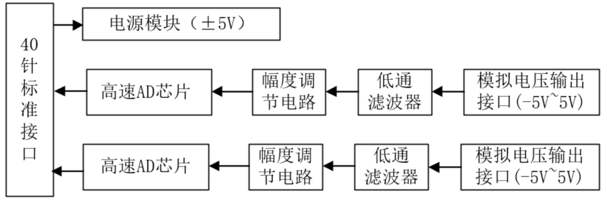
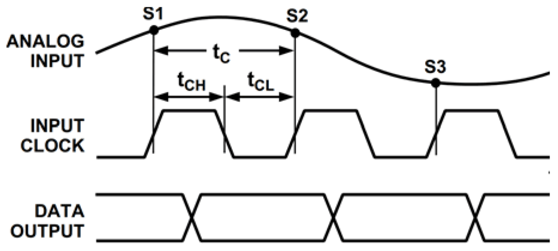
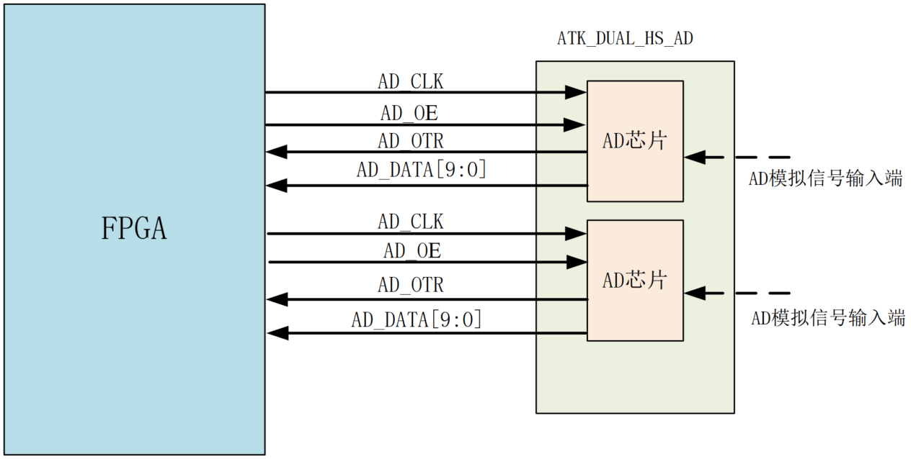

# 恩瑞浦  3PA1030  

3PA1030 在时钟的驱动下工作， 3PA1030 内置片内采样保持放大器（ SHA），同时采用多级差 分流水线架构，保证了 50MSPS 的数据转换速率下全温度范围内无失码； 3PA1030 内部集成了基准源，根据系统需要也可以选择外部高精度基准满足系统的要求。  

3PA1030 输出的数据以二进制格式表示，当输入的模拟电压超出量程时，会拉高 OVR 信号；当输入的模拟电压在量程范围内时， OVR 信号为低电平，因此可以通过 OVR 信号来判断输入的模拟电压是否在测量范围内。另外 3PA1030 有一个 OE 信号，当该信号为高电平时 3PA1030 输出呈高阻态，低电平则可以正常输出。  

上图中， S1,S2,S3 分别为三个采样点，可以看到，芯片在时钟的上升沿采样。 需要注意的是， 3PA1030 芯片的最大转换速度是 50MSPS，即输入的时钟最大频率为 50MHz。  

3PA1030 支持输入的模拟电压范围是 0V 至 2V， 0V 对应输出的数字信号为 0， 2V 对应输出的数字信号为 1023。

   

将转换后的数字信号传给 FPGA 管脚， FPGA 内部逻辑分析仪通过抓取数据将外部的模型信号呈现出来。  